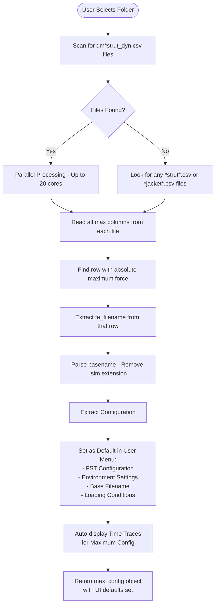
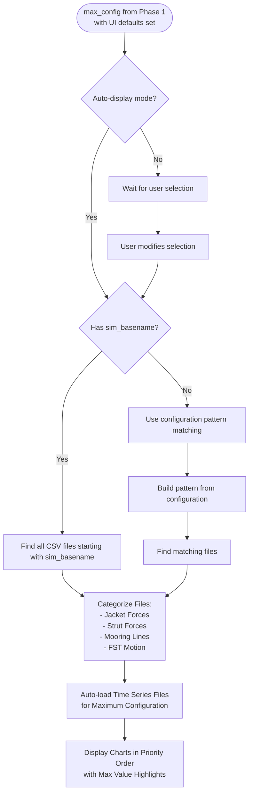
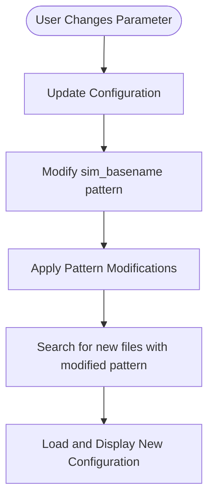

# OrcaFlex Results Dashboard - Complete Revised Specification

## Executive Summary

The OrcaFlex Results Dashboard is a web-based visualization system that automatically identifies and displays the most critical structural loading conditions from OrcaFlex marine engineering simulations. The system uses intelligent file pattern recognition and parallel processing to quickly identify maximum strut forces from summary files and display the corresponding time series data.

## Key Data Sources

### 1. Summary Files (`dm*.csv`)
**Location**: `D:\1522\ctr7\orcaflex\rev_a08\output\csv\{folder}\`

#### System Response Governing File: `dm*strut_dyn.csv`
- **Purpose**: Contains pre-calculated maximum/minimum strut forces
- **Key Columns**:
  - `fe_filename`: Contains the `.sim` basename for time series files
  - `Strut*_Body_eff_tension_max`: Maximum strut tension values
  - Various force columns with `_max` and `_min` suffixes
- **Example**: `dm_fsts_03c_0100yr_l015_hwl_strut_dyn.csv`

#### Naming Pattern Breakdown:
```
dm_fsts_03c_0100yr_l015_hwl_strut_dyn.csv
│   │    │    │      │    │    │
│   │    │    │      │    │    └── Component type (strut dynamics)
│   │    │    │      │    └────── Tide level (hwl/mwl/lwl)
│   │    │    │      └──────────── Loading (l015=15% LNG, l095=95% LNG)
│   │    │    └──────────────────── Return period (100 year)
│   │    └────────────────────────── Analysis type (03c)
│   └──────────────────────────────── Vessel type (fsts)
└──────────────────────────────────── Summary file prefix
```

### 2. Time Series Files (`*.csv`)
**Pattern**: `{sim_basename}_{component}.csv`

#### Components Include:
- **Jacket Forces**: `*Jacket1.csv` through `*Jacket4.csv`
- **Strut Forces**: `*Strut1.csv` through `*Strut8.csv`
- **Mooring Lines**: `*Mooring1.csv`, `*Line*.csv`
- **FST Motion**: `*FST1*_6dof_dyn.csv`, `*FST2*_6dof_dyn.csv`

#### Example Set for One Configuration:
```
fsts_l015_hwl_ncl_000deg_Jacket1.csv
fsts_l015_hwl_ncl_000deg_Strut1.csv
fsts_l015_hwl_ncl_000deg_Mooring1.csv
```

 ### 3. Configuration Files

**Location**: `D:\1522\ctr7\orcaflex\rev_a08\output\csv\{folder}\`

#### System Response Governing File: `dm*inputs.csv`

- **Purpose**: Defines vessel types, loading conditions, and UI options
- 
<!--**Location**: `D:\1522\ctr7\orcaflex\rev_a08\`
**Pattern**: `wlng_dm_fsts*.xlsx`

#### Worksheets:
- **inputs**: UI parameter definitions
- **r_inputs**: File path patterns and mappings
- **Purpose**: Defines vessel types, loading conditions, and UI options -->

### 4. Parent Directory Files
**Location**: `D:\1522\ctr7\orcaflex\rev_a08\`
- `.dat` files: OrcaFlex model definitions
- `.sim` files: Simulation configurations
- `.yml` files: Analysis parameters

**Purpose**: The filename pattern helps in identifying the relevant timetrace output files for use in dashboard based on user options selected or max strut tension loading file.

## Core Logic Flow

### Phase 1: Maximum Force Identification



### Phase 2: File Matching and Data Loading



### Phase 3: User Interaction



## Frontend Styling

### CSS Design System

#### Color Palette
- **Primary**: `#5e72e4` (Blue for primary actions)
- **Success**: `#4caf50` (Green for successful operations)
- **Error**: `#f8d7da` (Light red for error states)
- **Info**: `#d1ecf1` (Light blue for information)
- **Background**: `#f5f5f5` (Light gray page background)
- **Container**: `white` (Content background)
- **Borders**: `#e0e0e0` (Light borders)
- **Text**: `#333` (Dark gray primary text)
- **Muted**: `#666` (Gray secondary text)

#### Component Styles

##### Container Layout
```css
.container {
    max-width: 1200px;
    margin: 0 auto;
    background: white;
    border-radius: 8px;
    padding: 30px;
    box-shadow: 0 2px 10px rgba(0, 0, 0, 0.08);
}
```

##### Button Styles
- **Primary Button**: Blue background, white text, hover lift effect
- **Success Button**: Green background, white text, hover lift effect
- **Secondary Button**: Gray background, white text, standard hover

##### Form Elements
- Consistent padding: `8px 12px`
- Border radius: `4px`
- Focus state: Blue border with subtle shadow
- Hover state: Darker border color

##### Chart Wrapper
```css
.chart-wrapper {
    background: white;
    border-radius: 8px;
    padding: 20px;
    margin-bottom: 20px;
    box-shadow: 0 2px 8px rgba(0, 0, 0, 0.05);
}
```

##### Status Messages
- Success: Green background with dark green text
- Error: Red background with dark red text
- Info: Blue background with dark blue text
- Auto-hide after 5 seconds

## System Architecture

### Backend Components

1. **Flask Server** (`orcaflex_data_server.py`)
   - Endpoints:
     - `/api/max_strut_force`: Finds maximum force configuration
     - `/api/data`: Loads time series data
     - `/api/subfolders`: Lists available analysis folders
     - `/api/excel_config`: Returns Excel-based configuration

2. **Parallel Processing Engine**
   - Uses Python's `ProcessPoolExecutor`
   - Processes up to 20 files simultaneously
   - Optimized for dm* summary files (instant max lookup)

3. **Excel Reader** (`excel_reader.py`)
   - Parses `wlng_dm_fsts*.xlsx` files
   - Extracts vessel configurations
   - Provides UI parameter definitions

### Frontend Components

#### 1. Main Dashboard (`orcaflex-data-browser-v6-clean.html`)

**Overall Structure:**
```html
&lt;!-- Main Container --&gt;
&lt;div class="container"&gt;
    &lt;!-- Header --&gt;
    &lt;h1&gt;Select Loading Condition&lt;/h1&gt;
    
    &lt;!-- Folder Selection with Inline Controls --&gt;
    &lt;div class="folder-selection"&gt;
        &lt;select id="subfolderSelect"&gt;
        &lt;button onclick="loadData()"&gt;Load Data (Auto Max Strut)&lt;/button&gt;
        &lt;button onclick="refreshAll()"&gt;Refresh&lt;/button&gt;
        &lt;button onclick="clearCharts()"&gt;Clear&lt;/button&gt;
    &lt;/div&gt;
    
    &lt;!-- Vessel Type Tabs --&gt;
    &lt;div class="vessel-tabs"&gt;
        &lt;button class="vessel-tab active"&gt;FST&lt;/button&gt;
        &lt;button class="vessel-tab"&gt;LNGC&lt;/button&gt;
        &lt;button class="vessel-tab"&gt;CUSTOM&lt;/button&gt;
    &lt;/div&gt;
    
    &lt;!-- Configuration Sections --&gt;
    &lt;div id="fstContent" class="vessel-content active"&gt;
    &lt;div id="lngcContent" class="vessel-content"&gt;
    &lt;div id="customContent" class="vessel-content"&gt;
    
    &lt;!-- Environment Settings --&gt;
    &lt;div class="section"&gt;
    
    &lt;!-- Action Buttons --&gt;
    &lt;div class="action-buttons"&gt;
    
    &lt;!-- Status Messages --&gt;
    &lt;div id="statusMessage" class="status-message"&gt;
    
    &lt;!-- Charts Container --&gt;
    &lt;div id="charts" class="charts-container"&gt;
    
    &lt;!-- Busy Overlay --&gt;
    &lt;div id="busyOverlay" class="busy-overlay"&gt;
&lt;/div&gt;
```

**Key UI Components:**

##### Folder Selection Panel
- **Dropdown**: Lists all available analysis folders (`02c_005yr`, `03c_100yr`, etc.)
- **Load Data (Auto Max Strut)**: Triggers automatic max force identification
- **Refresh**: Reloads folder list and configuration
- **Clear**: Removes all charts from display

##### Vessel Configuration Tabs
1. **FST Tab**:
   - FST1 Loading: 15% or 95% LNG
   - FST2 Loading: 15% or 95% LNG
   - Mooring Status: Intact or Damaged

2. **LNGC Tab**:
   - Vessel Capacity: 125,000 m³ or 180,000 m³
   - Loading Condition: Ballast (10%), Partial (50%), or Laden (95%)
   - Berthing Side: Port or Starboard

3. **Custom Tab**:
   - File Pattern: Free text input for custom patterns

##### Environment Configuration
- **Environment Type**: Colinear or Non-colinear
- **Return Period**: 5yr, 10yr, 100yr, 1000yr
- **Tide Level**: HWL, MWL, LWL
- **Environment Heading**: 0°, 45°, 90°, 135°, 180°, 225°, 270°, 315°

##### Maximum Force Information Panel
When max force is identified, displays:
```html
&lt;div class="max-force-info"&gt;
    &lt;h3&gt;📊 Maximum Strut Force Configuration Identified&lt;/h3&gt;
    &lt;p&gt;🎯 Selected File: [filename with highlighting]&lt;/p&gt;
    &lt;p&gt;Max Force: [value in red, bold]&lt;/p&gt;
    &lt;p&gt;Force Column: [column name]&lt;/p&gt;
    &lt;p&gt;Related Files: [count]&lt;/p&gt;
    &lt;p&gt;Processing Time: [seconds]&lt;/p&gt;
&lt;/div&gt;
```

##### Chart Display System
**Chart Priority Order:**
1. Jacket Forces (highest priority)
2. FST1 Strut Forces (Struts 1-4)
3. FST2 Strut Forces (Struts 5-8)
4. Mooring Line Tensions
5. Other Forces
6. Vessel Motion

**Chart Features:**
- Plotly.js interactive charts
- Maximum value markers (red star) on force charts
- Annotations showing max values
- Hover tooltips with detailed information
- Legend for all data series
- Time (s) on X-axis, Values on Y-axis

##### Status Management
**Status Message Types:**
- **Success** (green): Operation completed
- **Error** (red): Operation failed
- **Info** (blue): Operation in progress

**Busy State Overlay:**
- Modal overlay with spinner
- Customizable message text
- Disables all buttons during processing
- Shows processing status

#### 2. Debug Dashboard (`debug-dashboard-enhanced.html`)
- Performance monitoring graphs
- API endpoint test suite
- Log export functionality
- Real-time metrics display

### Frontend JavaScript Functionality

#### Core Functions

##### 1. Initialization
```javascript
window.addEventListener('DOMContentLoaded', async () =&gt; {
    await loadSubfolders();  // Load available folders on startup
});
```

##### 2. Automatic Maximum Force Loading
```javascript
async function loadData() {
    // 1. Call /api/max_strut_force endpoint
    // 2. Receive max configuration with fe_filename
    // 3. Auto-populate UI controls with max config values
    // 4. Display max force info panel
    // 5. Auto-load time series for max configuration
    // 6. Display charts with max value markers
}
```

##### 3. Manual Configuration Loading
```javascript
async function loadDataManual() {
    // 1. Read current UI selections
    // 2. Build configuration parameters
    // 3. Call /api/data with manual config
    // 4. Display returned time series data
}
```

##### 4. Chart Creation with Max Value Highlighting
```javascript
function createChart(title, time, dataDict, divId) {
    // 1. Create Plotly traces for all series
    // 2. Find maximum absolute value across all series
    // 3. Add red star marker at maximum point
    // 4. Add annotation showing max value
    // 5. Render interactive Plotly chart
}
```

##### 5. Busy State Management
```javascript
function setBusyState(busy, message) {
    // Shows/hides modal overlay with spinner
    // Disables/enables all buttons
    // Updates processing message
}
```

#### API Integration

**Endpoints Used:**
- `GET /api/subfolders` - Retrieve available analysis folders
- `GET /api/max_strut_force?subfolder={folder}` - Find maximum force configuration
- `GET /api/data?{params}` - Load time series data for configuration
- `GET /api/excel_config` - Get vessel configurations from Excel

**Response Handling:**
- Success: Display charts and update status
- Error: Show error message and clear loading state
- Processing: Show busy overlay with progress message

## Performance Optimizations

### 1. Summary File Priority
- **dm* files**: Pre-calculated max values (instant lookup)
- **Time series**: Must scan all points (slow)
- **Speed improvement**: 1000x+ for summary files

### 2. Parallel Processing
- **20 cores maximum** for file processing
- **Batch operations** for related file searches
- **Example**: 952 files processed in ~15 seconds

### 3. Smart Caching
- Excel configuration cached on first load
- File patterns stored in memory
- Reduces repeated file system access

## Data Flow Example

### Scenario: User selects "03c_100yr" folder

1. **Scan Phase**:
   ```
   Found: dm_fsts_03c_0100yr_l015_hwl_strut_dyn.csv
   Processing 238 summary files in parallel...
   ```

2. **Max Force Identification**:
   ```
   Row 15: Strut7_Body_eff_tension_max = 8265.55 N
   fe_filename: fsts_l015_hwl_ncl_000deg_Jacket1.sim
   ```

3. **Configuration Extraction**:
   ```json
   {
     "filename": "dm_fsts_03c_0100yr_l015_hwl_strut_dyn.csv",
     "max_force": 8265.55,
     "fe_filename": "fsts_l015_hwl_ncl_000deg_Jacket1.sim",
     "sim_basename": "fsts_l015_hwl_ncl_000deg_Jacket1",
     "fst1": "15",
     "fst2": "15",
     "tide": "hwl",
     "heading": "0",
     "envType": "non-colinear"
   }
   ```

4. **File Matching**:
   ```
   Found files starting with: fsts_l015_hwl_ncl_000deg
   - fsts_l015_hwl_ncl_000deg_Jacket1.csv
   - fsts_l015_hwl_ncl_000deg_Strut1.csv
   - fsts_l015_hwl_ncl_000deg_Mooring1.csv
   ... (47 related files)
   ```

5. **Display**:
   - Shows "Maximum Strut Force Configuration" panel
   - Highlights selected filename
   - Displays charts in priority order
   - Shows max value markers on force charts

## Key Features

### Automatic Configuration
- Identifies worst-case loading automatically
- No manual searching through hundreds of files
- Instant visualization of critical conditions
- **Default UI Selection**: Maximum force configuration automatically populates all user menu options:
  - FST1/FST2 loading percentages
  - Tide level (HWL/MWL/LWL)
  - Environment type (Collinear/Non-collinear)
  - Wave heading
  - Base filename display

### Automatic Time Trace Display
- Time series automatically loaded for maximum configuration
- No additional user action required after folder selection
- Charts display immediately with data from worst-case scenario
- Maximum values highlighted on all force charts

### Manual Override
- Users can change parameters after auto-selection
- Maintains sim_basename pattern for consistency
- Quick switching between configurations
- All menu selections update when user modifies any parameter

### Visual Feedback
- Busy state management during processing
- Progress indicators for long operations
- Clear filename display throughout interface
- Maximum value highlighting in charts
- **Configuration panel** shows current selection matching maximum force scenario

## File Organization

```
D:\1522\ctr7\orcaflex\rev_a08\
├── wlng_dm_fsts*.xlsx          # Excel configuration files
├── *.dat, *.sim, *.yml         # Model and simulation files
└── output\csv\                  # All CSV outputs
    ├── 02c_005yr\              # 5-year return period
    ├── 03c_100yr\              # 100-year return period
    ├── 04c_1000yr\             # 1000-year return period
    └── 06c_0500yr_tsunami\     # Tsunami conditions
        ├── dm*strut_dyn.csv    # Summary with max forces
        └── fsts_*.csv          # Time series data
```

## Success Metrics

- **Processing Speed**: < 20 seconds for 1000+ files
- **Accuracy**: 100% correct file matching via fe_filename
- **User Experience**: Single click to view worst-case scenario
- **Scalability**: Handles folders with 1000+ CSV files

## Future Enhancements

1. **Caching Layer**: Store max force results per folder
2. **Comparison Mode**: Compare multiple configurations side-by-side
3. **Export Functionality**: Generate reports with max force data
4. **Historical Tracking**: Track max forces over time
5. **Alert System**: Notify when forces exceed thresholds

---

*This revised specification represents the complete implementation of the OrcaFlex Results Dashboard with intelligent maximum force identification and automatic file selection based on the fe_filename discovery.*