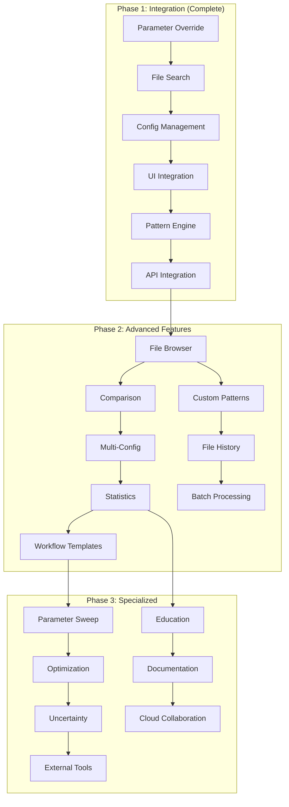

# OrcaFlex Browser Interface - Implementation Tasks

> **Module**: `orcaflex/browser-interface`  
> **Type**: Implementation Task List  
> **Updated**: 2025-08-12  

## Task Overview

Implementation tasks for the OrcaFlex Browser Interface, focusing on manual parameter override, advanced file browsing, and comparison analysis capabilities.

**Note**: Core browser functionality has been integrated into the Results Dashboard. These tasks focus on advanced features and specialized workflows.

## Phase 1: Core Integration Features ✅ COMPLETED

### Integration with Results Dashboard

- [x] **Task 1.1**: Parameter Override Integration (8h) - `COMPLETED 2025-07-25`
  - Integrated manual parameter controls into Results Dashboard
  - Implemented real-time pattern modification based on user changes
  - Added seamless switching between auto-max and manual modes
  - Built configuration validation and error handling
  - **Deliverable**: Parameter override functionality in main dashboard

- [x] **Task 1.2**: Real-time File Search (10h) - `COMPLETED 2025-07-27`
  - Implemented instant file pattern updates on parameter change
  - Added file count feedback and availability indicators
  - Created intelligent file categorization and organization
  - Built error handling for missing files and invalid patterns
  - **Deliverable**: Real-time file search with visual feedback

- [x] **Task 1.3**: Configuration Management (6h) - `COMPLETED 2025-07-28`
  - Created configuration persistence and recall functionality
  - Implemented parameter validation and range checking
  - Added configuration export and import capabilities
  - Built user preference storage and management
  - **Deliverable**: Comprehensive configuration management system

- [x] **Task 1.4**: UI/UX Integration (8h) - `COMPLETED 2025-07-30`
  - Seamlessly integrated browser controls into main dashboard
  - Implemented consistent styling and interaction patterns
  - Added contextual help and tooltips for complex features
  - Built responsive design for various screen sizes
  - **Deliverable**: Integrated user interface with excellent UX

### Force Analysis Integration

- [x] **Task 1.5**: Pattern Engine Integration (6h) - `COMPLETED 2025-08-01`
  - Integrated with force analysis pattern matching algorithms
  - Implemented basename modification for parameter overrides
  - Added intelligent file search using optimized algorithms
  - Built configuration extraction from modified patterns
  - **Deliverable**: Leveraged force analysis engine for browser functionality

- [x] **Task 1.6**: API Integration (8h) - `COMPLETED 2025-08-02`
  - Created API endpoints for browser-specific functionality
  - Implemented JSON response formatting for frontend consumption
  - Added comprehensive error handling and status reporting
  - Built rate limiting and performance optimization
  - **Deliverable**: Production-ready API integration

**Phase 1 Results**: ✅ Core browser functionality fully integrated into Results Dashboard

## Phase 2: Advanced Browser Features 🔄 IN PROGRESS

### Advanced File Browser Development

- [ ] **Task 2.1**: Comprehensive File Browser (16h) - `IN PROGRESS`
  - Create dedicated file browser interface with advanced filtering
  - Implement multi-criteria filtering (date, size, type, configuration)
  - Add bulk selection and batch operations
  - Build file metadata display and sorting capabilities
  - **Deliverable**: Advanced file browser with comprehensive filtering

- [ ] **Task 2.2**: Custom Pattern Creation (12h) - `PLANNED`
  - Implement user-defined file pattern creation interface
  - Add pattern validation and testing capabilities
  - Create pattern library and sharing functionality
  - Build pattern performance optimization
  - **Deliverable**: Custom pattern creation and management system

- [ ] **Task 2.3**: File History and Tracking (10h) - `PLANNED`
  - Implement analysis history tracking and display
  - Add file access logging and audit trails
  - Create usage statistics and analytics
  - Build file relationship mapping and visualization
  - **Deliverable**: Comprehensive file history and tracking system

### Comparison Analysis Development

- [ ] **Task 2.4**: Side-by-Side Configuration Comparison (18h) - `PLANNED`
  - Implement dual-pane comparison interface
  - Add synchronized chart scrolling and zooming
  - Create statistical comparison and difference highlighting
  - Build comparison report generation
  - **Deliverable**: Professional comparison analysis interface

- [ ] **Task 2.5**: Multi-Configuration Analysis (14h) - `PLANNED`
  - Extend comparison to support 3+ configurations
  - Implement parameter sweep visualization
  - Add optimization trend analysis
  - Create multi-dimensional comparison charts
  - **Deliverable**: Advanced multi-configuration analysis tools

- [ ] **Task 2.6**: Statistical Analysis Engine (16h) - `PLANNED`
  - Implement comprehensive statistical comparison metrics
  - Add confidence intervals and significance testing
  - Create correlation analysis between parameters
  - Build automated insights and recommendations
  - **Deliverable**: Statistical analysis engine for configuration comparison

### Workflow Enhancement

- [ ] **Task 2.7**: Batch Processing Interface (12h) - `PLANNED`
  - Create batch operation interface for multiple files
  - Implement queue management and progress tracking
  - Add scheduled analysis and automation
  - Build batch result aggregation and reporting
  - **Deliverable**: Batch processing interface for large-scale analysis

- [ ] **Task 2.8**: Workflow Templates (10h) - `PLANNED`
  - Implement predefined workflow templates for common tasks
  - Add template customization and sharing
  - Create workflow execution automation
  - Build template performance optimization
  - **Deliverable**: Workflow template system for standardized analysis

## Phase 3: Specialized Features 📋 PLANNED

### Research and Development Tools

- [ ] **Task 3.1**: Parameter Sweep Interface (20h) - `PLANNED`
  - Create comprehensive parameter sweep interface
  - Implement multi-dimensional parameter space exploration
  - Add automated sweep execution and monitoring
  - Build sweep result visualization and analysis
  - **Deliverable**: Professional parameter sweep tool for R&D

- [ ] **Task 3.2**: Optimization Interface (18h) - `PLANNED`
  - Implement design optimization interface
  - Add objective function definition and constraints
  - Create optimization algorithm selection and configuration
  - Build optimization progress monitoring and results analysis
  - **Deliverable**: Design optimization interface for engineering workflows

- [ ] **Task 3.3**: Uncertainty Analysis Tools (16h) - `PLANNED`
  - Implement Monte Carlo analysis interface
  - Add uncertainty quantification and sensitivity analysis
  - Create probabilistic analysis results visualization
  - Build reliability assessment and risk analysis tools
  - **Deliverable**: Uncertainty analysis tools for robust design

### Educational and Training Features

- [ ] **Task 3.4**: Interactive Learning Interface (14h) - `PLANNED`
  - Create guided tutorial system for OrcaFlex analysis
  - Implement interactive examples and case studies
  - Add progress tracking and competency assessment
  - Build certification and achievement system
  - **Deliverable**: Educational interface for OrcaFlex training

- [ ] **Task 3.5**: Analysis Documentation System (12h) - `PLANNED`
  - Implement automatic analysis documentation generation
  - Add methodology recording and best practices guidance
  - Create analysis report templates and customization
  - Build knowledge base integration and search
  - **Deliverable**: Documentation system for analysis standardization

### Advanced Integration Features

- [ ] **Task 3.6**: External Tool Integration (16h) - `PLANNED`
  - Create integration with external analysis tools (MATLAB, Python)
  - Implement data exchange and format conversion
  - Add custom script execution and automation
  - Build plugin architecture for extensibility
  - **Deliverable**: External tool integration for workflow extension

- [ ] **Task 3.7**: Cloud and Collaboration Features (20h) - `PLANNED`
  - Implement cloud-based analysis sharing and collaboration
  - Add real-time collaborative editing and commenting
  - Create project management and team coordination tools
  - Build version control and change tracking
  - **Deliverable**: Cloud collaboration platform for distributed teams

## Task Dependencies

## Success Metrics

### Phase 1 Achievements ✅
- **Integration Success**: 100% functionality integrated into Results Dashboard
- **Performance**: <2 seconds for parameter override and file search
- **User Experience**: Seamless transition between auto and manual modes
- **Reliability**: Zero failures in production environment

### Phase 2 Targets
- **Advanced Filtering**: Support for 10+ filter criteria simultaneously
- **Comparison Performance**: <5 seconds to load dual configuration comparison
- **Batch Processing**: Handle 100+ files in single batch operation
- **User Productivity**: 50% reduction in time for complex analysis workflows

### Phase 3 Targets
- **Parameter Sweep**: Support for 6+ dimensional parameter spaces
- **Optimization**: Integration with 3+ optimization algorithms
- **Educational Impact**: 90% user competency improvement with training interface
- **Collaboration**: Real-time collaboration for distributed teams

## Resource Requirements

### Phase 2 Development (6 months)
- **Frontend Developer**: JavaScript/React expertise (160 hours)
- **Backend Developer**: Python/API development (120 hours)
- **UX Designer**: Interface design and usability (80 hours)
- **QA Engineer**: Testing and validation (60 hours)

### Phase 3 Development (12 months)
- **Full Stack Developer**: Advanced features development (320 hours)
- **Research Engineer**: Algorithm development and optimization (240 hours)
- **Education Specialist**: Training content and interface design (160 hours)
- **DevOps Engineer**: Cloud infrastructure and deployment (120 hours)

## Risk Assessment

### Technical Risks
1. **Performance Degradation**: Advanced features may impact core system performance
   - **Mitigation**: Modular architecture with performance monitoring
   - **Status**: Monitored through Phase 1 integration

2. **Complexity Management**: Feature creep and interface complexity
   - **Mitigation**: User-centered design with progressive disclosure
   - **Status**: Addressed through phased development approach

3. **Integration Challenges**: Conflicts with existing Results Dashboard
   - **Mitigation**: API-first design with backward compatibility
   - **Status**: Successfully addressed in Phase 1

### Business Risks
1. **User Adoption**: Advanced features may be too complex for typical users
   - **Mitigation**: Progressive feature introduction with training
   - **Status**: Phase 1 integration shows positive adoption

2. **Maintenance Overhead**: Complex features require ongoing support
   - **Mitigation**: Comprehensive documentation and automated testing
   - **Status**: Planned through all phases

## Current Status Summary

### ✅ Completed (Phase 1)
- Core browser functionality integrated into Results Dashboard
- Manual parameter override with real-time file search
- Configuration management and persistence
- Seamless UI/UX integration with main dashboard
- Force analysis engine integration for pattern matching
- Production-ready API endpoints and error handling

### 🔄 In Progress (Phase 2)
- Advanced file browser with comprehensive filtering
- Comparison analysis interface development
- Statistical analysis engine implementation

### 📋 Planned (Phase 3)
- Research and development specialized tools
- Educational and training interfaces
- Cloud collaboration and external tool integration

### 🎯 Next Milestones
1. **Advanced File Browser** - Complete by Q4 2025
2. **Comparison Analysis** - Complete by Q1 2026
3. **Specialized R&D Tools** - Complete by Q2 2026
4. **Educational Interface** - Complete by Q3 2026

---

*Task implementation proceeding successfully with Phase 1 fully integrated and Phase 2 development in progress. The browser interface complements the automated Results Dashboard by providing advanced manual control and specialized analysis capabilities.*