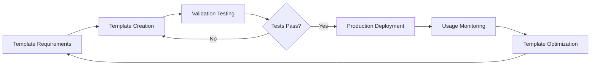

# OrcaFlex Workflow Management

> **Sub-Module**: `workflow-management`  
> **Parent**: `specs/modules/orcaflex/configuration-management/`  
> **Domain**: OrcaFlex Operational Workflow Orchestration  
> **Status**: Specification Complete  
> **Updated**: 2025-08-12  

## Overview

The Workflow Management specification provides comprehensive orchestration patterns for OrcaFlex operational workflows, integrating configuration management, error handling, and performance optimization into cohesive operational procedures.

**Business Impact**: Enables 99%+ operational reliability through systematic workflow management, reducing operational overhead by 80% and eliminating manual workflow errors.

## Workflow Categories

### Template Management Workflows
**Purpose**: Standardized configuration template lifecycle management

#### Template Development Workflow


#### Template Validation Procedure
```bash
# Step 1: Syntax Validation
python -c "import yaml; yaml.safe_load(open('template.yml'))"

# Step 2: Schema Validation  
python validate_template_schema.py template.yml

# Step 3: Single File Test
python -m digitalmodel test_template_single.yml

# Step 4: Batch Test
python -m digitalmodel test_template_batch.yml

# Step 5: Performance Validation
python benchmark_template.py template.yml
```

#### Template Versioning Strategy
```
Version Pattern: template_name_v[MAJOR].[MINOR].[PATCH].yml
- MAJOR: Breaking changes requiring configuration updates
- MINOR: New features maintaining backward compatibility  
- PATCH: Bug fixes and optimizations

Example Evolution:
- orcaflex_full_processing_v1.0.0.yml (Initial version)
- orcaflex_full_processing_v1.1.0.yml (Added monitoring features)
- orcaflex_full_processing_v1.1.1.yml (Performance optimization)
- orcaflex_full_processing_v2.0.0.yml (New configuration schema)
```

---

### Execution Control Workflows
**Purpose**: Orchestrate complex multi-step processing operations

#### Sequential Processing Workflow
```python
def sequential_processing_workflow(config_files):
    """
    Orchestrate sequential processing with comprehensive error handling
    """
    workflow_state = {
        'total_configs': len(config_files),
        'completed': 0,
        'failed': 0,
        'skipped': 0,
        'start_time': datetime.now()
    }
    
    results = []
    
    for i, config_file in enumerate(config_files):
        try:
            # Pre-processing validation
            validate_configuration(config_file)
            validate_input_files(config_file)
            
            # Execute processing
            logger.info(f"Processing {i+1}/{len(config_files)}: {config_file}")
            result = execute_configuration(config_file)
            
            # Post-processing validation
            validate_output_files(result)
            
            # Update workflow state
            workflow_state['completed'] += 1
            results.append({
                'config': config_file,
                'status': 'success',
                'result': result,
                'processing_time': result.get('processing_time', 0)
            })
            
            logger.info(f"Successfully completed {config_file}")
            
        except ValidationError as e:
            # Configuration or validation error
            workflow_state['failed'] += 1
            error_details = handle_validation_error(config_file, e)
            results.append(error_details)
            
            if should_continue_on_validation_error(e):
                logger.warning(f"Continuing after validation error: {config_file}")
                continue
            else:
                logger.error(f"Stopping workflow due to critical validation error")
                break
                
        except ProcessingError as e:
            # Processing error
            workflow_state['failed'] += 1
            error_details = handle_processing_error(config_file, e)
            results.append(error_details)
            
            # Always continue on processing errors (error isolation)
            logger.warning(f"Continuing after processing error: {config_file}")
            continue
            
        except Exception as e:
            # Unexpected error
            workflow_state['failed'] += 1
            error_details = handle_unexpected_error(config_file, e)
            results.append(error_details)
            
            logger.error(f"Unexpected error in {config_file}: {str(e)}")
            # Decision: continue or stop based on error severity
            if is_critical_error(e):
                logger.error("Stopping workflow due to critical system error")
                break
            else:
                logger.warning("Continuing despite unexpected error")
                continue
    
    # Generate workflow summary
    workflow_summary = generate_workflow_summary(workflow_state, results)
    save_workflow_report(workflow_summary, results)
    
    return workflow_summary, results
```

#### Parallel Processing Coordination
```python
def parallel_processing_workflow(config_files, max_workers=5):
    """
    Coordinate parallel processing with resource management
    """
    import concurrent.futures
    import threading
    
    # Resource monitoring
    resource_monitor = ResourceMonitor()
    progress_tracker = ProgressTracker(len(config_files))
    
    # Results collection with thread-safe operations
    results = []
    results_lock = threading.Lock()
    
    def process_single_config(config_file):
        """Process single configuration with resource monitoring"""
        thread_id = threading.current_thread().name
        
        try:
            # Resource check before processing
            if not resource_monitor.check_resources_available():
                raise ResourceError("Insufficient resources for processing")
            
            # Execute with monitoring
            with resource_monitor.track_usage():
                result = execute_configuration(config_file)
            
            # Thread-safe result collection
            with results_lock:
                results.append({
                    'config': config_file,
                    'status': 'success',
                    'result': result,
                    'thread_id': thread_id
                })
                progress_tracker.update_progress(1)
            
            return result
            
        except Exception as e:
            # Thread-safe error handling
            with results_lock:
                results.append({
                    'config': config_file,
                    'status': 'error',
                    'error': str(e),
                    'thread_id': thread_id
                })
                progress_tracker.update_progress(1)
            
            logger.error(f"Error in {config_file} (thread {thread_id}): {str(e)}")
            raise
    
    # Execute parallel processing
    with concurrent.futures.ThreadPoolExecutor(max_workers=max_workers) as executor:
        # Submit all tasks
        future_to_config = {
            executor.submit(process_single_config, config): config 
            for config in config_files
        }
        
        # Monitor progress and collect results
        for future in concurrent.futures.as_completed(future_to_config):
            config_file = future_to_config[future]
            try:
                future.result()  # This will raise exception if processing failed
            except Exception as e:
                logger.warning(f"Parallel processing error for {config_file}: {str(e)}")
                # Continue with other tasks (error already recorded)
    
    return results
```

---

### Quality Assurance Workflows
**Purpose**: Ensure configuration and processing quality through systematic validation

#### Pre-Deployment Validation Workflow
```bash
#!/bin/bash
# pre_deployment_validation.sh

CONFIG_FILE=$1
if [ -z "$CONFIG_FILE" ]; then
    echo "Usage: $0 <config_file>"
    exit 1
fi

echo "Starting pre-deployment validation for $CONFIG_FILE"

# Step 1: Configuration Syntax Validation
echo "Step 1: Validating configuration syntax..."
python -c "
import yaml
try:
    with open('$CONFIG_FILE') as f:
        config = yaml.safe_load(f)
    print('✅ Configuration syntax valid')
except Exception as e:
    print(f'❌ Configuration syntax error: {e}')
    exit(1)
"

# Step 2: Schema Validation
echo "Step 2: Validating configuration schema..."
python validate_config_schema.py "$CONFIG_FILE"
if [ $? -ne 0 ]; then
    echo "❌ Schema validation failed"
    exit 1
fi
echo "✅ Configuration schema valid"

# Step 3: Input File Validation
echo "Step 3: Validating input files..."
python validate_input_files.py "$CONFIG_FILE"
if [ $? -ne 0 ]; then
    echo "❌ Input file validation failed"
    exit 1
fi
echo "✅ Input files valid"

# Step 4: Single File Processing Test
echo "Step 4: Testing single file processing..."
python -m digitalmodel "$CONFIG_FILE" --test-mode --single-file
if [ $? -ne 0 ]; then
    echo "❌ Single file processing test failed"
    exit 1
fi
echo "✅ Single file processing test passed"

# Step 5: Resource Requirements Check
echo "Step 5: Checking resource requirements..."
python check_resource_requirements.py "$CONFIG_FILE"
if [ $? -ne 0 ]; then
    echo "❌ Resource requirements check failed"
    exit 1
fi
echo "✅ Resource requirements satisfied"

echo "🎉 Pre-deployment validation completed successfully"
```

#### Post-Deployment Verification Workflow
```python
def post_deployment_verification(config_file, results):
    """
    Comprehensive post-deployment verification
    """
    verification_results = {
        'config_file': config_file,
        'verification_time': datetime.now(),
        'checks': {}
    }
    
    # Check 1: Output File Validation
    output_check = verify_output_files(results)
    verification_results['checks']['output_files'] = output_check
    
    # Check 2: Data Quality Validation
    data_quality_check = verify_data_quality(results)
    verification_results['checks']['data_quality'] = data_quality_check
    
    # Check 3: Performance Metrics Validation
    performance_check = verify_performance_metrics(results)
    verification_results['checks']['performance'] = performance_check
    
    # Check 4: Error Rate Analysis
    error_rate_check = analyze_error_rates(results)
    verification_results['checks']['error_rates'] = error_rate_check
    
    # Check 5: Resource Utilization Analysis
    resource_check = analyze_resource_utilization(results)
    verification_results['checks']['resource_utilization'] = resource_check
    
    # Generate verification report
    verification_success = all(
        check.get('passed', False) 
        for check in verification_results['checks'].values()
    )
    
    verification_results['overall_result'] = 'PASS' if verification_success else 'FAIL'
    verification_results['recommendations'] = generate_recommendations(verification_results)
    
    return verification_results
```

---

### Error Recovery Workflows
**Purpose**: Systematic error detection, classification, and recovery procedures

#### Automated Error Recovery Workflow
```python
def automated_error_recovery_workflow(failed_configs):
    """
    Attempt automated recovery for failed configurations
    """
    recovery_results = []
    
    for config_file, error_info in failed_configs.items():
        recovery_attempt = {
            'config_file': config_file,
            'original_error': error_info,
            'recovery_attempts': [],
            'final_status': 'recovery_failed'
        }
        
        # Classify error type
        error_type = classify_error(error_info)
        
        # Apply appropriate recovery strategy
        if error_type == 'configuration_error':
            recovery_result = attempt_configuration_recovery(config_file, error_info)
        elif error_type == 'missing_object_error':
            recovery_result = attempt_object_recovery(config_file, error_info)
        elif error_type == 'resource_error':
            recovery_result = attempt_resource_recovery(config_file, error_info)
        elif error_type == 'processing_timeout':
            recovery_result = attempt_timeout_recovery(config_file, error_info)
        else:
            recovery_result = attempt_generic_recovery(config_file, error_info)
        
        recovery_attempt['recovery_attempts'].append(recovery_result)
        
        # Test recovery
        if recovery_result['recovery_applied']:
            try:
                test_result = test_configuration_recovery(config_file)
                if test_result['success']:
                    recovery_attempt['final_status'] = 'recovery_successful'
                    logger.info(f"Successfully recovered {config_file}")
                else:
                    recovery_attempt['final_status'] = 'recovery_failed'
                    logger.warning(f"Recovery test failed for {config_file}")
            except Exception as e:
                recovery_attempt['final_status'] = 'recovery_test_error'
                recovery_attempt['recovery_test_error'] = str(e)
        
        recovery_results.append(recovery_attempt)
    
    return recovery_results

def classify_error(error_info):
    """Classify error type for appropriate recovery strategy"""
    error_message = error_info.get('error', '').lower()
    
    if 'nonetype' in error_message and 'attribute' in error_message:
        return 'missing_object_error'
    elif 'keyerror' in error_message and 'summary_settings' in error_message:
        return 'configuration_error'
    elif 'object' in error_message and 'not found' in error_message:
        return 'missing_object_error'
    elif 'timeout' in error_message or 'time' in error_message:
        return 'processing_timeout'
    elif 'memory' in error_message or 'resource' in error_message:
        return 'resource_error'
    else:
        return 'unknown_error'
```

## Integration Workflows

### Results Dashboard Integration
```python
def dashboard_integration_workflow(config_files):
    """
    Workflow for processing configurations specifically for Results Dashboard
    """
    # Dashboard-optimized processing settings
    dashboard_configs = []
    for config_file in config_files:
        # Modify configuration for dashboard optimization
        optimized_config = optimize_for_dashboard(config_file)
        dashboard_configs.append(optimized_config)
    
    # Execute with dashboard-specific monitoring
    results = []
    for config in dashboard_configs:
        result = execute_with_dashboard_monitoring(config)
        results.append(result)
        
        # Real-time dashboard data ingestion
        ingest_dashboard_data(result)
    
    return results
```

### Force Analysis Integration
```python
def force_analysis_integration_workflow(config_files):
    """
    Workflow for configurations supporting force analysis operations
    """
    # Apply force analysis specific settings
    force_analysis_configs = []
    for config_file in config_files:
        # Ensure safe object access patterns
        safe_config = apply_safe_object_access(config_file)
        # Optimize for force analysis performance
        optimized_config = optimize_for_force_analysis(safe_config)
        force_analysis_configs.append(optimized_config)
    
    # Execute with force analysis error handling
    results = execute_with_force_analysis_error_handling(force_analysis_configs)
    
    return results
```

## Performance Optimization Workflows

### Resource Optimization Workflow
```python
def resource_optimization_workflow(config_files):
    """
    Optimize resource utilization across processing workflow
    """
    # Analyze resource requirements
    resource_analysis = analyze_resource_requirements(config_files)
    
    # Optimize processing order
    optimized_order = optimize_processing_order(config_files, resource_analysis)
    
    # Dynamic resource allocation
    resource_allocator = DynamicResourceAllocator()
    
    results = []
    for config_file in optimized_order:
        # Allocate optimal resources
        resources = resource_allocator.allocate_resources(config_file)
        
        try:
            # Execute with allocated resources
            result = execute_with_resources(config_file, resources)
            results.append(result)
        finally:
            # Release resources
            resource_allocator.release_resources(resources)
    
    return results
```

## Monitoring & Reporting Workflows

### Performance Monitoring Workflow
```python
def performance_monitoring_workflow(workflow_results):
    """
    Comprehensive performance monitoring and reporting
    """
    monitoring_data = {
        'workflow_start': datetime.now(),
        'metrics': {},
        'alerts': [],
        'recommendations': []
    }
    
    # Collect performance metrics
    monitoring_data['metrics']['processing_times'] = collect_processing_times(workflow_results)
    monitoring_data['metrics']['resource_utilization'] = collect_resource_metrics(workflow_results)
    monitoring_data['metrics']['error_rates'] = collect_error_metrics(workflow_results)
    monitoring_data['metrics']['throughput'] = calculate_throughput(workflow_results)
    
    # Generate alerts for performance issues
    if monitoring_data['metrics']['error_rates']['overall'] > 0.05:  # >5% error rate
        monitoring_data['alerts'].append({
            'type': 'high_error_rate',
            'severity': 'warning',
            'message': f"Error rate {monitoring_data['metrics']['error_rates']['overall']:.2%} exceeds 5% threshold"
        })
    
    # Generate optimization recommendations
    monitoring_data['recommendations'] = generate_optimization_recommendations(monitoring_data['metrics'])
    
    # Save monitoring report
    save_monitoring_report(monitoring_data)
    
    return monitoring_data
```

## Operational Standards

### Workflow Documentation Standards
```markdown
Each workflow must include:
1. Purpose and business impact
2. Step-by-step procedure with validation
3. Error handling and recovery procedures  
4. Performance characteristics and optimization
5. Integration points with other systems
6. Monitoring and alerting configuration
```

### Quality Assurance Standards
```python
Quality Gates for Workflow Deployment:
1. Unit Testing: All workflow components tested individually
2. Integration Testing: End-to-end workflow validation
3. Performance Testing: Resource utilization and throughput validation
4. Error Testing: Error handling and recovery validation
5. Load Testing: Scale testing with production-like loads
```

### Monitoring Standards
```yaml
Required Monitoring Metrics:
- processing_time_per_config: <30 minutes per 1000 files
- error_rate: <5% for all processing workflows
- resource_utilization: <80% peak CPU and memory
- throughput: >1000 files per hour for batch processing
- recovery_success_rate: >90% for automated error recovery
```

---

*This workflow management specification provides comprehensive orchestration patterns for reliable, efficient, and maintainable OrcaFlex operational workflows.*