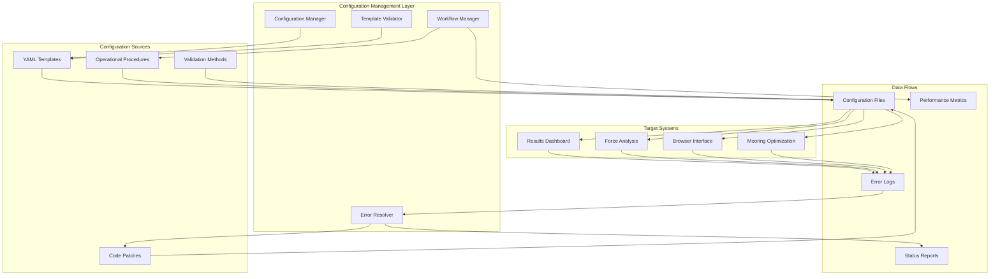

# Configuration Management - Technical Details

> **Module**: `configuration-management`  
> **Created**: 2025-08-12  
> **Focus**: Technical implementation specifications for OrcaFlex operational management  

## Technical Architecture

### System Overview
Configuration Management provides operational control layer for OrcaFlex production systems through standardized procedures, validated templates, and systematic error resolution.



## Component Specifications

### Sequential Processing Engine
**Location**: `sub-specs/sequential-processing/`  
**Purpose**: Standardized YAML configuration management for OrcaFlex batch workflows

#### Technical Requirements
```yaml
Configuration Structure:
meta:
  basename: orcaflex_post_process
  library: digitalmodel
  label: '[unique_identifier]'
  description: '[processing_description]'

workflow:
  execution_order: integer         # Sequential processing order
  next_config: string | null       # Next configuration file
  previous_config: string | null   # Previous configuration reference

default:
  log_level: DEBUG | INFO | WARNING | ERROR
  config:
    overwrite:
      output: boolean

parameters:
  VarNames:
    Line: [string array]           # Variable names for Line objects
    # Additional object types...

orcaflex:
  postprocess:
    visualization: {flag: boolean}
    summary: 
      flag: boolean
      statistics: object
      min: boolean
      max: boolean  
      mean: boolean
    linked_statistics: {flag: boolean}
    RangeGraph: {flag: boolean}
    time_series: {flag: boolean}
    cummulative_histograms: {flag: boolean}

summary_settings:                  # Required when summary.flag: true
  groups:
    - Label: string
      Columns:
        - ObjectName: string       # MUST be string, not array
          VarName: [string array]

file_management:
  flag: boolean
  input_directory: string
  output_directory: string
  filename:
    extension: [string array]
    pattern: string
    filters:
      contains: [string array]
      not_contains: [string array]

parallel_processing:
  enabled: boolean
  max_workers: integer
  timeout_per_file: integer
  save_error_reports: boolean
  progress_reporting: boolean
```

#### Validation Rules
1. **Required Sections**: meta, default, parameters, orcaflex, file_management
2. **Conditional Requirements**: summary_settings required when summary.flag: true
3. **Data Type Validation**: ObjectName must be string, not array
4. **File Pattern Validation**: Pattern must match actual filenames without extension
5. **Directory Validation**: Input/output directories must exist or be creatable

#### Template Categories
```
1. Full Processing Template:
   - All processing flags enabled
   - Complete summary_settings
   - Production-ready configuration

2. Minimal Test Template:
   - Only essential processing enabled
   - Single file pattern matching
   - Fast validation configuration

3. Debug Template:
   - Enhanced logging enabled
   - Error reporting maximized
   - Diagnostic information collection

4. Sequential Batch Template:
   - Workflow management enabled
   - Execution order specified
   - Chained configuration support
```

### Error Resolution System
**Location**: `sub-specs/troubleshooting/`  
**Purpose**: Systematic resolution of OrcaFlex processing errors with proven fixes

#### Error Pattern Classification
```python
Error Categories:
1. NoneType Errors:
   - Pattern: "'NoneType' object has no attribute 'name'"
   - Cause: Missing objects in damaged/incomplete models
   - Fix Location: digitalmodel/modules/orcaflex/*.py
   
2. Configuration Errors:
   - Pattern: "'summary_settings' KeyError"
   - Cause: Missing required configuration sections
   - Fix: Template validation and completion
   
3. Object Reference Errors:
   - Pattern: "Object 'Line' not found in model"
   - Cause: Generic object names vs actual model objects
   - Fix: Object name mapping and validation

4. Processing Errors:
   - Pattern: Sequential processing termination
   - Cause: Error propagation stopping batch processing
   - Fix: Error isolation and continuation logic
```

#### Code Fix Patterns
```python
# Safe Object Access Pattern
def safe_object_access(obj):
    try:
        if obj is not None and hasattr(obj, 'type') and obj.type is not None:
            if hasattr(obj.type, 'name') and obj.type.name is not None:
                return obj.type.name
            else:
                logger.warning(f"Object has invalid type.name: {obj}")
                return None
        else:
            logger.warning(f"Object has invalid type: {obj}")
            return None
    except Exception as e:
        logger.warning(f"Error accessing object properties: {str(e)}")
        return None

# Error Handling Implementation Locations:
# 1. orcaflex_objects.py:get_model_objects() - Lines 312-341
# 2. orcaflex_objects.py:get_object_vars() - Lines 361-378  
# 3. all_vars.py - Lines 88-101
```

#### Testing Procedures
```bash
# Step 1: Minimal Configuration Test
python -m digitalmodel test_minimal_[scenario].yml

# Step 2: Single File Validation
python -m digitalmodel test_single_[specific_file].yml

# Step 3: Full Processing Test
python -m digitalmodel test_full_[scenario].yml

# Step 4: Sequential Batch Test
python run_sequential.py
```

### Workflow Management System
**Location**: `sub-specs/workflow-management/`  
**Purpose**: Orchestrate complex multi-step OrcaFlex processing workflows

#### Workflow Components
```
1. Template Management:
   - Version control for configuration templates
   - Template validation and testing procedures
   - Customization guidelines and examples

2. Execution Control:
   - Sequential processing with error handling
   - Parallel processing coordination
   - Progress monitoring and reporting

3. Quality Assurance:
   - Pre-deployment validation checklists
   - Post-deployment verification procedures
   - Performance monitoring and optimization

4. Error Recovery:
   - Automatic error detection and classification
   - Recovery procedure automation
   - Manual intervention procedures
```

#### Performance Optimization
```python
Optimization Strategies:
1. Configuration Caching:
   - Template validation caching
   - Configuration parsing optimization
   - Parameter validation shortcuts

2. Batch Processing:
   - Optimal batch size determination
   - Resource allocation optimization
   - Memory usage monitoring

3. Error Handling:
   - Fast-fail for configuration errors
   - Error isolation for processing continuation
   - Intelligent retry mechanisms

4. Monitoring:
   - Real-time performance metrics
   - Resource utilization tracking
   - Bottleneck identification
```

## Integration Specifications

### Results Dashboard Integration
```python
Integration Points:
1. Configuration Templates:
   - Dashboard uses sequential processing templates
   - Auto-max configuration optimization
   - Performance-tuned processing settings

2. Error Handling:
   - Dashboard applies troubleshooting procedures
   - Automatic error recovery where possible
   - User-friendly error reporting

3. Workflow Management:
   - Dashboard batch processing uses workflow templates
   - Progress monitoring integration
   - Performance metrics collection
```

### Force Analysis Integration
```python
Integration Points:
1. Object Management:
   - Safe object access patterns applied
   - Missing object handling in force analysis
   - Graceful degradation for incomplete models

2. Configuration Management:
   - Force analysis uses validated templates
   - Performance-optimized configurations
   - Error handling integration

3. Batch Processing:
   - Sequential processing for large datasets
   - Parallel processing coordination
   - Resource optimization
```

### Browser Interface Integration
```python
Integration Points:
1. Manual Override Support:
   - Configuration modification workflows
   - Parameter validation and testing
   - Rollback and recovery procedures

2. Template Management:
   - Manual template customization
   - Real-time configuration validation
   - Template versioning and history

3. Workflow Flexibility:
   - Auto-to-manual workflow transitions
   - Manual workflow templates
   - Configuration persistence
```

## Performance Specifications

### Response Time Requirements
```
Configuration Operations:
- Template validation: <100ms
- Configuration loading: <500ms
- Batch configuration setup: <2 seconds
- Error diagnosis: <1 second

Processing Operations:
- Single file configuration: <30 seconds
- Batch processing setup: <5 minutes
- Error recovery: <2 minutes
- Workflow completion: <30 minutes (1000 files)
```

### Throughput Requirements
```
Configuration Management:
- Template operations: 1000+ operations/hour
- Configuration validation: 500+ validations/hour
- Error resolution: 100+ resolutions/hour

Batch Processing:
- File processing: 1000+ files/batch
- Concurrent configurations: 10+ parallel streams
- Error handling: 95%+ automatic resolution
```

### Reliability Requirements
```
System Reliability:
- Configuration accuracy: 99.9%+
- Error detection: 100%
- Recovery success: 95%+
- Data integrity: 100%

Operational Reliability:
- Template validation: 100% success
- Configuration deployment: 99%+ first-time success
- Error resolution: 95%+ automatic
- Workflow completion: 99%+ success rate
```

## Security Specifications

### Configuration Security
```python
Security Measures:
1. Template Validation:
   - Input sanitization for all configuration parameters
   - Path validation for file operations
   - Parameter range validation

2. Access Control:
   - Configuration modification logging
   - User authentication for sensitive operations
   - Role-based access to configuration templates

3. Data Protection:
   - Configuration backup and versioning
   - Sensitive parameter encryption
   - Secure configuration transmission
```

### Operational Security
```python
Security Procedures:
1. Error Logging:
   - Sanitized error messages (no sensitive data)
   - Secure log storage and access
   - Error pattern analysis for security threats

2. File Operations:
   - Path traversal protection
   - File permission validation
   - Secure temporary file handling

3. Network Operations:
   - Secure configuration distribution
   - Encrypted inter-service communication
   - Network access validation
```

## Monitoring & Diagnostics

### Performance Monitoring
```python
Metrics Collection:
1. Configuration Metrics:
   - Template usage statistics
   - Configuration validation times
   - Error resolution success rates

2. Processing Metrics:
   - Batch processing throughput
   - Individual file processing times
   - Resource utilization statistics

3. Error Metrics:
   - Error frequency by type
   - Resolution time by error category
   - Manual intervention requirements
```

### Diagnostic Capabilities
```python
Diagnostic Tools:
1. Configuration Analysis:
   - Template validation reporting
   - Configuration dependency analysis
   - Performance bottleneck identification

2. Error Analysis:
   - Error pattern recognition
   - Root cause analysis automation
   - Resolution effectiveness tracking

3. Workflow Analysis:
   - Processing pipeline analysis
   - Resource utilization optimization
   - Performance trend analysis
```

## Implementation Standards

### Code Quality Standards
```python
Quality Requirements:
1. Error Handling:
   - Comprehensive try-catch blocks
   - Meaningful error messages
   - Graceful degradation patterns

2. Logging Standards:
   - Structured logging with correlation IDs
   - Appropriate log levels (DEBUG, INFO, WARNING, ERROR)
   - Performance-sensitive logging optimization

3. Testing Standards:
   - Unit tests for all configuration logic
   - Integration tests for workflow procedures
   - Performance tests for optimization validation
```

### Documentation Standards
```markdown
Documentation Requirements:
1. Technical Documentation:
   - Complete API documentation
   - Configuration schema documentation  
   - Error handling procedure documentation

2. Operational Documentation:
   - Step-by-step operational procedures
   - Troubleshooting decision trees
   - Performance optimization guides

3. User Documentation:
   - Configuration template usage guides
   - Common error resolution procedures
   - Best practice recommendations
```

---

*These technical details provide comprehensive implementation specifications for building reliable, efficient, and maintainable OrcaFlex configuration management systems.*