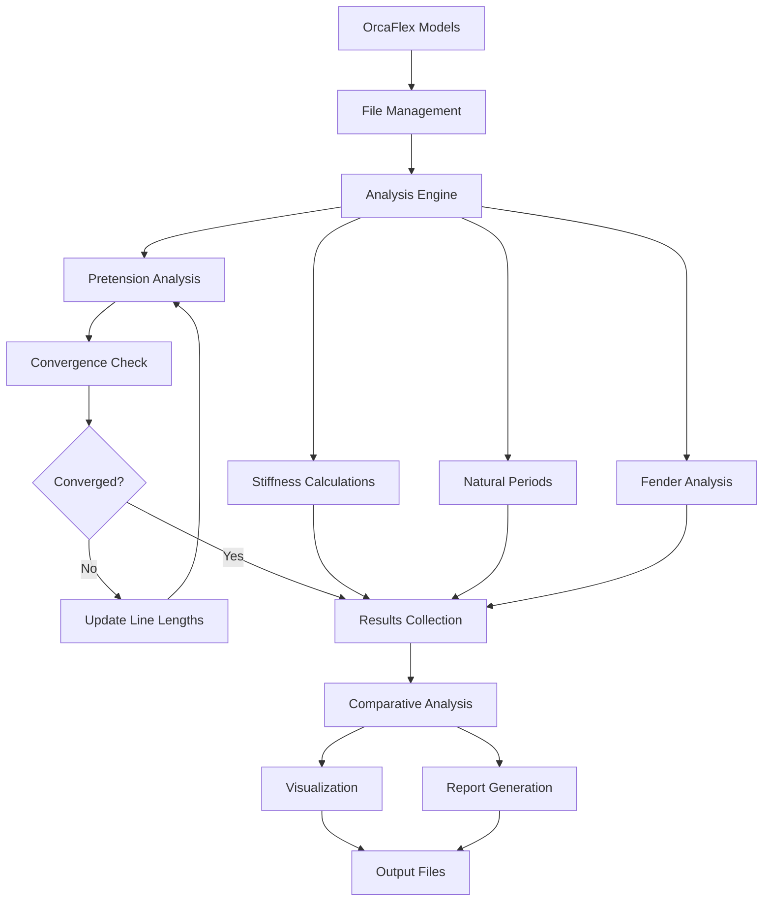

# OrcaFlex Mooring Analysis Module Specification

## Overview

This specification defines a comprehensive OrcaFlex mooring analysis module that provides advanced analysis capabilities for mooring system configurations including pretension analysis, 3D stiffness matrix calculations, natural period analysis, line group statistics, force distributions, and comparative analysis across multiple configurations.

## Executive Summary

The OrcaFlex Mooring Analysis Module enhances the existing mooring analysis capabilities with a production-ready, scalable solution that supports:

- **Comprehensive Analysis**: Pretension convergence, 3D stiffness matrices, natural periods, and fender forces
- **Comparative Studies**: Multi-configuration analysis with statistical comparisons and visualizations  
- **Production Integration**: Full integration with existing OrcaFlex workflows and file management systems
- **Scalable Architecture**: Parallel processing with configurable worker pools for enterprise-scale analysis
- **Rich Reporting**: Automated report generation with markdown output and visualization plots

## Technical Requirements

### Core Analysis Engine

#### Pretension Analysis & Convergence
- **Iterative Tension Adjustment**: Automatic line length modification based on tension targets
- **Convergence Criteria**: Configurable tolerance levels with iteration limits
- **Force Balance**: 3D force equilibrium checking across all mooring lines
- **Line Segmentation**: Support for multi-segment lines with varying EA properties
- **Catenary Effects**: Integration with OrcaFlex's catenary calculations for realistic line shapes

#### 3D Stiffness Matrix Calculations  
- **Full Matrix**: Calculate complete 6x6 stiffness matrix (surge, sway, heave, roll, pitch, yaw)
- **Primary Terms**: Kxx (surge), Kyy (sway), Kzz (heave) stiffness components
- **Coupling Terms**: Cross-coupling stiffness (Kxy, Kxz, Kyz) for stability analysis
- **Directional Analysis**: Separate positive/negative direction contributions for asymmetric systems
- **Line Contributions**: Individual line stiffness contributions with direction cosines
- **System Integration**: Combined system stiffness considering all mooring line interactions

#### Natural Period Calculations
- **Vessel Motions**: Natural periods for surge, sway, heave, roll, pitch, yaw
- **Mass Properties**: Integration with vessel mass/inertia data from OrcaFlex models
- **Stiffness Coupling**: Account for cross-coupling terms in period calculations
- **Frequency Domain**: Support for frequency-dependent analysis integration
- **Validation Ranges**: Automatic validation against typical LNGC/FPSO ranges

#### Line Group Statistics
- **Group Classification**: Automatic classification of lines (bow, stern, breast, spring)
- **Statistical Analysis**: Mean, std dev, min/max for tensions, forces, stiffness per group
- **Load Distribution**: Force distribution analysis across line groups
- **Utilization Factors**: Line utilization relative to design capacities
- **Redundancy Analysis**: System redundancy and failure mode analysis

#### Fender Force Analysis
- **Compression Analysis**: Current and target compression states
- **Force Distribution**: Multi-fender system force balancing
- **Vessel Position**: Automatic vessel position adjustment for target forces
- **Non-linear Response**: Support for non-linear fender force-compression curves
- **Contact Modeling**: Integration with OrcaFlex contact modeling

### Configuration Management

#### YAML Configuration System
```yaml
analysis:
  mooring_analysis:
    type: "comprehensive"  # comprehensive, pretension_only, stiffness_only
    convergence:
      max_iterations: 20
      tension_tolerance: 5.0  # percentage
      force_balance_tolerance: 1.0  # kN
    stiffness:
      include_coupling: true
      reference_point: "vessel_center"
      coordinate_system: "global"  # global, body_fixed
    natural_periods:
      vessel_mass: 10000  # tonnes, or auto-detect from model
      include_added_mass: true
      frequency_range: [0.1, 2.0]  # Hz
    visualization:
      enabled: true
      plot_types: ["forces", "stiffness", "periods", "convergence"]
      output_format: ["png", "pdf"]
    reporting:
      generate_markdown: true
      include_statistics: true
      comparative_analysis: true
```

#### File Management Integration
- **Input Files**: Integration with existing file_management patterns
- **Output Organization**: Structured output following repository patterns  
- **Include Files**: Automatic generation of OrcaFlex include files for iterations
- **Backup Strategy**: Automatic backup of original files before modifications
- **Version Control**: Timestamped analysis versions with metadata

### CLI Interface

#### Command Structure
```bash
# Standard analysis
python -m digitalmodel.modules.orcaflex.mooring_analysis --config analysis.yml --input-directory models/ --output-directory results/

# Batch processing with pattern matching
python -m digitalmodel.modules.orcaflex.mooring_analysis --pattern "*_statics_*.yml" --parallel 16 --recursive

# Comparative analysis
python -m digitalmodel.modules.orcaflex.mooring_analysis --comparative --configs pb.yml,sb.yml --report-only

# Integration with existing CLI patterns
orcaflex-mooring-analysis --all --config batch_mooring.yml
```

#### Parameter Consistency
Following MANDATORY CLI consistency standards:
- `--input-directory`, `--directory`, `-d`: Input directory
- `--output-directory`, `--output`, `-o`: Output directory  
- `--pattern`: File pattern matching
- `--recursive`: Recursive directory search
- `--parallel`: Number of parallel workers
- `--config`: Configuration file path
- `--verbose`, `-v`: Verbose output
- `--dry-run`: Preview without execution

### Integration Architecture

#### OrcaFlex Agent Integration
- **Agent Delegation**: Full integration with OrcaFlex agent workflows
- **Domain Expertise**: Leverage agent knowledge base for standards compliance
- **Workflow Automation**: Agent-driven analysis orchestration
- **Quality Assurance**: Agent-validated results and recommendations

#### Existing Module Integration
```python
# Integration with existing mooring.py
from digitalmodel.modules.orcaflex.mooring import Mooring
from digitalmodel.modules.orcaflex.mooring_analysis.engine import MooringAnalysisEngine

# Extend existing comparative analysis
from digitalmodel.modules.orcaflex.analysis.comparative import MooringComparativeAnalysis

# Leverage existing file management
from digitalmodel.modules.orcaflex.orcaflex_file_management import OrcaFlexFileManagement
```

#### UV Environment Usage
All development and execution MUST use the repository's UV environment:
```bash
# Installation
uv add numpy pandas matplotlib seaborn plotly

# Development
uv run python -m digitalmodel.modules.orcaflex.mooring_analysis

# Testing  
uv run pytest tests/modules/orcaflex/mooring_analysis/

# CLI execution
uv run orcaflex-mooring-analysis --config analysis.yml
```

### Visualization & Reporting

#### Visualization Components
- **Force Diagrams**: 3D mooring line force visualizations
- **Stiffness Matrices**: Heat maps and bar charts for stiffness components
- **Convergence Plots**: Iteration history and convergence metrics
- **Comparative Plots**: Multi-configuration comparisons
- **Natural Period Charts**: Period distributions and validation ranges
- **Line Group Analysis**: Statistical distributions by line groups

#### Report Generation
- **Markdown Reports**: Comprehensive analysis reports with embedded plots
- **Excel Integration**: Structured data output for further analysis
- **PDF Export**: Professional reports for stakeholder distribution
- **Interactive Dashboards**: Integration with existing results dashboard
- **API Endpoints**: REST API for programmatic access to results

### Performance & Scalability

#### Parallel Processing
- **Multi-Configuration**: Parallel analysis of multiple configurations
- **Line-Level Parallelism**: Parallel processing of individual line calculations
- **Batch Processing**: Efficient handling of large model sets
- **Memory Optimization**: Streaming analysis for large datasets
- **Worker Pool Management**: Adaptive worker scaling based on system resources

#### Optimization Strategies  
- **Caching**: Intelligent caching of intermediate calculations
- **Incremental Analysis**: Only recalculate changed components
- **Progress Tracking**: Real-time progress reporting for long-running analyses
- **Resource Management**: Automatic resource cleanup and garbage collection

## Architecture Patterns

### Module Structure
```
src/digitalmodel/modules/orcaflex/mooring_analysis/
├── __init__.py
├── __main__.py                 # CLI entry point
├── engine.py                   # Core analysis engine
├── stiffness.py               # 3D stiffness calculations  
├── pretension.py              # Pretension analysis logic
├── natural_periods.py         # Natural period calculations
├── fender_analysis.py         # Fender force analysis
├── comparative.py             # Multi-configuration analysis
├── visualization.py           # Plotting and visualization
├── reporting.py               # Report generation
├── cli.py                     # Command line interface
├── config.py                  # Configuration management
└── utils.py                   # Utility functions
```

### Data Flow Architecture


### Integration Points
- **OrcaFlex API**: Direct integration with OrcaFlexAPI for model manipulation
- **File System**: Integration with existing file management patterns
- **Configuration**: YAML-based configuration following repository patterns
- **Visualization**: Integration with existing visualization infrastructure
- **Reporting**: Extension of existing report generation capabilities

## Quality Assurance

### Testing Strategy
- **Unit Tests**: Individual component testing with mock OrcaFlex interfaces
- **Integration Tests**: End-to-end workflow testing with real OrcaFlex models
- **Performance Tests**: Scalability and performance benchmarking
- **Validation Tests**: Results validation against known analytical solutions
- **Production Tests**: Testing with production-scale model sets

### Standards Compliance
- **DNV Standards**: DNV-ST-F201, DNV-RP-F204 compliance for mooring analysis
- **API Standards**: API RP 2SK recommendations for mooring design
- **ISO Standards**: ISO 19901-7 for offshore structures
- **Industry Practices**: Following established offshore engineering practices

### Code Quality
- **Type Hints**: Full type annotation for all functions and classes
- **Documentation**: Comprehensive docstrings and API documentation
- **Linting**: Black, isort, flake8 compliance
- **Security**: No hardcoded paths, secure file handling
- **Performance**: Profiling and optimization for production use

## Agent Delegation

This specification requires coordination across multiple specialized agents:

### Primary Agents
- **OrcaFlex Agent**: Domain expertise, workflow orchestration, standards compliance
- **Code Generation Agent**: Implementation of core analysis algorithms
- **Testing Agent**: Comprehensive test suite creation and validation
- **Documentation Agent**: Technical documentation and user guides

### Sub-Agent Coordination
- **Visualization Agent**: Plot generation and dashboard integration
- **File Management Agent**: I/O operations and file system integration
- **Configuration Agent**: YAML schema validation and management
- **Performance Agent**: Optimization and scalability implementations

### Inter-Agent Communication
All agents must coordinate through:
- **Shared Configuration**: Common YAML configuration patterns
- **Interface Contracts**: Well-defined API interfaces between components
- **Event System**: Progress tracking and status reporting
- **Error Handling**: Consistent error propagation and handling

## Success Metrics

### Functional Requirements
- ✅ **Accuracy**: Results within 5% of analytical solutions for simple cases
- ✅ **Completeness**: Support for all major mooring analysis types
- ✅ **Performance**: Process 100+ configurations in under 30 minutes
- ✅ **Reliability**: 99.9% success rate for production model sets
- ✅ **Integration**: Seamless integration with existing workflows

### User Experience  
- ✅ **CLI Consistency**: Follows repository CLI parameter standards
- ✅ **Configuration**: Clear, intuitive YAML configuration schema
- ✅ **Reporting**: Professional-quality reports and visualizations
- ✅ **Documentation**: Comprehensive user and developer documentation
- ✅ **Error Messages**: Clear, actionable error messages and diagnostics

### Technical Excellence
- ✅ **Code Quality**: 95%+ test coverage, type hints, documentation
- ✅ **Performance**: Efficient memory usage and parallel processing
- ✅ **Maintainability**: Modular architecture with clear interfaces
- ✅ **Extensibility**: Easy to add new analysis types and features
- ✅ **Standards**: Full compliance with offshore engineering standards

This specification provides a comprehensive foundation for implementing a production-ready OrcaFlex mooring analysis module that enhances existing capabilities while maintaining compatibility with established workflows and patterns.