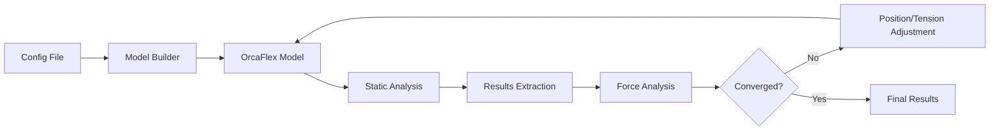

# Technical Specification: OrcaFlex Starting Mooring Tension Analysis

## Executive Summary

This specification defines a comprehensive system for determining optimal starting mooring tensions in marine analysis using OrcaFlex. The system creates fixed vessel models, analyzes static equilibrium conditions, and iteratively adjusts vessel position and line tensions to achieve force balance across all degrees of freedom.

**Core Objectives:**
- Create OrcaFlex models with fixed vessels (0DOF) for initial static analysis
- Extract and analyze forces on all components (lines, fenders, vessels, foundations)
- Iteratively adjust vessel Z-position to balance vertical forces
- Optimize line tensions to achieve zero net X and Y forces
- Converge to equilibrium within defined tolerance limits

## System Overview

### Purpose
Establish optimal starting conditions for mooring system analysis by determining pretension values and vessel equilibrium position that result in balanced forces across all components in static conditions.

### Scope
- OrcaFlex model creation with fixed vessel configuration
- Static analysis execution and results extraction
- Force balance analysis in global and local coordinates
- Iterative optimization of vessel position and line tensions
- Convergence tracking and reporting

### Key Features
1. **Model Configuration**: Automated setup of 0DOF vessel models
2. **Force Extraction**: Comprehensive force data from all components
3. **Equilibrium Analysis**: Multi-axis force balancing
4. **Iterative Optimization**: Automated convergence to target conditions
5. **Results Reporting**: Detailed analysis summaries and convergence metrics

## Technical Architecture

### Component Structure

```python
class MooringTensionStartingPosition:
    """Main orchestrator for starting position analysis."""
    
    def __init__(self, config: StartingPositionConfig):
        self.config = config
        self.model_builder = OrcaFlexModelBuilder()
        self.force_analyzer = ForceAnalyzer()
        self.position_optimizer = VesselPositionOptimizer()
        self.tension_optimizer = TensionOptimizer()
        self.convergence_tracker = ConvergenceTracker()
```

### Core Modules

#### 1. Model Builder Module
```python
class OrcaFlexModelBuilder:
    """Creates and configures OrcaFlex models."""
    
    def create_fixed_vessel_model(self, vessel_config):
        """Create model with 0DOF vessel configuration."""
        # Set vessel to fixed (None) degrees of freedom
        # Configure mooring lines and fenders
        # Define connection points and properties
        
    def set_initial_conditions(self, initial_state):
        """Apply initial vessel position and line tensions."""
```

#### 2. Force Analyzer Module
```python
class ForceAnalyzer:
    """Extracts and analyzes forces from simulation results."""
    
    def extract_component_forces(self, sim_results):
        """Extract forces on all components."""
        return {
            'vessels': self.get_vessel_forces(),
            'lines': self.get_line_forces(),
            'fenders': self.get_fender_forces(),
            'foundations': self.get_foundation_forces()
        }
    
    def calculate_force_balance(self, forces):
        """Calculate net forces in X, Y, Z directions."""
        return {
            'Fx_net': sum(forces['X']),
            'Fy_net': sum(forces['Y']),
            'Fz_net': sum(forces['Z'])
        }
```

#### 3. Position Optimizer Module
```python
class VesselPositionOptimizer:
    """Optimizes vessel Z-position for vertical force balance."""
    
    def optimize_z_position(self, current_forces, target_z_force=0):
        """Adjust vessel Z to achieve target vertical force."""
        # Newton-Raphson method for Z-position optimization
        # Calculate required adjustment based on force imbalance
        # Apply constraints (draft limits, clearances)
```

#### 4. Tension Optimizer Module
```python
class TensionOptimizer:
    """Optimizes line tensions for horizontal force balance."""
    
    def optimize_tensions(self, current_forces, constraints):
        """Adjust line tensions to balance X and Y forces."""
        # Multi-variable optimization for tension distribution
        # Apply min/max tension constraints
        # Maintain tension ratios if specified
```

## Iteration Algorithm

### Main Iteration Loop

```python
def iterate_to_equilibrium(self):
    """Main iteration loop for force balance."""
    
    iteration = 0
    converged = False
    
    while iteration < self.config.max_iterations and not converged:
        iteration += 1
        
        # Step 1: Run static analysis
        sim_results = self.run_static_analysis()
        
        # Step 2: Extract forces
        forces = self.force_analyzer.extract_component_forces(sim_results)
        
        # Step 3: Check force balance
        balance = self.force_analyzer.calculate_force_balance(forces)
        
        # Step 4: Optimize Z position
        if abs(balance['Fz_net']) > self.config.z_force_tolerance:
            new_z = self.position_optimizer.optimize_z_position(forces)
            self.model.update_vessel_position(z=new_z)
        
        # Step 5: Optimize line tensions
        if (abs(balance['Fx_net']) > self.config.xy_force_tolerance or
            abs(balance['Fy_net']) > self.config.xy_force_tolerance):
            new_tensions = self.tension_optimizer.optimize_tensions(forces)
            self.model.update_line_tensions(new_tensions)
        
        # Step 6: Check convergence
        converged = self.check_convergence(iteration, forces)
        
    return self.generate_results_summary(iteration, converged)
```

### Convergence Criteria

```python
class ConvergenceChecker:
    """Evaluates convergence criteria."""
    
    def check_convergence(self, iteration, metrics):
        """Check if any convergence criterion is met."""
        
        # Criterion 1: Maximum iterations
        if iteration >= self.config.max_iterations:
            return True, "Maximum iterations reached"
        
        # Criterion 2: Tension change threshold
        if self.max_tension_change < 10.0:  # kN
            return True, "Tension change below threshold"
        
        # Criterion 3: Force balance achieved
        if (abs(metrics['Fx_net']) < self.config.force_tolerance and
            abs(metrics['Fy_net']) < self.config.force_tolerance and
            abs(metrics['Fz_net']) < self.config.force_tolerance):
            return True, "Force balance achieved"
        
        # Criterion 4: Relative improvement
        if self.relative_improvement < 0.01:  # 1% improvement
            return True, "Convergence rate below threshold"
        
        return False, "Not converged"
```

## Configuration Management

### Input Configuration Structure

```yaml
# mooring_tension_starting_config.yml
analysis:
  name: "Starting Position Analysis"
  model_file: "base_model.dat"
  output_directory: "./results"

vessel:
  name: "FPSO_1"
  initial_position:
    x: 0.0
    y: 0.0
    z: -15.0  # Initial draft
  constraints:
    min_draft: -20.0
    max_draft: -10.0
    
mooring_lines:
  - name: "Line01"
    initial_tension: 1000.0  # kN
    min_tension: 500.0
    max_tension: 2000.0
  - name: "Line02"
    initial_tension: 1000.0
    min_tension: 500.0
    max_tension: 2000.0

iteration:
  max_iterations: 5
  tension_change_threshold: 10.0  # kN
  force_tolerance: 50.0  # kN
  z_position_step: 0.1  # m
```

## Data Flow

### Input Processing Pipeline



### Output Data Structure

```python
@dataclass
class StartingPositionResults:
    """Complete results from starting position analysis."""
    
    # Convergence information
    converged: bool
    iterations_completed: int
    convergence_reason: str
    
    # Final vessel position
    vessel_position: Dict[str, float]  # {x, y, z}
    
    # Final line tensions
    line_tensions: Dict[str, float]  # Line name -> tension (kN)
    
    # Force balance
    force_balance: Dict[str, float]  # {Fx, Fy, Fz}
    
    # Component forces
    line_forces: Dict[str, Dict[str, float]]
    fender_forces: Dict[str, Dict[str, float]]
    vessel_forces: Dict[str, Dict[str, float]]
    
    # Convergence history
    iteration_history: List[IterationSnapshot]
```

## Integration with Existing Modules

### Utilizing Go-By Files from Mooring Tension Iteration

**IMPORTANT**: This specification leverages existing reference implementations and go-by files from the mooring-tension-iteration module located at `specs/modules/orcaflex/mooring-tension-iteration/go-by/`. These files provide proven workflows and configurations that will be adapted and enhanced for this implementation.

#### Reference Files to Utilize

**Scripts and Workflows**:
- `dm_iterator.sh` - Existing iteration orchestration logic
- `dm_pretension_iteration.sh` - Pretension adjustment workflow
- `run_models_to_sim.py` - Model-to-simulation conversion utilities
- `dm_ofx_anal_mooring_fsts_*.yml` - Analysis configuration templates
- `dm_ofx_post_fsts_*.yml` - Post-processing configurations
- `au_collate.yml` - Results collation configuration

**Data Templates**:
- `fsts_*_target_mooring_pretension.csv` - Target tension value formats
- `_target_fender_force.csv` - Fender force specifications
- `template_pretension_analysis_summary.xlsx` - Excel reporting template

**Results and Logs**:
- `results/*.yml` - Output format examples
- `logs/*.log` - Logging patterns to follow

#### Integration Strategy

```python
class GoByIntegration:
    """Leverage existing go-by reference implementations."""
    
    GO_BY_PATH = "specs/modules/orcaflex/mooring-tension-iteration/go-by"
    
    def __init__(self):
        self.reference_path = Path(self.GO_BY_PATH)
        self.load_reference_templates()
    
    def load_reference_templates(self):
        """Load and adapt existing configuration templates."""
        self.templates = {
            'analysis_config': self.load_yaml('scripts/dm_ofx_anal_mooring_*.yml'),
            'post_process': self.load_yaml('scripts/dm_ofx_post_*.yml'),
            'collation': self.load_yaml('scripts/au_collate.yml'),
            'target_tensions': self.load_csv('scripts/*_target_mooring_pretension.csv')
        }
    
    def adapt_shell_logic_to_python(self):
        """Convert shell script logic to Python implementation."""
        # Parse dm_iterator.sh for workflow logic
        # Implement equivalent Python functions
        # Maintain compatibility with existing data formats
```

### Using mooring.py Module

```python
from digitalmodel.modules.mooring import mooring

class ForceExtractor:
    """Integrates with existing mooring module."""
    
    def extract_forces_from_sim(self, sim_file):
        """Use mooring.py to extract force data."""
        # Initialize mooring module
        mooring_analyzer = mooring.MooringAnalyzer()
        
        # Extract global forces
        global_forces = mooring_analyzer.get_global_forces(sim_file)
        
        # Extract local forces
        local_forces = mooring_analyzer.get_local_forces(sim_file)
        
        return {
            'global': global_forces,
            'local': local_forces
        }
```

### OrcaFlex Universal Runner Integration

```python
def run_analysis_batch(self, config_pattern):
    """Integrate with universal runner for batch processing."""
    
    from digitalmodel.modules.orcaflex.universal import UniversalRunner
    
    runner = UniversalRunner()
    results = runner.run_batch(
        pattern=config_pattern,
        input_directory=self.config.input_dir,
        output_directory=self.config.output_dir,
        parallel_workers=self.config.workers
    )
    
    return results
```

## Testing Strategy

### Unit Tests

```python
class TestMooringTensionStarting:
    """Unit tests for starting position analysis."""
    
    def test_force_extraction(self):
        """Test force extraction from simulation results."""
        
    def test_z_position_optimization(self):
        """Test vessel Z-position adjustment logic."""
        
    def test_tension_optimization(self):
        """Test line tension optimization algorithm."""
        
    def test_convergence_criteria(self):
        """Test convergence checking logic."""
```

### Integration Tests

```python
def test_full_iteration_workflow():
    """Test complete iteration from model creation to convergence."""
    
    # Create test model
    # Run iteration
    # Verify convergence
    # Validate results
```

## Performance Considerations

### Optimization Strategies

1. **Parallel Processing**: Run multiple line tension scenarios in parallel
2. **Jacobian Caching**: Cache sensitivity matrices between iterations
3. **Adaptive Step Sizing**: Adjust optimization steps based on convergence rate
4. **Early Termination**: Stop if improvement rate falls below threshold

### Expected Performance

- Single iteration: 30-60 seconds (depending on model complexity)
- Full convergence: 3-5 iterations typical
- Total execution time: 3-5 minutes for standard models

## Error Handling

### Critical Error Scenarios

```python
class ErrorHandler:
    """Comprehensive error handling for iteration process."""
    
    def handle_model_errors(self):
        # Invalid vessel configuration
        # Missing mooring lines
        # Incompatible DOF settings
        
    def handle_convergence_errors(self):
        # Diverging solutions
        # Oscillating behavior
        # Constraint violations
        
    def handle_numerical_errors(self):
        # Singular matrices
        # Division by zero
        # Overflow conditions
```

## Success Criteria

1. **Force Balance**: All net forces < 50 kN (configurable)
2. **Tension Stability**: Change between iterations < 10 kN
3. **Position Feasibility**: Vessel position within operational limits
4. **Convergence Speed**: Typically converge within 3-5 iterations
5. **Results Validation**: All outputs pass physical consistency checks

## Future Enhancements

1. **Multi-Vessel Support**: Handle systems with multiple floating bodies
2. **Dynamic Initial Guess**: Use machine learning for better starting values
3. **Sensitivity Analysis**: Automated parameter sensitivity studies
4. **GUI Integration**: Visual interface for configuration and monitoring
5. **Real-time Monitoring**: Live convergence tracking and visualization