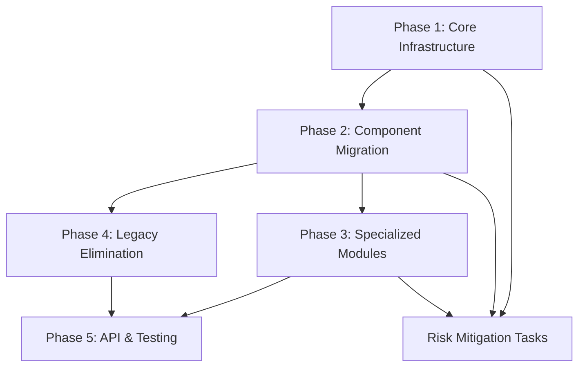

# OrcaFlex Module Refactoring Tasks

## Task Breakdown with Effort Estimates

### Phase 1: Core Infrastructure Setup (24 person-days)

#### Task 1.1: Create Core Framework Foundation (8 person-days)
**Priority**: Critical
**Dependencies**: None
**Effort**: 8 person-days

**Subtasks:**
- [ ] Design and implement core interfaces and protocols (2 days)
- [ ] Create abstract base classes for analyzers, processors, and extractors (2 days) 
- [ ] Implement component registry system with factory pattern (2 days)
- [ ] Create custom exception hierarchy for consistent error handling (1 day)
- [ ] Set up logging framework integration (1 day)

**Acceptance Criteria:**
- All core interfaces defined with comprehensive docstrings
- Component registry supports dynamic registration and discovery
- Exception hierarchy covers all major error scenarios
- Logging is consistent across all core components

---

#### Task 1.2: Implement Unified Configuration Management (6 person-days)
**Priority**: Critical
**Dependencies**: Task 1.1
**Effort**: 6 person-days

**Subtasks:**
- [ ] Design unified configuration schema with Pydantic models (2 days)
- [ ] Implement configuration loading from YAML with validation (1.5 days)
- [ ] Create legacy configuration conversion utilities (2 days)
- [ ] Implement configuration validation and error reporting (0.5 days)

**Acceptance Criteria:**
- Single configuration schema supports all analysis types
- Legacy configurations can be automatically converted
- Configuration validation provides clear error messages
- Schema is extensible for future enhancements

---

#### Task 1.3: Create OrcFxAPI Abstraction Layer (6 person-days)
**Priority**: Critical
**Dependencies**: Task 1.1
**Effort**: 6 person-days

**Subtasks:**
- [ ] Design model interface abstraction with error handling (2 days)
- [ ] Implement file loading and validation wrapper (1.5 days)
- [ ] Create static analysis execution wrapper (1.5 days)
- [ ] Implement dynamic simulation wrapper with progress tracking (1 day)

**Acceptance Criteria:**
- All OrcFxAPI calls wrapped with consistent error handling
- Model interface provides standardized result formats
- Progress tracking available for long-running operations
- License checking integrated into model interface

---

#### Task 1.4: Build Analysis Engine Framework (4 person-days)
**Priority**: Critical  
**Dependencies**: Tasks 1.1, 1.2, 1.3
**Effort**: 4 person-days

**Subtasks:**
- [ ] Create main analysis orchestrator class (1.5 days)
- [ ] Implement workflow base classes and interfaces (1 day)
- [ ] Create sequential and parallel execution runners (1.5 days)

**Acceptance Criteria:**
- Analysis engine can orchestrate complete workflows
- Supports both sequential and parallel execution modes
- Workflow base classes provide consistent interfaces
- Runner selection is configurable

### Phase 2: Component Migration (32 person-days)

#### Task 2.1: Migrate Preprocessing Components (8 person-days)
**Priority**: High
**Dependencies**: Phase 1 complete
**Effort**: 8 person-days

**Subtasks:**
- [ ] Consolidate file management functionality from multiple sources (3 days)
- [ ] Implement unified model setup and validation (2 days)
- [ ] Create data validation utilities (2 days) 
- [ ] Migrate `preprocess/load_vessel.py` functionality (1 day)

**Acceptance Criteria:**
- All file operations centralized in preprocessing module
- Model setup is consistent across all analysis types
- Data validation catches common input errors
- Legacy preprocessing functionality preserved

---

#### Task 2.2: Refactor Analysis Components (12 person-days)
**Priority**: High
**Dependencies**: Task 2.1
**Effort**: 12 person-days

**Subtasks:**
- [ ] Migrate `OrcaFlexCustomAnalysis` to new workflow framework (4 days)
- [ ] Refactor `OrcaflexAnalysis` router to use new engine (2 days)
- [ ] Create static analysis workflow implementation (2 days)
- [ ] Create dynamic analysis workflow implementation (2 days)
- [ ] Create iterative analysis workflow implementation (2 days)

**Acceptance Criteria:**
- All analysis classes use consistent interfaces
- Static, dynamic, and iterative workflows properly separated
- Router delegates to appropriate workflow based on configuration
- Performance maintained or improved

---

#### Task 2.3: Migrate Postprocessing Components (12 person-days)
**Priority**: High
**Dependencies**: Task 2.2
**Effort**: 12 person-days

**Subtasks:**
- [ ] Migrate summary extraction from `opp_summary.py` (3 days)
- [ ] Migrate time series extraction from `opp_time_series.py` (3 days)
- [ ] Migrate range graph extraction from `opp_range_graph.py` (2 days)
- [ ] Migrate linked statistics from `opp_linkedstatistics.py` (2 days)
- [ ] Create unified export system for CSV/Excel/reports (2 days)

**Acceptance Criteria:**
- All extraction functionality consolidated in postprocessing module
- Export system supports multiple formats consistently
- Parallel processing capabilities preserved and enhanced
- Legacy postprocessing results format maintained

### Phase 3: Specialized Module Organization (20 person-days)

#### Task 3.1: Organize Mooring Analysis Module (8 person-days)
**Priority**: Medium
**Dependencies**: Phase 2 complete
**Effort**: 8 person-days

**Subtasks:**
- [ ] Migrate existing mooring tension iteration system (3 days)
- [ ] Refactor `mooring.py` to use new framework (2 days)
- [ ] Create mooring-specific analysis workflows (2 days)
- [ ] Integrate with specialized module registry (1 day)

**Acceptance Criteria:**
- Mooring tension iteration fully functional in new structure
- Mooring analysis integrates with main analysis engine
- Specialized configuration schema for mooring analysis
- All existing mooring functionality preserved

---

#### Task 3.2: Organize Fatigue Analysis Module (6 person-days)
**Priority**: Medium
**Dependencies**: Phase 2 complete
**Effort**: 6 person-days

**Subtasks:**
- [ ] Migrate `orcaflex_fatigue_analysis.py` functionality (3 days)
- [ ] Clean up legacy `OrcaFlexAnalysis_Fatigue.py` code (1 day)
- [ ] Create fatigue-specific workflows (2 days)

**Acceptance Criteria:**
- Fatigue analysis properly modularized
- Legacy fatigue code eliminated
- Fatigue workflows integrated with main engine

---

#### Task 3.3: Organize Installation and Modal Analysis (6 person-days)
**Priority**: Medium  
**Dependencies**: Phase 2 complete
**Effort**: 6 person-days

**Subtasks:**
- [ ] Migrate `orcaflex_installation.py` functionality (2 days)
- [ ] Migrate `orcaflex_modal_analysis.py` functionality (2 days)
- [ ] Migrate umbilical analysis components (2 days)

**Acceptance Criteria:**
- Installation analysis properly modularized
- Modal analysis integrated with new framework
- Umbilical analysis components organized

### Phase 4: Legacy Code Elimination (12 person-days)

#### Task 4.1: Remove OrcaFlex_Post Directory (4 person-days)
**Priority**: High
**Dependencies**: Phase 2 complete
**Effort**: 4 person-days

**Subtasks:**
- [ ] Identify all dependencies on OrcaFlex_Post components (1 day)
- [ ] Update import statements and references (1.5 days)
- [ ] Remove obsolete files and directories (0.5 days)
- [ ] Update tests and documentation (1 day)

**Acceptance Criteria:**
- OrcaFlex_Post directory completely removed
- No remaining references to legacy components
- All functionality preserved in new structure

---

#### Task 4.2: Eliminate Duplicate Implementations (4 person-days)
**Priority**: High
**Dependencies**: Task 4.1
**Effort**: 4 person-days

**Subtasks:**
- [ ] Remove duplicate range graph processing code (1 day)
- [ ] Eliminate duplicate static analysis routines (1 day)
- [ ] Remove redundant file loading patterns (1 day)
- [ ] Clean up duplicate configuration handling (1 day)

**Acceptance Criteria:**
- No duplicate functionality across modules
- Single source of truth for each feature
- Code complexity significantly reduced

---

#### Task 4.3: Update Import Patterns (4 person-days)  
**Priority**: Medium
**Dependencies**: Task 4.2
**Effort**: 4 person-days

**Subtasks:**
- [ ] Standardize all import statements (2 days)
- [ ] Eliminate circular dependencies (1 day)
- [ ] Update global instantiations to dependency injection (1 day)

**Acceptance Criteria:**
- Consistent import patterns throughout module
- No circular dependencies
- Clear dependency relationships

### Phase 5: API Integration and Testing (20 person-days)

#### Task 5.1: Create Public API (6 person-days)
**Priority**: High
**Dependencies**: Phase 3 complete
**Effort**: 6 person-days

**Subtasks:**
- [ ] Design clean public API interfaces (2 days)
- [ ] Implement backward compatibility layer (2 days)
- [ ] Create comprehensive API documentation (2 days)

**Acceptance Criteria:**
- Public API is intuitive and consistent
- Backward compatibility maintained for all existing code
- API documentation is complete and accurate

---

#### Task 5.2: Develop Comprehensive Test Suite (10 person-days)
**Priority**: Critical
**Dependencies**: Task 5.1
**Effort**: 10 person-days

**Subtasks:**
- [ ] Create unit tests for core framework (3 days)
- [ ] Create integration tests for analysis workflows (3 days)
- [ ] Create performance benchmarking tests (2 days)
- [ ] Create regression tests for legacy compatibility (2 days)

**Acceptance Criteria:**
- Test coverage >90% for all new code
- All critical workflows have integration tests
- Performance benchmarks establish baseline metrics
- Regression tests ensure backward compatibility

---

#### Task 5.3: Performance Optimization and Validation (4 person-days)
**Priority**: High
**Dependencies**: Task 5.2
**Effort**: 4 person-days

**Subtasks:**
- [ ] Profile current vs new implementation performance (1 day)
- [ ] Optimize critical performance bottlenecks (2 days)
- [ ] Validate memory usage improvements (1 day)

**Acceptance Criteria:**
- Performance maintained or improved across all workflows
- Memory usage reduced by targeted amount
- No performance regressions introduced

## Risk Mitigation Tasks

### High-Priority Risk Mitigation

#### Risk Mitigation 1: Comprehensive Regression Testing (6 person-days)
**Addresses**: Backward compatibility breakage
**Effort**: 6 person-days

**Subtasks:**
- [ ] Create test suite using existing analysis configurations (2 days)
- [ ] Implement automated before/after result comparison (2 days)  
- [ ] Set up continuous integration for regression detection (2 days)

#### Risk Mitigation 2: Performance Monitoring Framework (4 person-days)
**Addresses**: Performance degradation
**Effort**: 4 person-days

**Subtasks:**
- [ ] Implement performance monitoring and alerting (2 days)
- [ ] Create performance dashboard for key metrics (2 days)

#### Risk Mitigation 3: Migration Documentation and Tools (8 person-days)
**Addresses**: Integration complexity and learning curve
**Effort**: 8 person-days

**Subtasks:**
- [ ] Create comprehensive migration guide (3 days)
- [ ] Develop automated migration tools (3 days)
- [ ] Create training materials and examples (2 days)

## Timeline Summary

| Phase | Duration | Critical Path Dependencies |
|-------|----------|----------------------------|
| Phase 1: Core Infrastructure | 3 weeks | Foundation for all subsequent work |
| Phase 2: Component Migration | 4 weeks | Depends on Phase 1 completion |
| Phase 3: Specialized Modules | 2.5 weeks | Can partially overlap with Phase 2 |
| Phase 4: Legacy Elimination | 1.5 weeks | Depends on Phase 2 completion |
| Phase 5: API & Testing | 2.5 weeks | Depends on Phase 3 completion |
| Risk Mitigation | 2.5 weeks | Can overlap with other phases |

**Total Estimated Effort**: 108 person-days (approximately 16 weeks with a team of 2 developers)

## Task Dependencies Diagram

## Resource Allocation

### Recommended Team Structure
- **Senior Python Developer (Lead)**: Architecture design, core framework, code review
- **Mid-Level Python Developer**: Component migration, testing, documentation
- **DevOps/Testing Specialist** (Part-time): CI/CD setup, performance testing, deployment

### Skill Requirements
- **Essential**: Python 3.8+, OrcaFlex/OrcFxAPI experience, software architecture
- **Preferred**: Pandas/NumPy, parallel processing, configuration management
- **Nice-to-have**: Domain knowledge in marine engineering, DevOps experience

## Success Tracking

### Weekly Milestones
- **Week 1-3**: Core framework complete, configuration system functional
- **Week 4-7**: Major components migrated, basic workflows operational
- **Week 8-10**: Specialized modules organized, legacy code removal begun
- **Week 11-13**: API finalized, comprehensive testing in progress
- **Week 14-16**: Performance validated, documentation complete, ready for production

### Quality Gates
- Each phase requires 90%+ test coverage before proceeding
- Performance benchmarks must meet or exceed baseline
- Code review required for all architectural components
- Documentation review required before phase completion

This task breakdown provides a structured approach to the OrcaFlex module refactoring while maintaining clear accountability, dependencies, and success criteria.