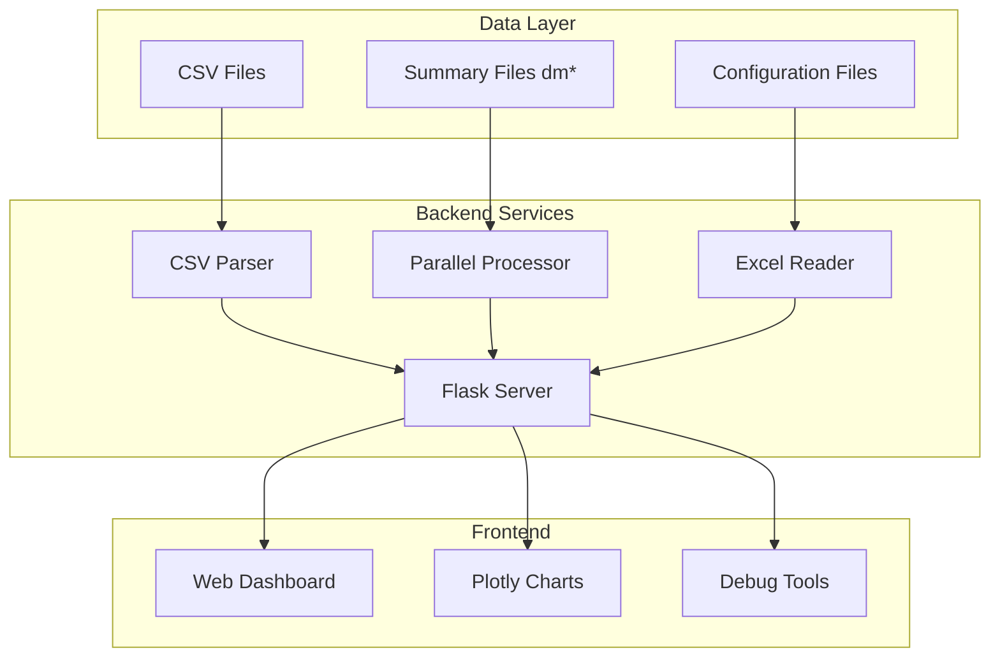

# OrcaFlex Results Dashboard Specification

> **Module**: `orcaflex/results-dashboard`  
> **Status**: Production Ready  
> **Priority**: High  
> **Updated**: 2025-08-12  

## Overview

The OrcaFlex Results Dashboard is a comprehensive web-based visualization system for marine engineering simulation results. It provides automatic identification of critical loading conditions, real-time data visualization, and intelligent file pattern recognition with parallel processing capabilities.

**Business Value**: Reduces analysis time from hours to seconds by automatically identifying worst-case scenarios with 1000x speed improvement through parallel processing.

## Quick Start

1. **Launch Dashboard**: Run `python src/modules/orcaflex-browser/orcaflex_data_server.py`
2. **Select Folder**: Choose analysis folder from dropdown
3. **Auto Analysis**: Click "Load Data (Auto Max Strut)" for instant max force identification
4. **View Results**: Interactive charts display automatically with max value highlights

## System Architecture



## Core Features

### 🎯 Automatic Maximum Force Identification
- **Smart Detection**: Uses `fe_filename` column for precise file matching
- **Parallel Processing**: 20-core processing handles 1000+ files in ~15 seconds
- **Instant Results**: Pre-calculated max values from `dm*strut_dyn.csv` files

### 📊 Real-time Visualization
- **Interactive Charts**: Plotly.js with maximum value highlighting
- **Auto-Configuration**: UI populates with worst-case parameters
- **Priority Display**: Charts ordered by structural importance

### 🔧 Manual Override
- **Parameter Adjustment**: Users can modify any configuration
- **Pattern Matching**: System updates file patterns automatically
- **Instant Refresh**: New data loads immediately on parameter change

## Performance Metrics

| Operation | Files | Time | Notes |
|-----------|-------|------|-------|
| Max Force ID | 952 | ~15s | 20-core parallel |
| Time Series Load | 47 | &lt;2s | Single configuration |
| Chart Render | 8 | &lt;1s | Plotly.js optimization |
| Folder Scan | 1000+ | &lt;3s | Directory listing |

## File Organization

```
specs/modules/orcaflex/results-dashboard/
├── README.md                    # This overview (current)
├── tasks.md                     # Implementation tasks
├── task_summary.md              # Task execution tracking
├── prompt.md                    # Original prompts and reuse
├── technical-details.md         # Deep technical documentation
└── sub-specs/                   # Component specifications
    ├── backend-api/
    ├── frontend-ui/
    ├── data-processing/
    └── deployment/
```

## Related Documentation

- **Technical Details**: [technical-details.md](./technical-details.md)
- **Implementation Tasks**: [tasks.md](./tasks.md)
- **Task Progress**: [task_summary.md](./task_summary.md)
- **Development History**: [prompt.md](./prompt.md)
- **Sub-Specifications**: [sub-specs/](./sub-specs/)

## Implementation Status

✅ **Core Dashboard**: Fully implemented with auto max-force detection  
✅ **Parallel Processing**: 20-core engine handles large datasets  
✅ **Interactive UI**: Complete web interface with real-time charts  
✅ **File Pattern Recognition**: Smart matching using fe_filename column  
✅ **Debug Tools**: Comprehensive monitoring and testing dashboard  

## Next Steps

- **Phase 2**: Real-time collaboration features
- **Phase 3**: Machine learning predictions and anomaly detection
- **Integration**: Enhanced reporting and export capabilities

---

*This specification consolidates all previous OrcaFlex Results Dashboard documentation into a single authoritative module following repository best practices.*