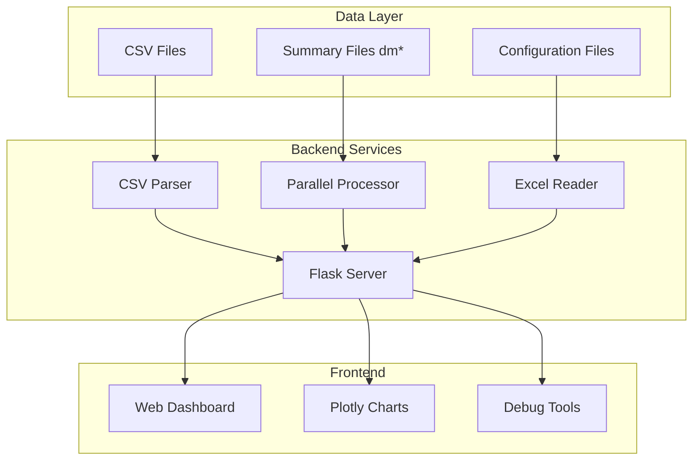
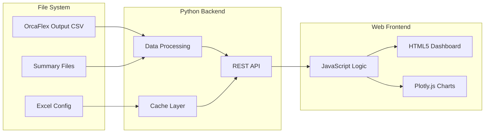
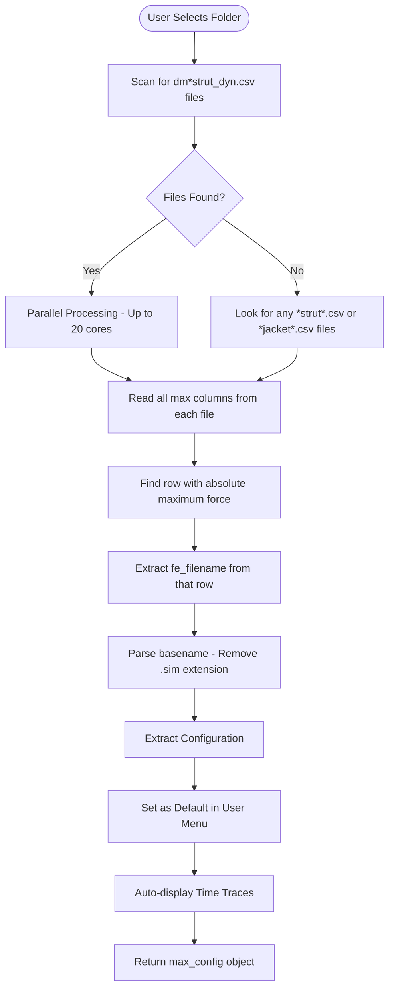
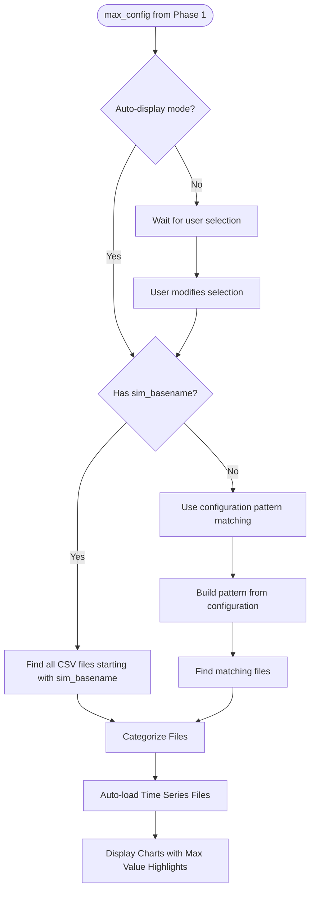
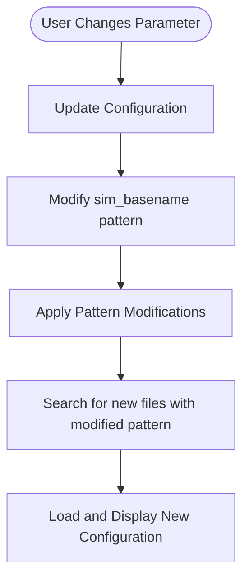

# OrcaFlex Results Dashboard - Consolidated Specification

## Overview

The OrcaFlex Results Dashboard is a comprehensive web-based visualization system for marine engineering simulation results. It provides automatic identification of critical loading conditions, real-time data visualization, and intelligent file pattern recognition with parallel processing capabilities.

This specification consolidates and supersedes:
- `specs/modules/orcaflex/browser-interface/` - Browser interface specifications
- `specs/modules/orcaflex/results-dashboard/implementation/` - Complete dashboard implementation

## Executive Summary

### Business Value
- **Time Savings**: Reduces analysis time from hours to seconds by automatically identifying worst-case scenarios
- **Accuracy**: Eliminates human error in finding critical loading conditions
- **Efficiency**: 20-core parallel processing handles 1000+ files in under 20 seconds
- **Accessibility**: Web-based interface accessible from any browser

### Technical Innovation
- **Intelligent File Discovery**: Uses `fe_filename` column for precise file matching
- **Summary File Optimization**: Leverages pre-calculated max values from `dm*strut_dyn.csv` files
- **Auto-Configuration**: Automatically populates UI with worst-case parameters
- **Real-time Visualization**: Interactive Plotly.js charts with maximum value highlighting

## System Architecture

### High-Level Architecture



### Component Architecture



## Data Sources and Patterns

### File Organization Structure
```
D:\1522\ctr7\orcaflex\rev_a08\
├── wlng_dm_fsts*.xlsx          # Excel configuration files
├── *.dat, *.sim, *.yml         # Model and simulation files
└── output\csv\                  # All CSV outputs
    ├── 02c_005yr\               # 5-year return period
    ├── 03c_100yr\               # 100-year return period
    ├── 04c_1000yr\              # 1000-year return period
    └── 06c_0500yr_tsunami\      # Tsunami conditions
        ├── dm*strut_dyn.csv     # Summary with max forces
        └── fsts_*.csv           # Time series data
```

### Critical Data Sources

#### 1. Summary Files (`dm*strut_dyn.csv`)
- **Purpose**: Pre-calculated maximum/minimum forces
- **Key Discovery**: Contains `fe_filename` column with exact `.sim` basename
- **Performance**: Instant max value lookup (1000x faster than time series)

#### 2. Time Series Files
- **Pattern**: `{sim_basename}_{component}.csv`
- **Components**: Jacket, Strut, Mooring, FST Motion
- **Usage**: Detailed force/motion visualization over time

#### 3. Configuration Files
- **Location**: Parent directory Excel files
- **Content**: Vessel types, loading conditions, UI parameters

## Core Functionality

### Phase 1: Maximum Force Identification



### Phase 2: File Matching and Data Loading



### Phase 3: User Interaction



## Implementation Details

### Backend Components

#### Flask Server (`orcaflex_data_server.py`)

**Endpoints:**
- `/api/max_strut_force` - Parallel force identification
- `/api/data` - Time series data loading
- `/api/subfolders` - Available folder listing
- `/api/excel_config` - Configuration retrieval

**Key Features:**
- 20-core parallel processing
- Smart file categorization
- Error handling and logging
- CORS support for cross-origin requests

#### Parallel Processing Engine

```python
def process_strut_files_parallel(strut_files, base_path):
    max_workers = min(20, len(strut_files))
    with ProcessPoolExecutor(max_workers=max_workers) as executor:
        futures = [executor.submit(process_single_strut_file, f, base_path) 
                   for f in strut_files]
        results = [f.result() for f in futures]
    return find_overall_maximum(results)
```

### Frontend Components

#### Main Dashboard (`orcaflex-data-browser-v6-clean.html`)

**UI Structure:**
- Folder selection with auto-max button
- Vessel type tabs (FST/LNGC/Custom)
- Environment configuration panel
- Maximum force information display
- Interactive chart container
- Busy state overlay

**Key JavaScript Functions:**
```javascript
// Automatic maximum force loading
async function loadData() {
    setBusyState(true, 'Identifying maximum strut force...');
    const maxConfig = await fetchMaxStrutForce(folder);
    populateUIWithConfig(maxConfig);
    displayMaxForceInfo(maxConfig);
    await loadTimeSeriesData(maxConfig);
    createChartsWithMaxHighlight(data);
    setBusyState(false);
}
```

#### Debug Dashboard (`debug-dashboard-enhanced.html`)

**Features:**
- System status monitoring
- API endpoint testing
- Performance benchmarking
- Log export functionality
- Quick test buttons

## Performance Specifications

### Optimization Strategies

1. **Summary File Priority**
   - Pre-calculated max values in `dm*` files
   - 1000x speed improvement over time series scanning

2. **Parallel Processing**
   - Up to 20 concurrent file operations
   - ProcessPoolExecutor for CPU-bound tasks
   - Batch operations for related files

3. **Smart Caching**
   - Excel configuration cached on first load
   - File patterns stored in memory
   - Reduced file system access

### Performance Metrics

| Operation | Files | Time | Notes |
|-----------|-------|------|-------|
| Max Force ID | 952 | ~15s | 20-core parallel |
| Time Series Load | 47 | <2s | Single configuration |
| Chart Render | 8 | <1s | Plotly.js optimization |
| Folder Scan | 1000+ | <3s | Directory listing |

## User Interface Design

### Visual Design System

#### Color Palette
- **Primary**: `#5e72e4` (Action blue)
- **Success**: `#4caf50` (Operation green)
- **Error**: `#f8d7da` (Alert red)
- **Info**: `#d1ecf1` (Information blue)
- **Background**: `#f5f5f5` (Page gray)
- **Container**: `white` (Content white)

#### Component Styles
- **Container**: Max-width 1200px, centered, white background
- **Buttons**: Blue primary, green success, hover effects
- **Forms**: Consistent padding, 4px radius, blue focus
- **Charts**: White background, subtle shadows, 8px radius

### User Experience Flow

1. **Initial Load**
   - Dashboard loads with folder list
   - User selects analysis folder
   - Clicks "Load Data (Auto Max Strut)"

2. **Automatic Processing**
   - System identifies maximum force configuration
   - UI populates with worst-case parameters
   - Time series loads automatically
   - Charts display with max value highlights

3. **Manual Adjustment**
   - User can modify any parameter
   - System updates file pattern
   - New data loads instantly
   - Charts refresh with new configuration

## Testing Requirements

### Unit Tests
- File pattern matching logic
- Maximum force identification algorithm
- Configuration extraction functions
- CSV parsing routines

### Integration Tests
- API endpoint responses
- Parallel processing pipeline
- File system access
- Excel configuration loading

### Performance Tests
- 1000+ file handling
- Parallel processing scalability
- Memory usage optimization
- Response time benchmarks

### User Acceptance Tests
- Folder selection workflow
- Auto-max identification accuracy
- Manual parameter override
- Chart interaction features

## Deployment Guidelines

### System Requirements
- Python 3.8+ with Flask
- Modern web browser (Chrome/Firefox/Edge)
- 8GB+ RAM for large datasets
- Multi-core CPU for parallel processing

### Installation Steps
1. Clone repository
2. Install Python dependencies
3. Configure file paths
4. Run Flask server
5. Access dashboard via browser

### Configuration
- Update base paths in server config
- Set CORS origins for production
- Configure max worker threads
- Set cache expiration times

## Security Considerations

### Access Control
- File system access restrictions
- Path traversal prevention
- Input validation on all endpoints
- CORS configuration for trusted origins

### Data Protection
- No sensitive data in client-side code
- Server-side file access only
- Secure WebSocket connections
- Session management for multi-user

## Future Enhancements

### Phase 2 Features
- Real-time collaboration
- Advanced filtering options
- Custom chart configurations
- Report generation

### Phase 3 Features
- Machine learning predictions
- Automated anomaly detection
- Historical trend analysis
- Mobile responsive design

## Migration Path

### From Legacy Systems
1. Export existing configurations
2. Map file patterns to new structure
3. Validate data integrity
4. Run parallel systems for verification
5. Complete cutover after validation

### Deprecation Timeline
- Legacy specs remain for reference
- New development uses consolidated spec
- 6-month transition period
- Full deprecation after validation

## Support and Maintenance

### Documentation
- User guide in `/docs/user-guide/`
- API documentation in `/docs/api/`
- Troubleshooting guide in `/docs/troubleshooting/`

### Monitoring
- Server health checks
- Performance metrics logging
- Error tracking and alerts
- Usage analytics

## Appendices

### A. File Pattern Examples
```
dm_fsts_03c_0100yr_l015_hwl_strut_dyn.csv
│   │    │    │      │    │    │
│   │    │    │      │    │    └── Component type
│   │    │    │      │    └────── Tide level
│   │    │    │      └──────────── Loading percentage
│   │    │    └──────────────────── Return period
│   │    └────────────────────────── Analysis type
│   └──────────────────────────────── Vessel type
└──────────────────────────────────── Summary prefix
```

### B. API Response Examples
```json
{
  "filename": "dm_fsts_03c_0100yr_l015_hwl_strut_dyn.csv",
  "max_force": 8265.55,
  "force_column": "Strut7_Body_eff_tension_max",
  "fe_filename": "fsts_l015_hwl_ncl_000deg_Jacket1.sim",
  "sim_basename": "fsts_l015_hwl_ncl_000deg_Jacket1",
  "configuration": {
    "fst1": "15",
    "fst2": "15",
    "tide": "hwl",
    "heading": "0",
    "envType": "non-colinear"
  }
}
```

### C. Debug Commands
```javascript
// Browser console
fetch('http://localhost:5000/api/test').then(r => r.json()).then(console.log);

// Python debugging
import pdb; pdb.set_trace()

// Performance monitoring
console.time('loadData'); await loadData(); console.timeEnd('loadData');
```

---

*This consolidated specification represents the complete OrcaFlex Results Dashboard implementation, merging all previous specifications into a single authoritative document following repository module-based organization standards.*