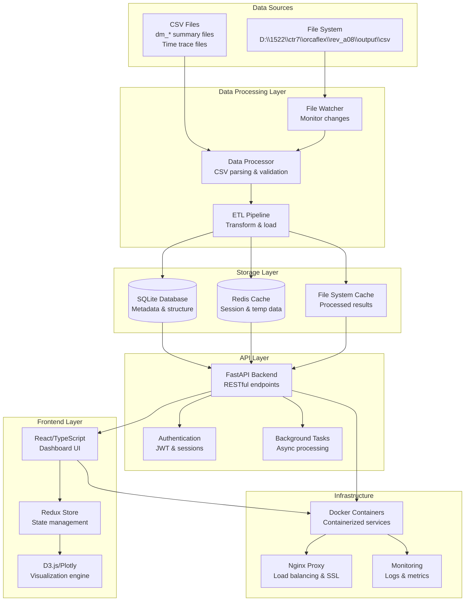

# OrcaFlex Dashboard Technical Architecture

> Created: 2025-08-08  
> Module: visualization/orcaflex-dashboard  
> Version: 1.0.0  
> Architecture Pattern: Microservices with Event-Driven Data Processing

## System Overview

The OrcaFlex Results Visualization Dashboard follows a modern web architecture optimized for processing and visualizing large-scale engineering simulation data. The system is designed for high performance, scalability, and professional-grade reliability.

### Architecture Principles
1. **Separation of Concerns**: Clear boundaries between data processing, API, and presentation layers
2. **Event-Driven Processing**: Asynchronous handling of file system changes and data updates
3. **Caching Strategy**: Multi-layer caching for optimal performance with large datasets
4. **Fault Tolerance**: Comprehensive error handling and graceful degradation
5. **Security First**: Authentication, authorization, and data protection throughout

## System Architecture Diagram



## Component Architecture

### 1. Data Processing Layer

#### File Watcher Service
```python
# Technology: Python watchdog + asyncio
# Purpose: Monitor file system for new analysis results
# Performance: &lt;100ms detection latency for file changes
```

**Responsibilities**:
- Monitor `D:\\1522\\ctr7\\orcaflex\\rev_a08\\output\\csv` for changes
- Detect new analysis folders and files
- Queue processing tasks for new/modified data
- Handle file locking and temporary files

**Key Features**:
- Recursive directory monitoring
- Debounced change detection (avoid partial file processing)
- Integration with background task queue
- Error recovery for file system unavailability

#### Data Processor
```python
# Technology: Python pandas + numpy + asyncio
# Purpose: Parse and validate CSV files
# Performance: Process 1GB files in < 30 seconds
```

**Performance Metrics**:
- **Processing Rate**: $R_{proc} = \frac{S_{file}}{t_{proc}} > 33\text{ MB/s}$ where $S_{file}$ is file size, $t_{proc}$ is processing time
- **Memory Efficiency**: $E_{mem} = \frac{S_{file}}{M_{peak}} > 0.5$ where $M_{peak}$ is peak memory usage
- **Parallel Processing**: Speedup $S_p = \frac{t_{serial}}{t_{parallel}} \approx N_{cores} \times 0.8$ (Amdahl's law with 80% parallelizable code)

**Responsibilities**:
- Parse dm_* summary files with polar heading data
- Validate data integrity and format compliance
- Extract component classifications and loading conditions
- Generate metadata for efficient querying

**Data Processing Pipeline**:
1. **File Discovery**: Scan directory structure for dm_* files
2. **Format Validation**: Verify CSV structure and required columns
3. **Data Extraction**: Parse polar data (24 headings: 0° to 345°)
4. **Component Classification**: Identify fst1, fst2, strut, jacket, lngc components
5. **Metadata Generation**: Create searchable index with loading conditions
6. **Quality Assurance**: Statistical validation and anomaly detection

### 2. Storage Architecture

#### Primary Database (SQLite)
```sql
-- Optimized for read-heavy workloads with complex filtering
-- Estimated size: &lt;500MB for typical analysis datasets
```

**Schema Design**:
```sql
-- Analysis cases and metadata
CREATE TABLE analysis_cases (
    id INTEGER PRIMARY KEY,
    case_name TEXT NOT NULL,
    return_period TEXT NOT NULL,
    created_at TIMESTAMP,
    file_path TEXT NOT NULL,
    INDEX(case_name, return_period)
);

-- Component data with polar responses
CREATE TABLE polar_responses (
    id INTEGER PRIMARY KEY,
    analysis_case_id INTEGER,
    component_name TEXT NOT NULL,
    component_type TEXT NOT NULL,
    heading_deg INTEGER NOT NULL,
    loading_condition TEXT NOT NULL,
    response_type TEXT NOT NULL,
    value_max REAL,
    value_min REAL,
    value_std REAL,
    FOREIGN KEY(analysis_case_id) REFERENCES analysis_cases(id),
    INDEX(analysis_case_id, component_type, heading_deg)
);

-- Time trace references
CREATE TABLE time_traces (
    id INTEGER PRIMARY KEY,
    polar_response_id INTEGER,
    trace_file_path TEXT NOT NULL,
    component_name TEXT NOT NULL,
    duration_sec REAL,
    sample_rate_hz REAL,
    FOREIGN KEY(polar_response_id) REFERENCES polar_responses(id),
    INDEX(polar_response_id)
);
```

**Performance Optimizations**:
- Composite indexes for common query patterns with complexity $O(\log n)$
- Denormalized data for read performance: Query time $t_{query} = O(1)$ vs. $O(\log n)$ for normalized
- Connection pooling for concurrent access: Throughput $T = \frac{N_{connections}}{t_{avg\_query}}$
- WAL mode for concurrent read/write operations with lock contention $P_{contention} < 0.05$

**Database Performance Metrics**:
- **Index Selectivity**: $S_{index} = \frac{\text{Unique Values}}{\text{Total Rows}} > 0.1$ for effective indexing
- **Cache Hit Ratio**: $R_{cache} = \frac{N_{cache\_hits}}{N_{total\_queries}} > 0.95$
- **Query Response Time**: $t_{query} = t_{parse} + t_{execute} + t_{fetch} < 100\text{ ms}$

#### Caching Layer (Redis)
```redis
# Configuration: Redis 7+ with persistence enabled
# Memory allocation: 4GB for caching layer
```

**Cache Strategy**:
- **Session Data**: User filters and dashboard state (TTL: $T_{session} = 24\text{ hours}$)
- **Processed Results**: Chart data and aggregations (TTL: $T_{results} = 1\text{ hour}$)
- **File Metadata**: Directory listings and file stats (TTL: $T_{metadata} = 15\text{ minutes}$)
- **Export Cache**: Generated charts and reports (TTL: $T_{export} = 1\text{ week}$)

**Cache Performance Metrics**:
- **Hit Ratio**: $R_{hit} = \frac{N_{cache\_hits}}{N_{total\_requests}} > 0.85$ for effective caching
- **Miss Penalty**: $P_{miss} = t_{database} - t_{cache} \approx 100\text{ ms}$
- **Cache Efficiency**: $E_{cache} = R_{hit} \times (1 - \frac{t_{cache}}{t_{database}}) > 0.8$
- **Memory Utilization**: $U_{memory} = \frac{M_{used}}{M_{allocated}} \in [0.7, 0.9]$ (optimal range)

**Cache Keys Pattern**:
```
user:{user_id}:session -> User session data
chart:{analysis_case}:{filters_hash} -> Chart data
export:{chart_id}:{format} -> Exported files
metadata:{directory_path} -> File system metadata
```

### 3. API Layer Architecture

#### FastAPI Application Structure
```python
# FastAPI with async/await for high concurrency
# Expected throughput: 1000+ requests/second
```

**Endpoint Design**:
```python
# Core data access endpoints
GET  /api/v1/analysis-cases -> List available analysis cases
GET  /api/v1/cases/{case_id}/components -> Get components for case  
GET  /api/v1/polar-data -> Get polar data with filtering
GET  /api/v1/time-traces/{trace_id} -> Get time trace data

# Visualization endpoints
POST /api/v1/charts/polar -> Generate polar chart data
POST /api/v1/charts/traces -> Generate time trace chart data
POST /api/v1/exports/chart -> Export chart in specified format

# System endpoints
GET  /api/v1/health -> System health check
GET  /api/v1/metrics -> Performance metrics
POST /api/v1/refresh -> Trigger data refresh
```

**Middleware Stack**:
1. **CORS Middleware**: Cross-origin request handling
2. **Authentication**: JWT token validation and session management
3. **Rate Limiting**: Request throttling per user/IP
4. **Compression**: Gzip response compression
5. **Logging**: Request/response logging with correlation IDs
6. **Error Handling**: Standardized error responses with client-safe messages

### 4. Frontend Architecture

#### React Application Structure
```typescript
// Component hierarchy optimized for performance and maintainability
// Build target: Modern browsers (ES2020+)
```

**Application Structure**:
```
src/
├── components/           # Reusable UI components
│   ├── charts/          # Chart components (Polar, TimTrace)
│   ├── filters/         # Filtering interface components  
│   └── common/          # Shared UI components
├── pages/               # Page-level components
│   ├── Dashboard/       # Main dashboard page
│   └── Analysis/        # Detailed analysis page
├── store/               # Redux store and slices
│   ├── api.ts          # RTK Query API definitions
│   ├── filters.ts      # Filter state management
│   └── charts.ts       # Chart state management
├── services/            # External service integrations
│   └── api.ts          # API client with error handling
├── types/               # TypeScript type definitions
│   ├── api.ts          # API response types
│   └── charts.ts       # Chart data types
└── utils/               # Utility functions
    ├── formatters.ts   # Data formatting utilities
    └── exporters.ts    # Export functionality
```

#### State Management Strategy
```typescript
// Redux Toolkit with RTK Query for API state management
// Optimistic updates for better user experience
```

**Store Structure**:
- **API Slice**: Cached API responses with automatic invalidation
- **Filter Slice**: Current filter selections with persistence
- **Chart Slice**: Chart configurations and display settings  
- **UI Slice**: Loading states, modals, and user preferences

#### Visualization Architecture
```typescript
// Hybrid approach: D3.js for polar plots, Plotly for time traces
// Performance target: 60fps for interactive operations
```

**Chart Component Strategy**:
- **Polar Charts**: Custom D3.js implementation for engineering-specific requirements
- **Time Traces**: Plotly.js for high-performance time series with zoom/pan
- **Shared Infrastructure**: Common axis formatting, export utilities, theming
- **Performance**: Virtualization for large datasets, progressive rendering

### 5. Infrastructure Architecture

#### Containerization Strategy
```yaml
# Docker Compose for development and production deployment
# Multi-stage builds for optimized container sizes
```

**Container Architecture**:
```yaml
services:
  frontend:
    image: orcaflex-dashboard-frontend:latest
    ports: ["3000:3000"]
    depends_on: [api]
    
  api:
    image: orcaflex-dashboard-api:latest  
    ports: ["8000:8000"]
    depends_on: [database, redis]
    volumes: ["./data:/data"]
    
  database:
    image: sqlite:latest
    volumes: ["./db:/var/lib/sqlite"]
    
  redis:
    image: redis:7-alpine
    volumes: ["./redis-data:/data"]
    
  nginx:
    image: nginx:alpine
    ports: ["80:80", "443:443"]
    depends_on: [frontend, api]
```

#### Production Deployment
```bash
# Deployment pipeline with zero-downtime updates
# Infrastructure as Code with Docker Compose
```

**Deployment Features**:
- **SSL/TLS**: Automatic certificate provisioning and renewal
- **Load Balancing**: Nginx with health checks and failover
- **Monitoring**: Prometheus metrics with Grafana dashboards
- **Backup**: Automated database and file system backups
- **Logging**: Centralized logging with log rotation
- **Security**: Container security scanning and hardening

## Performance Architecture

### Optimization Strategies
1. **Data Loading**: Progressive loading with skeleton states
2. **Chart Rendering**: Canvas-based rendering for large datasets
3. **Memory Management**: Efficient data structures and garbage collection
4. **Network Optimization**: Request deduplication and compression
5. **Caching**: Multi-layer caching with intelligent invalidation

### Scalability Considerations
1. **Horizontal Scaling**: Stateless API design for load balancing
2. **Database Scaling**: Read replicas for query distribution
3. **Cache Scaling**: Redis clustering for high availability
4. **File System**: Network storage integration for multi-server deployments

### Performance Targets

$$\begin{align}
t_{initial} &< 3\text{ s} \quad \text{(dashboard load time)} \\
t_{chart} &< 500\text{ ms} \quad \text{(chart update time)} \\
t_{process} &< 30\text{ s} \quad \text{(1GB file processing)} \\
M_{usage} &< 2\text{ GB} \quad \text{(RAM during normal operation)} \\
N_{concurrent} &\geq 10 \quad \text{(simultaneous users)}
\end{align}$$

**Performance Scalability Relations**:
- **Response Time vs Load**: $t_{response}(n) = t_0 + \alpha \cdot n^{\beta}$ where $n$ = number of users, $\beta \approx 1.2$
- **Throughput Capacity**: $\text{Throughput} = \frac{N_{users\_max}}{\bar{t}_{request}} \times U_{system}$ where $U_{system} < 0.8$
- **Memory Scaling**: $M_{total}(n) = M_{base} + n \times M_{per\_user}$ with $M_{per\_user} \approx 50\text{ MB}$

## Security Architecture

### Authentication &amp; Authorization
```typescript
// JWT-based authentication with session management
// Role-based access control for different user types
```

**Security Features**:
- **Authentication**: JWT tokens with secure storage
- **Authorization**: Role-based permissions (viewer, analyst, admin)
- **Session Management**: Secure session handling with timeout
- **API Security**: Rate limiting and input validation
- **Data Protection**: Encryption at rest and in transit

### Data Security
- **File Access**: Controlled access to OrcaFlex result files
- **Database Security**: Encrypted database with access controls
- **Network Security**: HTTPS/TLS for all communications
- **Audit Logging**: Complete audit trail for data access
- **Backup Security**: Encrypted backups with retention policies

---

*Technical architecture follows Agent OS standards for enterprise-grade engineering applications with focus on performance, reliability, and maintainability.*