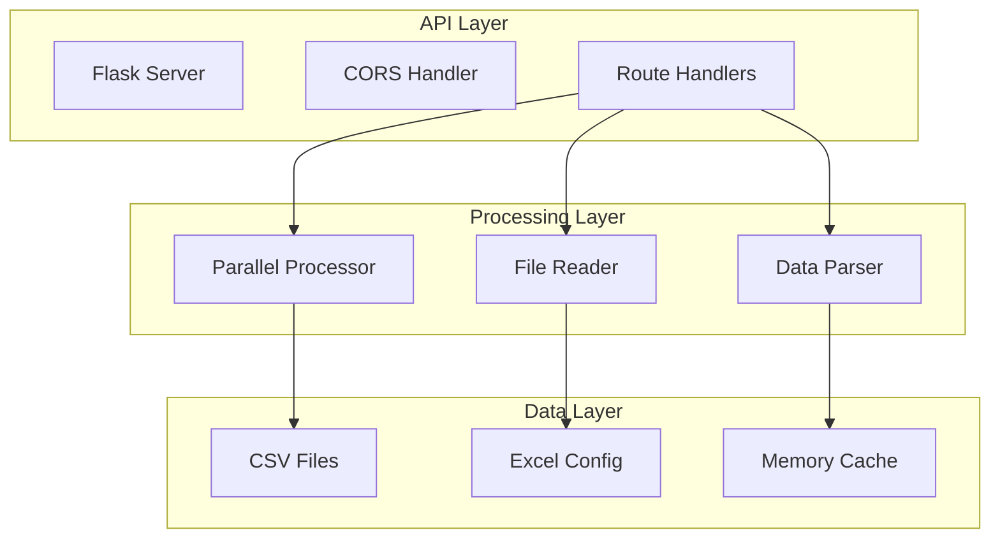

# Backend API Specification

> **Module**: `orcaflex/results-dashboard/backend-api`  
> **Type**: Component Specification  
> **Updated**: 2025-08-12  

## Overview

The Backend API component provides REST endpoints for the OrcaFlex Results Dashboard, handling file processing, data analysis, and configuration management.

## Core Architecture



## REST Endpoints

### `/api/max_strut_force`
**Method**: GET  
**Parameters**: `subfolder` (string)  
**Purpose**: Identify maximum force configuration using parallel processing

**Response**:
```json
{
  "success": true,
  "data": {
    "filename": "dm_fsts_03c_0100yr_l015_hwl_strut_dyn.csv",
    "max_force": 8265.55,
    "force_column": "Strut7_Body_eff_tension_max",
    "fe_filename": "fsts_l015_hwl_ncl_000deg_Jacket1.sim",
    "sim_basename": "fsts_l015_hwl_ncl_000deg_Jacket1",
    "configuration": {
      "fst1": "15",
      "fst2": "15", 
      "tide": "hwl",
      "heading": "0",
      "envType": "non-colinear"
    },
    "processing_time": 14.7,
    "files_processed": 238
  }
}
```

### `/api/data`  
**Method**: GET  
**Parameters**: Configuration object with vessel/environment settings  
**Purpose**: Load time series data for specified configuration

**Response**:
```json
{
  "success": true,
  "data": {
    "time": [0.0, 0.1, 0.2, ...],
    "categories": {
      "jacket_forces": {...},
      "strut_forces": {...},
      "mooring_tensions": {...},
      "vessel_motion": {...}
    },
    "files_loaded": 47,
    "load_time": 1.8
  }
}
```

### `/api/subfolders`
**Method**: GET  
**Purpose**: List available analysis folders

**Response**:
```json
{
  "success": true,
  "data": {
    "folders": ["02c_005yr", "03c_100yr", "04c_1000yr", "06c_0500yr_tsunami"],
    "base_path": "D:\\1522\\ctr7\\orcaflex\\rev_a08\\output\\csv\\"
  }
}
```

### `/api/excel_config`
**Method**: GET  
**Purpose**: Return vessel configuration from Excel files

**Response**:
```json
{
  "success": true,
  "data": {
    "vessel_types": ["FST", "LNGC"],
    "fst_config": {
      "loadings": ["15", "95"],
      "mooring_states": ["intact", "damaged"]
    },
    "lngc_config": {
      "capacities": ["125000", "180000"],
      "loadings": ["10", "50", "95"]
    }
  }
}
```

## Performance Specifications

- **Parallel Processing**: 20-core maximum for optimal throughput
- **Response Time**: &lt;3 seconds for max force identification  
- **Memory Usage**: &lt;1GB RAM for large datasets
- **File Throughput**: 1000+ files in &lt;20 seconds

## Error Handling

All endpoints return consistent error format:
```json
{
  "success": false,
  "error": {
    "message": "No strut files found in specified folder",
    "code": "NO_STRUT_FILES",
    "details": {
      "folder": "03c_100yr",
      "files_scanned": 1247
    }
  }
}
```

## Security Features

- Path validation and sanitization
- CORS configuration for production
- Input validation on all parameters
- No sensitive data in responses