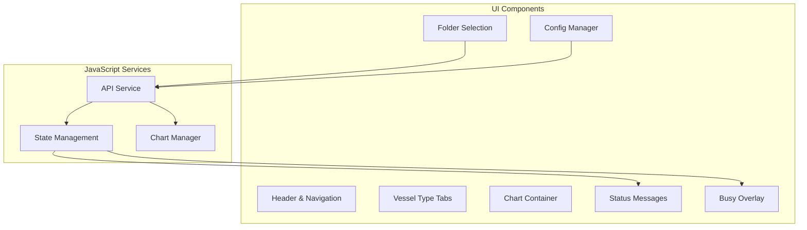

# Frontend UI Specification

> **Module**: `orcaflex/results-dashboard/frontend-ui`  
> **Type**: Component Specification  
> **Updated**: 2025-08-12  

## Overview

The Frontend UI component provides an interactive web dashboard for OrcaFlex data visualization with automatic configuration and real-time chart updates.

## Component Architecture



## UI Components

### Header Section
- Application title and branding
- Action buttons (Refresh, Clear)
- System status indicator

### Folder Selection Panel
```html
<div class="folder-selection">
    <select id="subfolderSelect">
        <option value="">Select Analysis Folder...</option>
        <!-- Populated dynamically -->
    </select>
    <button onclick="loadData()" class="btn-primary">
        Load Data (Auto Max Strut)
    </button>
    <button onclick="refreshAll()" class="btn-secondary">Refresh</button>
    <button onclick="clearCharts()" class="btn-secondary">Clear</button>
</div>
```

### Vessel Configuration Tabs
#### FST Tab
- FST1 Loading: 15% or 95% LNG
- FST2 Loading: 15% or 95% LNG  
- Mooring Status: Intact or Damaged

#### LNGC Tab
- Vessel Capacity: 125,000 m³ or 180,000 m³
- Loading Condition: Ballast (10%), Partial (50%), Laden (95%)
- Berthing Side: Port or Starboard

#### Custom Tab
- Free text input for custom file patterns

### Environment Configuration
```html
<div class="environment-config">
    <div class="config-row">
        <label>Environment Type:</label>
        <select id="envType">
            <option value="colinear">Colinear</option>
            <option value="non-colinear">Non-colinear</option>
        </select>
    </div>
    <div class="config-row">
        <label>Tide Level:</label>
        <select id="tideLevel">
            <option value="hwl">HWL</option>
            <option value="mwl">MWL</option>
            <option value="lwl">LWL</option>
        </select>
    </div>
    <div class="config-row">
        <label>Environment Heading:</label>
        <select id="envHeading">
            <option value="0">0°</option>
            <option value="45">45°</option>
            <option value="90">90°</option>
            <!-- ... other angles -->
        </select>
    </div>
</div>
```

### Maximum Force Information Panel
Displays when auto-max is identified:
```html
<div id="maxForceInfo" class="max-force-info">
    <h3>📊 Maximum Strut Force Configuration Identified</h3>
    <div class="info-grid">
        <div class="info-item">
            <strong>Selected File:</strong>
            <span class="filename-highlight">dm_fsts_03c_0100yr_l015_hwl_strut_dyn.csv</span>
        </div>
        <div class="info-item">
            <strong>Max Force:</strong>
            <span class="force-value">8265.55 N</span>
        </div>
        <div class="info-item">
            <strong>Processing Time:</strong>
            <span>14.7 seconds</span>
        </div>
    </div>
</div>
```

### Chart Display System
Charts organized by priority:
1. **Jacket Forces** (highest priority)
2. **FST1 Strut Forces** (Struts 1-4)
3. **FST2 Strut Forces** (Struts 5-8)
4. **Mooring Line Tensions**
5. **Vessel Motion**

#### Chart Features
- Plotly.js interactive visualization
- Red star markers for maximum values
- Hover tooltips with detailed information
- Annotations showing peak values
- Responsive sizing and layout

```html
<div class="chart-wrapper">
    <div id="chart-jacket-forces" class="chart-container"></div>
    <div class="chart-title">Jacket Forces</div>
</div>
```

## CSS Design System

### Color Palette
```css
:root {
    --primary-blue: #5e72e4;
    --success-green: #4caf50;
    --error-red: #f8d7da;
    --info-blue: #d1ecf1;
    --background-gray: #f5f5f5;
    --container-white: white;
    --border-gray: #e0e0e0;
}
```

### Component Styles

#### Container Layout
```css
.container {
    max-width: 1200px;
    margin: 0 auto;
    background: var(--container-white);
    border-radius: 8px;
    padding: 30px;
    box-shadow: 0 2px 10px rgba(0, 0, 0, 0.08);
}
```

#### Button Standards
```css
.btn-primary {
    background: var(--primary-blue);
    color: white;
    border: none;
    padding: 8px 16px;
    border-radius: 4px;
    cursor: pointer;
    transition: all 0.2s ease;
}

.btn-primary:hover {
    transform: translateY(-1px);
    box-shadow: 0 4px 8px rgba(0, 0, 0, 0.15);
}
```

#### Chart Wrapper
```css
.chart-wrapper {
    background: var(--container-white);
    border-radius: 8px;
    padding: 20px;
    margin-bottom: 20px;
    box-shadow: 0 2px 8px rgba(0, 0, 0, 0.05);
}
```

## JavaScript Architecture

### Core Functions

#### Auto-Configuration Loading
```javascript
async function loadData() {
    setBusyState(true, 'Identifying maximum strut force...');
    
    try {
        const maxConfig = await fetchMaxStrutForce(selectedFolder);
        populateUIWithConfig(maxConfig);
        displayMaxForceInfo(maxConfig);
        await loadTimeSeriesData(maxConfig);
        createChartsWithMaxHighlight(data);
    } finally {
        setBusyState(false);
    }
}
```

#### UI Population from Max Config
```javascript
function populateUIWithConfig(maxConfig) {
    const config = maxConfig.configuration;
    
    // Set vessel parameters
    if (config.fst1) document.getElementById('fst1Loading').value = config.fst1;
    if (config.fst2) document.getElementById('fst2Loading').value = config.fst2;
    
    // Set environment parameters  
    if (config.tide) document.getElementById('tideLevel').value = config.tide;
    if (config.heading) document.getElementById('envHeading').value = config.heading;
    if (config.envType) document.getElementById('envType').value = config.envType;
}
```

#### Chart Creation with Max Highlighting
```javascript
function createChart(title, time, dataDict, divId) {
    const traces = [];
    let globalMax = -Infinity;
    let maxPoint = null;
    
    // Create data traces
    for (const [key, values] of Object.entries(dataDict)) {
        traces.push({
            x: time,
            y: values,
            name: key,
            type: 'scatter',
            mode: 'lines'
        });
        
        // Find maximum absolute value
        const maxValue = Math.max(...values.map(Math.abs));
        if (maxValue > Math.abs(globalMax)) {
            globalMax = maxValue;
            const maxIndex = values.findIndex(v => Math.abs(v) === maxValue);
            maxPoint = { x: time[maxIndex], y: values[maxIndex], series: key };
        }
    }
    
    // Add maximum value marker
    if (maxPoint) {
        traces.push({
            x: [maxPoint.x],
            y: [maxPoint.y],
            mode: 'markers',
            marker: { symbol: 'star', size: 15, color: 'red' },
            name: `Max: ${maxPoint.y.toFixed(2)}`,
            showlegend: true
        });
    }
    
    // Create layout with annotation
    const layout = {
        title: title,
        xaxis: { title: 'Time (s)' },
        yaxis: { title: 'Force/Motion' },
        annotations: maxPoint ? [{
            x: maxPoint.x,
            y: maxPoint.y,
            text: `Max: ${maxPoint.y.toFixed(2)}`,
            showarrow: true
        }] : []
    };
    
    Plotly.newPlot(divId, traces, layout);
}
```

#### State Management
```javascript
function setBusyState(busy, message = '') {
    const overlay = document.getElementById('busyOverlay');
    const messageElement = document.getElementById('busyMessage');
    
    if (busy) {
        overlay.style.display = 'flex';
        messageElement.textContent = message;
        disableAllButtons(true);
    } else {
        overlay.style.display = 'none';
        disableAllButtons(false);
    }
}
```

## User Experience Flow

1. **Initial Load**: Dashboard loads with folder dropdown populated
2. **Folder Selection**: User selects analysis folder  
3. **Auto-Max Loading**: Click "Load Data (Auto Max Strut)" button
4. **Processing**: Busy overlay shows progress
5. **Configuration**: UI auto-populates with max force parameters
6. **Visualization**: Charts display with max value highlights
7. **Manual Override**: User can modify any parameter for instant updates

## Responsive Design

### Breakpoints
- **Desktop**: 1200px+ (full layout)
- **Tablet**: 768px-1199px (stacked components)  
- **Mobile**: &lt;768px (single column, touch-optimized)

### Mobile Optimizations
- Touch-friendly button sizes (44px minimum)
- Simplified navigation for small screens
- Optimized chart rendering for touch interaction
- Responsive text sizing and spacing

## Performance Considerations

- **Chart Rendering**: Plotly.js optimized for large datasets
- **DOM Updates**: Minimize reflows during UI updates
- **Memory Management**: Proper cleanup of chart instances
- **API Calls**: Debounced parameter changes to reduce server load
- **Loading States**: Immediate visual feedback for all operations