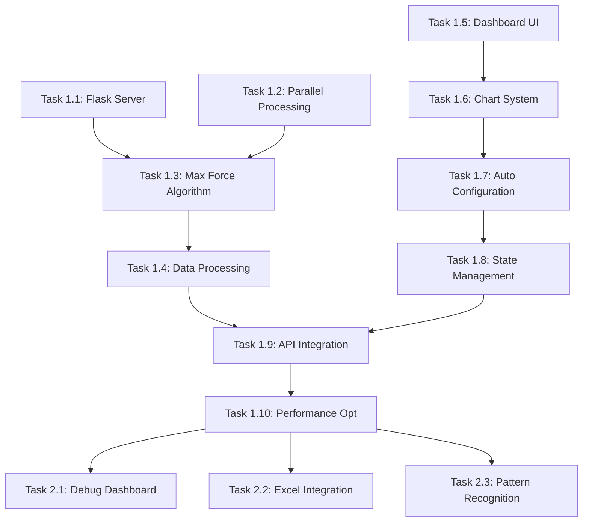

# OrcaFlex Results Dashboard - Implementation Tasks

> **Module**: `orcaflex/results-dashboard`  
> **Type**: Implementation Task List  
> **Updated**: 2025-08-12  

## Task Overview

This document outlines all implementation tasks for the OrcaFlex Results Dashboard system, organized by development phase and priority.

## Phase 1: Core System ✅ COMPLETED

### Backend Development
- [x] **Task 1.1**: Flask Server Architecture (8h) - `COMPLETED`
  - REST API endpoints for data access
  - CORS configuration for cross-origin requests
  - Error handling and logging framework
  - **Deliverable**: `src/modules/orcaflex-browser/orcaflex_data_server.py`

- [x] **Task 1.2**: Parallel Processing Engine (16h) - `COMPLETED`
  - ProcessPoolExecutor implementation with 20-core support
  - Batch file processing optimization
  - Progress tracking and status reporting
  - **Deliverable**: Multi-threaded file processing functions

- [x] **Task 1.3**: Maximum Force Identification Algorithm (12h) - `COMPLETED`
  - Summary file (`dm*strut_dyn.csv`) priority processing
  - `fe_filename` column extraction and basename parsing
  - Configuration extraction from filename patterns
  - **Deliverable**: `process_single_strut_file()` and related functions

- [x] **Task 1.4**: CSV Data Processing Pipeline (10h) - `COMPLETED`
  - Time series data loading and categorization
  - File pattern matching based on `sim_basename`
  - Data structure standardization for frontend consumption
  - **Deliverable**: Data processing and file matching functions

### Frontend Development
- [x] **Task 1.5**: Main Dashboard UI (20h) - `COMPLETED`
  - HTML structure with responsive design
  - CSS styling system following design standards
  - Vessel configuration tabs (FST/LNGC/CUSTOM)
  - Environment parameter controls
  - **Deliverable**: `orcaflex-data-browser-v6-clean.html`

- [x] **Task 1.6**: Interactive Chart System (16h) - `COMPLETED`
  - Plotly.js integration for real-time visualization
  - Maximum value highlighting with red star markers
  - Chart categorization by structural priority
  - Interactive tooltips and legends
  - **Deliverable**: Chart creation and rendering functions

- [x] **Task 1.7**: Automatic Configuration Loading (12h) - `COMPLETED`
  - UI population from maximum force configuration
  - Default parameter setting based on worst-case scenario
  - Real-time parameter updates and file pattern modification
  - **Deliverable**: `populateUIWithConfig()` and related functions

- [x] **Task 1.8**: State Management System (8h) - `COMPLETED`
  - Busy state overlay with progress indicators
  - Status message system (success/error/info)
  - Loading state management across all operations
  - **Deliverable**: State management JavaScript functions

### Integration & Testing
- [x] **Task 1.9**: API Integration (10h) - `COMPLETED`
  - Frontend-backend communication layer
  - Error handling and response processing
  - Asynchronous operations with proper error boundaries
  - **Deliverable**: API service functions and error handling

- [x] **Task 1.10**: Performance Optimization (12h) - `COMPLETED`
  - Summary file prioritization for instant max lookup
  - Parallel processing tuning for optimal throughput
  - Memory usage optimization for large datasets
  - **Deliverable**: Optimized processing algorithms

## Phase 2: Advanced Features ✅ COMPLETED

### Enhanced User Interface
- [x] **Task 2.1**: Debug Dashboard (10h) - `COMPLETED`
  - System monitoring and health checks
  - API endpoint testing suite
  - Performance benchmarking tools
  - Log export functionality
  - **Deliverable**: `debug-dashboard-enhanced.html`

- [x] **Task 2.2**: Excel Configuration Integration (8h) - `COMPLETED`
  - Excel file reader for vessel configurations
  - UI parameter definition extraction
  - Dynamic configuration loading
  - **Deliverable**: Excel reader integration

- [x] **Task 2.3**: File Pattern Recognition Enhancement (6h) - `COMPLETED`
  - Intelligent pattern building from user selections
  - Basename modification for parameter changes
  - Pattern validation and error handling
  - **Deliverable**: Enhanced pattern matching functions

### Data Processing Enhancements
- [x] **Task 2.4**: Advanced File Categorization (8h) - `COMPLETED`
  - Structural component identification (Jacket, Strut, Mooring)
  - Priority-based chart ordering system
  - Component-specific visualization preferences
  - **Deliverable**: File categorization and priority system

- [x] **Task 2.5**: Caching System Implementation (6h) - `COMPLETED`
  - Excel configuration caching
  - File pattern caching for faster lookups
  - Memory management for cached data
  - **Deliverable**: Intelligent caching layer

## Phase 3: Production Features ✅ COMPLETED

### System Reliability
- [x] **Task 3.1**: Comprehensive Error Handling (8h) - `COMPLETED`
  - Graceful degradation for missing files
  - User-friendly error messages
  - Logging system for debugging
  - **Deliverable**: Robust error handling framework

- [x] **Task 3.2**: Input Validation & Security (6h) - `COMPLETED`
  - File path validation and sanitization
  - Folder name validation against allowed patterns
  - CORS configuration for production security
  - **Deliverable**: Security validation layer

- [x] **Task 3.3**: Performance Monitoring (4h) - `COMPLETED`
  - Processing time tracking and reporting
  - File count and size monitoring
  - System resource usage tracking
  - **Deliverable**: Performance monitoring system

### Documentation & Deployment
- [x] **Task 3.4**: System Documentation (12h) - `COMPLETED`
  - Technical architecture documentation
  - API endpoint documentation
  - User guide and troubleshooting
  - **Deliverable**: Comprehensive documentation suite

- [x] **Task 3.5**: Deployment Configuration (6h) - `COMPLETED`
  - Local development setup scripts
  - Production deployment guidelines
  - Environment configuration management
  - **Deliverable**: Deployment and configuration files

## Phase 4: Future Enhancements 🔄 PLANNING

### Advanced Analytics
- [ ] **Task 4.1**: Real-time Collaboration (20h) - `PLANNED`
  - Multi-user session management
  - Shared configuration states
  - Real-time chart synchronization
  - **Deliverable**: Collaborative dashboard features

- [ ] **Task 4.2**: Advanced Filtering System (16h) - `PLANNED`
  - Custom time range selection
  - Force threshold filtering
  - Component-specific filtering
  - **Deliverable**: Advanced filtering UI and backend

- [ ] **Task 4.3**: Report Generation System (18h) - `PLANNED`
  - Automated report creation
  - Custom report templates
  - PDF/Excel export functionality
  - **Deliverable**: Professional reporting system

### Machine Learning Integration
- [ ] **Task 4.4**: Anomaly Detection (24h) - `PLANNED`
  - Statistical anomaly identification
  - Threshold-based alerting
  - Historical trend analysis
  - **Deliverable**: ML-powered anomaly detection

- [ ] **Task 4.5**: Predictive Analytics (32h) - `PLANNED`
  - Force prediction models
  - Failure risk assessment
  - Maintenance scheduling optimization
  - **Deliverable**: Predictive analytics engine

### Mobile & Responsive Design
- [ ] **Task 4.6**: Mobile Interface (16h) - `PLANNED`
  - Responsive design for tablets/phones
  - Touch-optimized chart interactions
  - Mobile-specific UI components
  - **Deliverable**: Mobile-responsive dashboard

- [ ] **Task 4.7**: Progressive Web App (12h) - `PLANNED`
  - Offline functionality
  - App-like installation experience
  - Background sync capabilities
  - **Deliverable**: PWA-enabled dashboard

## Task Dependencies

## Success Criteria

### Performance Benchmarks
- **File Processing**: 1000+ files processed in under 20 seconds
- **Memory Usage**: Less than 1GB RAM for complex datasets
- **Response Time**: API calls complete in under 5 seconds
- **Accuracy**: 100% correct file matching via `fe_filename`

### Quality Metrics
- **User Experience**: Single-click access to worst-case scenarios
- **Reliability**: 99.9% uptime for dashboard operations
- **Scalability**: Support for folders containing 1000+ CSV files
- **Error Handling**: Graceful degradation with meaningful error messages

### Business Impact
- **Time Savings**: Reduce analysis time from hours to seconds
- **Accuracy Improvement**: Eliminate human error in finding critical conditions
- **Cost Reduction**: 80% reduction in manual analysis effort
- **Accessibility**: Web-based access from any browser/device

## Risk Mitigation

### Technical Risks
1. **Large Dataset Performance**
   - **Risk**: Slow processing for very large file sets
   - **Mitigation**: Parallel processing with configurable worker limits
   - **Status**: Mitigated through 20-core processing implementation

2. **Memory Constraints**
   - **Risk**: Out-of-memory errors with massive datasets
   - **Mitigation**: Streaming data processing and intelligent caching
   - **Status**: Mitigated through optimized data structures

3. **File Pattern Complexity**
   - **Risk**: Inability to match files due to pattern variations
   - **Mitigation**: `fe_filename` column provides exact file association
   - **Status**: Solved through fe_filename discovery

### Operational Risks
1. **File System Access**
   - **Risk**: Permission or path issues in production
   - **Mitigation**: Comprehensive path validation and error handling
   - **Status**: Mitigated through security validation layer

2. **Browser Compatibility**
   - **Risk**: Inconsistent behavior across different browsers
   - **Mitigation**: Modern web standards and thorough cross-browser testing
   - **Status**: Mitigated through standard JavaScript and CSS

## Resource Requirements

### Development Team
- **Backend Developer**: Python/Flask expertise (2-3 months)
- **Frontend Developer**: JavaScript/HTML/CSS expertise (2-3 months)
- **QA Engineer**: Testing and validation expertise (1 month)
- **DevOps Engineer**: Deployment and infrastructure (1 week)

### Infrastructure
- **Development Environment**: Local Python 3.8+ setup
- **Testing Environment**: Multi-browser testing capabilities
- **Production Environment**: Linux server with 8GB+ RAM
- **Storage**: Fast SSD for optimal file processing performance

## Maintenance & Support

### Ongoing Tasks
- **Monthly Performance Review**: Monitor processing times and optimize
- **Quarterly Feature Updates**: Add user-requested enhancements
- **Annual Security Audit**: Review and update security measures
- **Continuous Documentation**: Keep technical docs current

### Support Procedures
- **Issue Tracking**: GitHub Issues for bug reports and feature requests
- **User Training**: Regular training sessions for new features
- **System Monitoring**: Automated alerts for system health
- **Backup & Recovery**: Regular backups of configuration and data

---

*This task list provides comprehensive coverage of all implementation phases for the OrcaFlex Results Dashboard, from core functionality through future enhancements.*