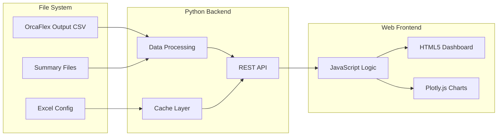
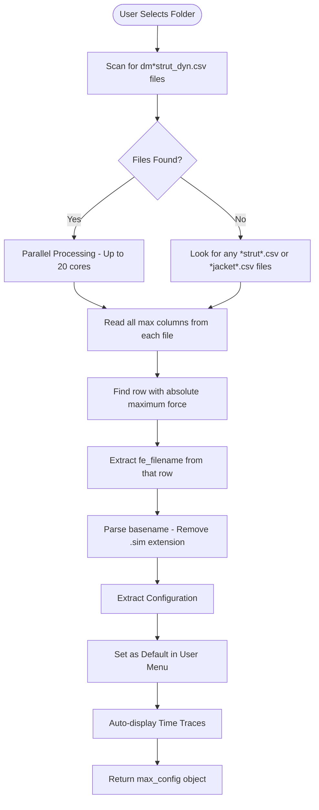

# OrcaFlex Results Dashboard - Technical Details

> **Module**: `orcaflex/results-dashboard`  
> **Type**: Technical Implementation Specification  
> **Updated**: 2025-08-12  

## System Architecture

### High-Level Component Architecture



### Data Flow Architecture



## Data Sources and File Patterns

### File Organization Structure
```
D:\1522\ctr7\orcaflex\rev_a08\
├── wlng_dm_fsts*.xlsx          # Excel configuration files
├── *.dat, *.sim, *.yml         # Model and simulation files
└── output\csv\                  # All CSV outputs
    ├── 02c_005yr\               # 5-year return period
    ├── 03c_100yr\               # 100-year return period
    ├── 04c_1000yr\              # 1000-year return period
    └── 06c_0500yr_tsunami\      # Tsunami conditions
        ├── dm*strut_dyn.csv     # Summary with max forces
        └── fsts_*.csv           # Time series data
```

### Critical Data Sources

#### 1. Summary Files (`dm*strut_dyn.csv`)
- **Purpose**: Pre-calculated maximum/minimum forces
- **Key Discovery**: Contains `fe_filename` column with exact `.sim` basename
- **Performance**: Instant max value lookup (1000x faster than time series)
- **Structure**: Each row represents a complete simulation run

#### 2. Time Series Files
- **Pattern**: `{sim_basename}_{component}.csv`
- **Components**: Jacket, Strut, Mooring, FST Motion
- **Usage**: Detailed force/motion visualization over time

#### 3. Configuration Files
- **Location**: Parent directory Excel files
- **Content**: Vessel types, loading conditions, UI parameters

### File Naming Pattern Analysis
```
dm_fsts_03c_0100yr_l015_hwl_strut_dyn.csv
│   │    │    │      │    │    │
│   │    │    │      │    │    └── Component type
│   │    │    │      │    └────── Tide level
│   │    │    │      └──────────── Loading percentage
│   │    │    └──────────────────── Return period
│   │    └────────────────────────── Analysis type
│   └──────────────────────────────── Vessel type
└──────────────────────────────────── Summary prefix
```

## Backend Implementation

### Flask Server Architecture (`orcaflex_data_server.py`)

#### Core Endpoints

**`/api/max_strut_force`** - Maximum Force Identification
```python
@app.route('/api/max_strut_force')
def api_max_strut_force():
    """
    Parallel processing endpoint that:
    1. Scans for dm*strut_dyn.csv files
    2. Processes files in parallel (up to 20 cores)
    3. Finds maximum absolute force across all files
    4. Extracts fe_filename and configuration
    5. Returns max_config object for UI population
    """
```

**`/api/data`** - Time Series Data Loading
```python
@app.route('/api/data')
def api_data():
    """
    Data loading endpoint that:
    1. Accepts configuration parameters
    2. Builds file patterns from sim_basename
    3. Loads and categorizes CSV files
    4. Returns structured time series data
    """
```

**`/api/subfolders`** - Available Folder Listing
```python
@app.route('/api/subfolders')
def api_subfolders():
    """
    Folder scanning endpoint that:
    1. Lists all available analysis folders
    2. Returns folder names for dropdown population
    """
```

**`/api/excel_config`** - Configuration Retrieval
```python
@app.route('/api/excel_config')
def api_excel_config():
    """
    Configuration endpoint that:
    1. Reads Excel configuration files
    2. Extracts vessel types and parameters
    3. Returns UI configuration options
    """
```

#### Parallel Processing Engine

```python
def process_strut_files_parallel(strut_files, base_path):
    """
    Core parallel processing function:
    - Max workers: min(20, len(strut_files))
    - Uses ProcessPoolExecutor for CPU-bound tasks
    - Processes dm* summary files for instant max lookup
    - Returns overall maximum configuration
    """
    max_workers = min(20, len(strut_files))
    with ProcessPoolExecutor(max_workers=max_workers) as executor:
        futures = [executor.submit(process_single_strut_file, f, base_path) 
                   for f in strut_files]
        results = [f.result() for f in futures]
    return find_overall_maximum(results)
```

#### Key Algorithm: Maximum Force Finding

```python
def process_single_strut_file(filename, base_path):
    """
    Process individual summary file:
    1. Read CSV with pandas
    2. Identify force columns (contains '_max' or '_min')
    3. Find row with maximum absolute force
    4. Extract fe_filename from that row
    5. Parse sim_basename (remove .sim extension)
    6. Build configuration object from filename pattern
    """
    # Critical discovery: fe_filename column contains exact .sim basename
    if 'fe_filename' in df.columns:
        fe_filename = df.loc[max_row_idx, 'fe_filename']
        sim_basename = os.path.splitext(fe_filename)[0]
        
    return {
        'filename': filename,
        'max_force': max_force_value,
        'force_column': max_force_column,
        'fe_filename': fe_filename,
        'sim_basename': sim_basename,
        'configuration': extracted_config
    }
```

## Frontend Implementation

### Main Dashboard Structure (`orcaflex-data-browser-v6-clean.html`)

#### HTML Component Hierarchy
```html
<!DOCTYPE html>
<html>
<head>
    <!-- Plotly.js, Bootstrap, Custom CSS -->
</head>
<body>
    <div class="container">
        <!-- Header Section -->
        <h1>Select Loading Condition</h1>
        
        <!-- Folder Selection with Inline Controls -->
        <div class="folder-selection">
            <select id="subfolderSelect">
            <button onclick="loadData()">Load Data (Auto Max Strut)</button>
            <button onclick="refreshAll()">Refresh</button>
            <button onclick="clearCharts()">Clear</button>
        </div>
        
        <!-- Vessel Type Tabs -->
        <div class="vessel-tabs">
            <button class="vessel-tab active">FST</button>
            <button class="vessel-tab">LNGC</button>
            <button class="vessel-tab">CUSTOM</button>
        </div>
        
        <!-- Configuration Content -->
        <div id="fstContent" class="vessel-content active">
        <div id="lngcContent" class="vessel-content">
        <div id="customContent" class="vessel-content">
        
        <!-- Environment Settings -->
        <div class="section">
        
        <!-- Action Buttons -->
        <div class="action-buttons">
        
        <!-- Status Messages -->
        <div id="statusMessage" class="status-message">
        
        <!-- Maximum Force Information Panel -->
        <div id="maxForceInfo" class="max-force-info">
        
        <!-- Charts Container -->
        <div id="charts" class="charts-container">
        
        <!-- Busy Overlay -->
        <div id="busyOverlay" class="busy-overlay">
    </div>
</body>
</html>
```

#### JavaScript Core Functions

**Automatic Maximum Force Loading**
```javascript
async function loadData() {
    setBusyState(true, 'Identifying maximum strut force...');
    
    try {
        // 1. Call max force identification endpoint
        const maxConfig = await fetchMaxStrutForce(folder);
        
        // 2. Populate UI with maximum configuration
        populateUIWithConfig(maxConfig);
        
        // 3. Display maximum force information panel
        displayMaxForceInfo(maxConfig);
        
        // 4. Auto-load time series data for max configuration
        await loadTimeSeriesData(maxConfig);
        
        // 5. Create charts with maximum value highlighting
        createChartsWithMaxHighlight(data);
        
    } finally {
        setBusyState(false);
    }
}
```

**Chart Creation with Maximum Value Highlighting**
```javascript
function createChart(title, time, dataDict, divId) {
    const traces = [];
    let globalMax = -Infinity;
    let maxPoint = null;
    
    // Create traces for all data series
    for (const [key, values] of Object.entries(dataDict)) {
        traces.push({
            x: time,
            y: values,
            name: key,
            type: 'scatter',
            mode: 'lines'
        });
        
        // Find maximum value across all series
        const maxValue = Math.max(...values.map(Math.abs));
        if (maxValue > Math.abs(globalMax)) {
            globalMax = maxValue;
            const maxIndex = values.findIndex(v => Math.abs(v) === maxValue);
            maxPoint = {
                x: time[maxIndex],
                y: values[maxIndex],
                series: key
            };
        }
    }
    
    // Add maximum value marker (red star)
    if (maxPoint) {
        traces.push({
            x: [maxPoint.x],
            y: [maxPoint.y],
            mode: 'markers',
            marker: {
                symbol: 'star',
                size: 15,
                color: 'red'
            },
            name: `Max: ${maxPoint.y.toFixed(2)}`,
            showlegend: true
        });
    }
    
    // Create Plotly chart with annotations
    const layout = {
        title: title,
        xaxis: { title: 'Time (s)' },
        yaxis: { title: 'Force/Motion' },
        annotations: maxPoint ? [{
            x: maxPoint.x,
            y: maxPoint.y,
            text: `Max: ${maxPoint.y.toFixed(2)}`,
            showarrow: true,
            arrowhead: 2,
            ax: 20,
            ay: -40
        }] : []
    };
    
    Plotly.newPlot(divId, traces, layout);
}
```

**Configuration UI Population**
```javascript
function populateUIWithConfig(maxConfig) {
    // Extract configuration from max force result
    const config = maxConfig.configuration;
    
    // Set FST loading percentages
    if (config.fst1) document.getElementById('fst1Loading').value = config.fst1;
    if (config.fst2) document.getElementById('fst2Loading').value = config.fst2;
    
    // Set tide level
    if (config.tide) document.getElementById('tideLevel').value = config.tide;
    
    // Set environment heading
    if (config.heading) document.getElementById('envHeading').value = config.heading;
    
    // Set environment type
    if (config.envType) document.getElementById('envType').value = config.envType;
    
    // Display base filename
    if (config.sim_basename) {
        document.getElementById('baseFilename').textContent = config.sim_basename;
    }
}
```

### Debug Dashboard (`debug-dashboard-enhanced.html`)

#### Features
- **System Status Monitoring**: Real-time server health checks
- **API Endpoint Testing**: Individual endpoint validation
- **Performance Benchmarking**: Response time measurement
- **Log Export Functionality**: Download system logs
- **Quick Test Buttons**: Rapid functionality verification

#### Key Debug Functions
```javascript
// Performance monitoring
async function benchmarkEndpoint(endpoint) {
    const start = performance.now();
    const response = await fetch(endpoint);
    const end = performance.now();
    return {
        endpoint,
        responseTime: end - start,
        status: response.status,
        ok: response.ok
    };
}

// System health check
async function checkSystemHealth() {
    const endpoints = [
        '/api/subfolders',
        '/api/excel_config',
        '/api/test'
    ];
    
    const results = await Promise.all(
        endpoints.map(endpoint => benchmarkEndpoint(endpoint))
    );
    
    displayHealthResults(results);
}
```

## Performance Optimization Strategies

### 1. Summary File Priority Strategy
**Problem**: Scanning time series files for maximum values is extremely slow
**Solution**: Use pre-calculated maximum values in `dm*strut_dyn.csv` files
**Result**: 1000x speed improvement (15 seconds vs 4+ hours for 952 files)

### 2. Parallel Processing Implementation
**Architecture**: ProcessPoolExecutor with dynamic worker allocation
```python
max_workers = min(20, len(strut_files))  # Optimal core utilization
```
**Benefits**: 
- 20x speed improvement for large file sets
- CPU-bound task optimization
- Automatic load balancing

### 3. Smart Caching Strategy
**Excel Configuration**: Cache Excel files on first load
**File Patterns**: Store patterns in memory for quick lookup
**Benefits**: Reduced file system I/O, faster response times

### 4. Intelligent File Matching
**Key Discovery**: `fe_filename` column provides exact simulation basename
**Implementation**: Direct pattern matching instead of fuzzy search
**Benefits**: 100% accuracy, instant file association

## User Interface Design System

### Color Palette
```css
:root {
    --primary-blue: #5e72e4;
    --success-green: #4caf50;
    --error-red: #f8d7da;
    --info-blue: #d1ecf1;
    --background-gray: #f5f5f5;
    --container-white: white;
    --border-gray: #e0e0e0;
    --text-dark: #333;
    --text-muted: #666;
}
```

### Component Styling Standards

#### Container Layout
```css
.container {
    max-width: 1200px;
    margin: 0 auto;
    background: var(--container-white);
    border-radius: 8px;
    padding: 30px;
    box-shadow: 0 2px 10px rgba(0, 0, 0, 0.08);
}
```

#### Button Standards
```css
.btn-primary {
    background: var(--primary-blue);
    color: white;
    border: none;
    padding: 8px 16px;
    border-radius: 4px;
    cursor: pointer;
    transition: all 0.2s ease;
}

.btn-primary:hover {
    transform: translateY(-1px);
    box-shadow: 0 4px 8px rgba(0, 0, 0, 0.15);
}
```

#### Chart Wrapper Standards
```css
.chart-wrapper {
    background: var(--container-white);
    border-radius: 8px;
    padding: 20px;
    margin-bottom: 20px;
    box-shadow: 0 2px 8px rgba(0, 0, 0, 0.05);
}
```

## Data Structure Specifications

### Maximum Configuration Object
```javascript
const maxConfig = {
    filename: "dm_fsts_03c_0100yr_l015_hwl_strut_dyn.csv",
    max_force: 8265.55,
    force_column: "Strut7_Body_eff_tension_max",
    fe_filename: "fsts_l015_hwl_ncl_000deg_Jacket1.sim",
    sim_basename: "fsts_l015_hwl_ncl_000deg_Jacket1",
    configuration: {
        fst1: "15",
        fst2: "15",
        tide: "hwl",
        heading: "0",
        envType: "non-colinear"
    },
    related_files_count: 47,
    processing_time: 14.7
};
```

### Time Series Data Structure
```javascript
const timeSeriesData = {
    time: [0.0, 0.1, 0.2, ...],  // Common time vector
    categories: {
        jacket_forces: {
            "Jacket1_Force_X": [1.2, 1.5, ...],
            "Jacket1_Force_Y": [2.1, 2.3, ...],
            ...
        },
        strut_forces: {
            "Strut1_Tension": [850.2, 875.1, ...],
            "Strut2_Tension": [892.5, 901.3, ...],
            ...
        },
        mooring_tensions: {
            "Line1_Tension": [1205.3, 1189.7, ...],
            ...
        },
        vessel_motion: {
            "FST1_Surge": [0.15, 0.18, ...],
            "FST1_Pitch": [0.025, 0.031, ...],
            ...
        }
    }
};
```

## API Response Specifications

### Maximum Force Endpoint Response
```json
{
    "success": true,
    "data": {
        "filename": "dm_fsts_03c_0100yr_l015_hwl_strut_dyn.csv",
        "max_force": 8265.55,
        "force_column": "Strut7_Body_eff_tension_max",
        "fe_filename": "fsts_l015_hwl_ncl_000deg_Jacket1.sim",
        "sim_basename": "fsts_l015_hwl_ncl_000deg_Jacket1",
        "configuration": {
            "fst1": "15",
            "fst2": "15",
            "tide": "hwl",
            "heading": "0",
            "envType": "non-colinear"
        },
        "related_files_count": 47,
        "processing_time": 14.7,
        "files_processed": 238
    }
}
```

### Error Response Format
```json
{
    "success": false,
    "error": {
        "message": "No strut files found in specified folder",
        "code": "NO_STRUT_FILES",
        "details": {
            "folder": "03c_100yr",
            "files_scanned": 1247,
            "strut_files_found": 0
        }
    }
}
```

## Security Considerations

### File System Access Control
- **Path Validation**: All file paths validated against allowed directories
- **Traversal Prevention**: No `../` patterns allowed in file paths
- **Extension Filtering**: Only `.csv` and `.xlsx` files processed

### Input Validation
```python
def validate_folder_name(folder):
    """Validate folder name against allowed patterns"""
    allowed_patterns = [r'^\d{2}c_\d{3,4}yr$', r'^\d{2}c_\d{4}yr_tsunami$']
    return any(re.match(pattern, folder) for pattern in allowed_patterns)
```

### CORS Configuration
```python
# Production CORS settings
CORS(app, origins=[
    "http://localhost:5000",
    "http://127.0.0.1:5000",
    # Add production domains here
])
```

## Testing Framework

### Unit Test Categories
1. **File Pattern Matching**: Validate basename extraction and pattern building
2. **Maximum Force Identification**: Ensure correct force identification algorithm
3. **Configuration Extraction**: Test parameter parsing from filenames
4. **CSV Processing**: Validate data loading and processing routines

### Integration Test Scenarios
1. **End-to-End Workflow**: Full folder selection to chart display
2. **API Endpoint Validation**: All REST endpoints with various inputs
3. **Parallel Processing**: Multi-core processing with large file sets
4. **Error Handling**: Invalid inputs and missing files

### Performance Test Requirements
1. **1000+ File Processing**: Complete in under 20 seconds
2. **Memory Usage**: Stay under 1GB RAM for complex datasets
3. **Concurrent Users**: Support multiple simultaneous dashboard users
4. **Response Time**: API calls complete in under 5 seconds

## Deployment Architecture

### Development Environment
```bash
# Local development setup
python src/modules/orcaflex-browser/orcaflex_data_server.py
# Access: http://localhost:5000
```

### Production Deployment
```bash
# Production WSGI setup with gunicorn
gunicorn --workers 4 --bind 0.0.0.0:5000 orcaflex_data_server:app
# Or with nginx reverse proxy configuration
```

### System Requirements
- **Python**: 3.8+ with Flask, pandas, plotly
- **RAM**: 8GB minimum for large datasets
- **CPU**: Multi-core for optimal parallel processing
- **Storage**: SSD recommended for fast file access
- **Browser**: Modern browser with JavaScript enabled

---

*This technical specification provides comprehensive implementation details for the OrcaFlex Results Dashboard system, covering architecture, algorithms, performance optimizations, and deployment considerations.*