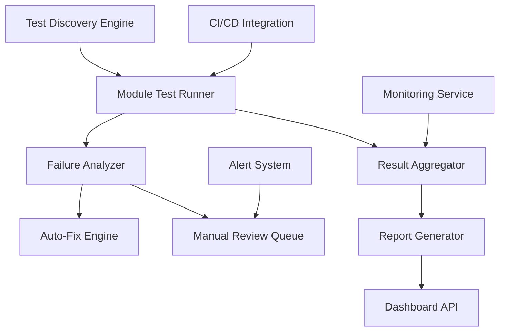

# Technical Specification: Test Suite Automation

## Architecture Overview

### System Components



## Core Components

### 1. Test Discovery Engine

**Purpose**: Automatically discover and categorize all test files across the repository.

**Key Features**:
- Recursive directory scanning
- Module-based categorization
- Test type classification
- Dependency mapping

**Implementation**:
```python
class TestDiscoveryEngine:
    def __init__(self, base_path="tests"):
        self.base_path = Path(base_path)
        self.module_categories = {
            'engineering': ['aqwa', 'orcaflex', 'pipe_capacity', 'pipeline'],
            'calculation': ['code_dnvrph103', 'fatigue_analysis', 'time_series'],
            'integration': ['all_yml', 'transformation', 'ship_design'],
            'development': ['in_progress', 'local_temp'],
            'restricted': ['no_license', 'unresolved']
        }
    
    def discover_all(self):
        """Discover all test modules and files"""
        modules = {}
        for category, module_list in self.module_categories.items():
            for module in module_list:
                module_path = self.base_path / "modules" / module
                if module_path.exists():
                    modules[module] = self._scan_module(module_path)
        return modules
    
    def _scan_module(self, module_path):
        """Scan individual module for test files"""
        test_files = []
        config_files = []
        
        for file_path in module_path.rglob("*"):
            if file_path.name.startswith("test_") and file_path.suffix == ".py":
                test_files.append(file_path)
            elif file_path.suffix in [".yml", ".yaml"]:
                config_files.append(file_path)
        
        return {
            'path': module_path,
            'test_files': test_files,
            'config_files': config_files,
            'category': self._get_category(module_path.name)
        }
```

### 2. Module Test Runner

**Purpose**: Execute tests by module with support for parallel execution and resource management.

**Key Features**:
- Parallel test execution
- Resource isolation
- Progress monitoring
- Result collection

**Implementation**:
```python
import asyncio
import subprocess
from concurrent.futures import ThreadPoolExecutor, as_completed
from dataclasses import dataclass
from typing import Dict, List, Optional

@dataclass
class TestResult:
    module: str
    test_file: str
    status: str  # 'passed', 'failed', 'skipped'
    duration: float
    error_message: Optional[str] = None
    stdout: Optional[str] = None
    stderr: Optional[str] = None

class ModuleTestRunner:
    def __init__(self, max_workers=4):
        self.max_workers = max_workers
        self.results = {}
        
    async def run_all_modules(self, modules: Dict) -> Dict[str, List[TestResult]]:
        """Run tests for all modules in parallel"""
        with ThreadPoolExecutor(max_workers=self.max_workers) as executor:
            futures = {
                executor.submit(self.run_module, module_name, module_info): module_name
                for module_name, module_info in modules.items()
                if module_info['category'] not in ['restricted']
            }
            
            results = {}
            for future in as_completed(futures):
                module_name = futures[future]
                try:
                    results[module_name] = future.result()
                except Exception as exc:
                    print(f'Module {module_name} generated an exception: {exc}')
                    results[module_name] = [TestResult(
                        module=module_name,
                        test_file="module_error",
                        status="failed",
                        duration=0.0,
                        error_message=str(exc)
                    )]
            
            return results
    
    def run_module(self, module_name: str, module_info: Dict) -> List[TestResult]:
        """Run all tests for a specific module"""
        results = []
        
        for test_file in module_info['test_files']:
            result = self._run_single_test(module_name, test_file)
            results.append(result)
        
        return results
    
    def _run_single_test(self, module_name: str, test_file: Path) -> TestResult:
        """Run a single test file"""
        start_time = time.time()
        
        try:
            process = subprocess.run(
                ['python', '-m', 'pytest', str(test_file), '-v'],
                capture_output=True,
                text=True,
                timeout=300  # 5 minute timeout
            )
            
            duration = time.time() - start_time
            
            if process.returncode == 0:
                status = 'passed'
                error_message = None
            else:
                status = 'failed'
                error_message = process.stderr or "Test failed without error message"
            
            return TestResult(
                module=module_name,
                test_file=test_file.name,
                status=status,
                duration=duration,
                error_message=error_message,
                stdout=process.stdout,
                stderr=process.stderr
            )
            
        except subprocess.TimeoutExpired:
            return TestResult(
                module=module_name,
                test_file=test_file.name,
                status='failed',
                duration=300.0,
                error_message="Test timed out after 5 minutes"
            )
        except Exception as e:
            return TestResult(
                module=module_name,
                test_file=test_file.name,
                status='failed',
                duration=time.time() - start_time,
                error_message=f"Execution error: {str(e)}"
            )
```

### 3. Failure Analyzer

**Purpose**: Analyze test failures to determine if they can be automatically resolved.

**Key Features**:
- Pattern recognition
- Error classification
- Fix recommendation
- Confidence scoring

**Implementation**:
```python
import re
from typing import Dict, List, Optional, Tuple
from enum import Enum

class FailureType(Enum):
    IMPORT_ERROR = "import_error"
    FILE_NOT_FOUND = "file_not_found"
    CONFIG_ERROR = "config_error"
    DEPENDENCY_ERROR = "dependency_error"
    ASSERTION_ERROR = "assertion_error"
    TIMEOUT_ERROR = "timeout_error"
    UNKNOWN = "unknown"

@dataclass
class FailureAnalysis:
    failure_type: FailureType
    confidence: float
    fixable: bool
    fix_suggestion: Optional[str] = None
    manual_review_reason: Optional[str] = None

class FailureAnalyzer:
    def __init__(self):
        self.error_patterns = {
            FailureType.IMPORT_ERROR: [
                r"ModuleNotFoundError: No module named '(.+)'",
                r"ImportError: cannot import name '(.+)'",
                r"ImportError: No module named (.+)"
            ],
            FailureType.FILE_NOT_FOUND: [
                r"FileNotFoundError: \[Errno 2\] No such file or directory: '(.+)'",
                r"IOError: \[Errno 2\] No such file or directory: '(.+)'"
            ],
            FailureType.CONFIG_ERROR: [
                r"yaml\.scanner\.ScannerError",
                r"KeyError: '(.+)' in config",
                r"Invalid configuration"
            ],
            FailureType.DEPENDENCY_ERROR: [
                r"OrcaFlexAPI not available",
                r"ANSYS license not found",
                r"Licensed software required"
            ]
        }
        
        self.fix_patterns = {
            FailureType.IMPORT_ERROR: self._suggest_import_fix,
            FailureType.FILE_NOT_FOUND: self._suggest_file_fix,
            FailureType.CONFIG_ERROR: self._suggest_config_fix,
            FailureType.DEPENDENCY_ERROR: self._suggest_dependency_fix
        }
    
    def analyze(self, test_result: TestResult) -> FailureAnalysis:
        """Analyze a test failure and provide recommendations"""
        if test_result.status == 'passed':
            return FailureAnalysis(
                failure_type=FailureType.UNKNOWN,
                confidence=1.0,
                fixable=False
            )
        
        error_text = test_result.error_message or ""
        stderr_text = test_result.stderr or ""
        combined_error = f"{error_text}\n{stderr_text}"
        
        failure_type = self._classify_error(combined_error)
        confidence = self._calculate_confidence(failure_type, combined_error)
        
        if failure_type in self.fix_patterns and confidence > 0.7:
            fix_suggestion = self.fix_patterns[failure_type](combined_error, test_result)
            return FailureAnalysis(
                failure_type=failure_type,
                confidence=confidence,
                fixable=True,
                fix_suggestion=fix_suggestion
            )
        else:
            return FailureAnalysis(
                failure_type=failure_type,
                confidence=confidence,
                fixable=False,
                manual_review_reason=self._get_manual_review_reason(failure_type, combined_error)
            )
    
    def _classify_error(self, error_text: str) -> FailureType:
        """Classify error based on patterns"""
        for failure_type, patterns in self.error_patterns.items():
            for pattern in patterns:
                if re.search(pattern, error_text, re.IGNORECASE):
                    return failure_type
        return FailureType.UNKNOWN
    
    def _suggest_import_fix(self, error_text: str, test_result: TestResult) -> str:
        """Suggest fix for import errors"""
        import_match = re.search(r"No module named '(.+)'", error_text)
        if import_match:
            missing_module = import_match.group(1)
            return f"Add mock for {missing_module} or install missing dependency"
        return "Check import statements and dependencies"
    
    def _suggest_file_fix(self, error_text: str, test_result: TestResult) -> str:
        """Suggest fix for file not found errors"""
        file_match = re.search(r"No such file or directory: '(.+)'", error_text)
        if file_match:
            missing_file = file_match.group(1)
            return f"Create missing file: {missing_file} or update file path"
        return "Check file paths in test configuration"
```

### 4. Auto-Fix Engine

**Purpose**: Automatically apply fixes for common, predictable failures.

**Key Features**:
- Safe fix application
- Rollback capability
- Fix validation
- Change logging

**Implementation**:
```python
import shutil
from pathlib import Path
from typing import List, Dict, Optional

class AutoFixEngine:
    def __init__(self, backup_dir="test_backups"):
        self.backup_dir = Path(backup_dir)
        self.backup_dir.mkdir(exist_ok=True)
        self.applied_fixes = []
    
    def apply_fixes(self, failures: List[Tuple[TestResult, FailureAnalysis]]) -> Dict[str, str]:
        """Apply automatic fixes where possible"""
        fix_results = {}
        
        for test_result, analysis in failures:
            if not analysis.fixable:
                continue
                
            fix_key = f"{test_result.module}::{test_result.test_file}"
            
            try:
                if analysis.failure_type == FailureType.IMPORT_ERROR:
                    success = self._fix_import_error(test_result, analysis)
                elif analysis.failure_type == FailureType.FILE_NOT_FOUND:
                    success = self._fix_file_not_found(test_result, analysis)
                elif analysis.failure_type == FailureType.CONFIG_ERROR:
                    success = self._fix_config_error(test_result, analysis)
                else:
                    success = False
                
                fix_results[fix_key] = "applied" if success else "failed"
                
            except Exception as e:
                fix_results[fix_key] = f"error: {str(e)}"
        
        return fix_results
    
    def _fix_import_error(self, test_result: TestResult, analysis: FailureAnalysis) -> bool:
        """Fix import errors by adding mocks or updating imports"""
        test_file_path = self._find_test_file(test_result)
        if not test_file_path:
            return False
        
        # Backup original file
        self._backup_file(test_file_path)
        
        try:
            # Read current content
            content = test_file_path.read_text()
            
            # Add common mocks at the top of the file
            mock_imports = """
# Auto-generated mocks for missing dependencies
try:
    import OrcaFlexAPI
except ImportError:
    class MockOrcaFlexAPI:
        def __init__(self):
            pass
    OrcaFlexAPI = MockOrcaFlexAPI

try:
    import ansys
except ImportError:
    class MockANSYS:
        def __init__(self):
            pass
    ansys = MockANSYS
"""
            
            # Insert mocks after existing imports
            import_end = self._find_import_section_end(content)
            if import_end >= 0:
                new_content = content[:import_end] + mock_imports + content[import_end:]
                test_file_path.write_text(new_content)
                return True
            
        except Exception as e:
            # Restore backup on error
            self._restore_backup(test_file_path)
            raise e
        
        return False
    
    def _fix_file_not_found(self, test_result: TestResult, analysis: FailureAnalysis) -> bool:
        """Fix file not found errors by creating placeholder files"""
        # Extract missing file path from error
        error_text = test_result.error_message or ""
        file_match = re.search(r"No such file or directory: '(.+)'", error_text)
        
        if not file_match:
            return False
        
        missing_file_path = Path(file_match.group(1))
        
        try:
            # Create directory structure if needed
            missing_file_path.parent.mkdir(parents=True, exist_ok=True)
            
            # Create placeholder file based on extension
            if missing_file_path.suffix in ['.yml', '.yaml']:
                placeholder_content = "# Auto-generated placeholder configuration\nplaceholder: true\n"
            elif missing_file_path.suffix == '.csv':
                placeholder_content = "# Auto-generated placeholder data file\ncolumn1,column2\nplaceholder,data\n"
            else:
                placeholder_content = "# Auto-generated placeholder file\n"
            
            missing_file_path.write_text(placeholder_content)
            
            # Log the fix
            self.applied_fixes.append({
                'type': 'file_creation',
                'file': str(missing_file_path),
                'test': f"{test_result.module}::{test_result.test_file}"
            })
            
            return True
            
        except Exception as e:
            return False
    
    def _backup_file(self, file_path: Path):
        """Create backup of file before modification"""
        backup_name = f"{file_path.name}.backup.{int(time.time())}"
        backup_path = self.backup_dir / backup_name
        shutil.copy2(file_path, backup_path)
```

### 5. Result Aggregator and Report Generator

**Purpose**: Collect, analyze, and report on test execution results.

**Implementation**:
```python
from datetime import datetime, timedelta
import json
from typing import Dict, List, Any

class TestReportGenerator:
    def __init__(self):
        self.report_template = {
            'metadata': {
                'timestamp': '',
                'total_execution_time': 0.0,
                'repository': 'digitalmodel',
                'test_automation_version': '1.0.0'
            },
            'summary': {
                'total_modules': 0,
                'total_tests': 0,
                'passed': 0,
                'failed': 0,
                'skipped': 0,
                'auto_fixed': 0,
                'manual_review': 0
            },
            'modules': {},
            'failures': {
                'fixable': [],
                'manual_review': []
            },
            'trends': {},
            'recommendations': []
        }
    
    def generate_comprehensive_report(
        self, 
        test_results: Dict[str, List[TestResult]], 
        fix_results: Dict[str, str],
        execution_time: float
    ) -> Dict[str, Any]:
        """Generate comprehensive test execution report"""
        
        report = self.report_template.copy()
        report['metadata']['timestamp'] = datetime.now().isoformat()
        report['metadata']['total_execution_time'] = execution_time
        
        # Process each module
        for module_name, results in test_results.items():
            module_summary = self._analyze_module_results(module_name, results)
            report['modules'][module_name] = module_summary
            
            # Update totals
            self._update_summary_totals(report['summary'], module_summary)
        
        # Process fix results
        self._process_fix_results(report, fix_results)
        
        # Generate recommendations
        report['recommendations'] = self._generate_recommendations(report)
        
        return report
    
    def _analyze_module_results(self, module_name: str, results: List[TestResult]) -> Dict[str, Any]:
        """Analyze results for a single module"""
        module_summary = {
            'total_tests': len(results),
            'passed': 0,
            'failed': 0,
            'skipped': 0,
            'average_duration': 0.0,
            'longest_test': None,
            'fastest_test': None,
            'failed_tests': []
        }
        
        total_duration = 0.0
        durations = []
        
        for result in results:
            if result.status == 'passed':
                module_summary['passed'] += 1
            elif result.status == 'failed':
                module_summary['failed'] += 1
                module_summary['failed_tests'].append({
                    'test_file': result.test_file,
                    'error': result.error_message
                })
            else:
                module_summary['skipped'] += 1
            
            total_duration += result.duration
            durations.append(result.duration)
        
        if durations:
            module_summary['average_duration'] = total_duration / len(durations)
            module_summary['longest_test'] = max(durations)
            module_summary['fastest_test'] = min(durations)
        
        return module_summary
    
    def generate_html_report(self, report_data: Dict[str, Any]) -> str:
        """Generate HTML report for dashboard viewing"""
        html_template = """
        <!DOCTYPE html>
        <html>
        <head>
            <title>Test Suite Automation Report</title>
            <style>
                body { font-family: Arial, sans-serif; margin: 20px; }
                .summary { background: #f0f0f0; padding: 15px; border-radius: 5px; }
                .module { margin: 20px 0; border: 1px solid #ddd; border-radius: 5px; }
                .module-header { background: #e0e0e0; padding: 10px; font-weight: bold; }
                .module-content { padding: 10px; }
                .passed { color: green; }
                .failed { color: red; }
                .recommendations { background: #fff3cd; padding: 15px; border-radius: 5px; }
            </style>
        </head>
        <body>
            <h1>Test Suite Automation Report</h1>
            <div class="summary">
                <h2>Summary</h2>
                <p>Total Tests: {total_tests}</p>
                <p class="passed">Passed: {passed}</p>
                <p class="failed">Failed: {failed}</p>
                <p>Auto-Fixed: {auto_fixed}</p>
                <p>Manual Review: {manual_review}</p>
            </div>
            
            <h2>Module Results</h2>
            {module_details}
            
            <div class="recommendations">
                <h2>Recommendations</h2>
                {recommendations}
            </div>
        </body>
        </html>
        """
        
        # Build module details
        module_details = ""
        for module_name, module_data in report_data['modules'].items():
            module_details += f"""
            <div class="module">
                <div class="module-header">{module_name}</div>
                <div class="module-content">
                    <p>Tests: {module_data['total_tests']}</p>
                    <p class="passed">Passed: {module_data['passed']}</p>
                    <p class="failed">Failed: {module_data['failed']}</p>
                    <p>Average Duration: {module_data['average_duration']:.2f}s</p>
                </div>
            </div>
            """
        
        # Build recommendations
        recommendations = ""
        for rec in report_data['recommendations']:
            recommendations += f"<p>• {rec}</p>"
        
        return html_template.format(
            total_tests=report_data['summary']['total_tests'],
            passed=report_data['summary']['passed'],
            failed=report_data['summary']['failed'],
            auto_fixed=report_data['summary']['auto_fixed'],
            manual_review=report_data['summary']['manual_review'],
            module_details=module_details,
            recommendations=recommendations
        )
```

## Integration Specifications

### CI/CD Integration

```python
class CIIntegration:
    def __init__(self):
        self.exit_codes = {
            'success': 0,
            'tests_failed': 1,
            'system_error': 2,
            'partial_success': 3
        }
    
    def run_for_ci(self) -> int:
        """Main entry point for CI/CD systems"""
        try:
            # Run test automation
            discovery = TestDiscoveryEngine()
            modules = discovery.discover_all()
            
            runner = ModuleTestRunner()
            results = runner.run_all_modules(modules)
            
            analyzer = FailureAnalyzer()
            auto_fix = AutoFixEngine()
            
            # Process failures
            failures_to_fix = []
            for module, test_results in results.items():
                for result in test_results:
                    if result.status == 'failed':
                        analysis = analyzer.analyze(result)
                        if analysis.fixable:
                            failures_to_fix.append((result, analysis))
            
            # Apply fixes
            fix_results = auto_fix.apply_fixes(failures_to_fix)
            
            # Re-run fixed tests
            rerun_results = self._rerun_fixed_tests(fix_results)
            
            # Generate final report
            report_gen = TestReportGenerator()
            final_report = report_gen.generate_comprehensive_report(
                results, fix_results, 0.0
            )
            
            # Save report for CI artifacts
            self._save_ci_artifacts(final_report)
            
            # Determine exit code
            return self._calculate_exit_code(final_report)
            
        except Exception as e:
            print(f"Test automation system error: {e}")
            return self.exit_codes['system_error']
```

### Development Environment Integration

```python
class DevEnvironmentIntegration:
    def __init__(self):
        self.watch_paths = ['tests/', 'src/']
        self.debounce_time = 2.0  # seconds
    
    def setup_file_watcher(self):
        """Setup file system watcher for automatic test execution"""
        from watchdog.observers import Observer
        from watchdog.events import FileSystemEventHandler
        
        class TestHandler(FileSystemEventHandler):
            def __init__(self, integration):
                self.integration = integration
                self.last_run = 0
            
            def on_modified(self, event):
                if event.is_directory:
                    return
                
                current_time = time.time()
                if current_time - self.last_run < self.integration.debounce_time:
                    return
                
                self.last_run = current_time
                
                # Determine which module to test based on changed file
                if event.src_path.startswith('tests/'):
                    module_name = self._extract_module_name(event.src_path)
                    self.integration.run_module_tests(module_name)
        
        handler = TestHandler(self)
        observer = Observer()
        
        for path in self.watch_paths:
            observer.schedule(handler, path, recursive=True)
        
        observer.start()
        return observer
```

## Performance Considerations

### Parallel Execution Optimization

```python
class PerformanceOptimizer:
    def __init__(self):
        self.resource_limits = {
            'max_memory_per_test': 512 * 1024 * 1024,  # 512MB
            'max_cpu_time_per_test': 300,  # 5 minutes
            'max_parallel_licensed_tests': 2  # For licensed software
        }
    
    def optimize_test_execution(self, modules: Dict) -> Dict:
        """Optimize test execution order and parallelization"""
        
        # Categorize tests by resource requirements
        categories = {
            'lightweight': [],
            'licensed_software': [],
            'memory_intensive': [],
            'long_running': []
        }
        
        for module_name, module_info in modules.items():
            category = self._categorize_module(module_name, module_info)
            categories[category].append((module_name, module_info))
        
        # Create execution plan
        execution_plan = {
            'phase_1': categories['lightweight'],  # Run first, high parallelism
            'phase_2': categories['memory_intensive'],  # Run with memory limits
            'phase_3': categories['licensed_software'],  # Run with license limits
            'phase_4': categories['long_running']  # Run last, low parallelism
        }
        
        return execution_plan
```

## Error Handling and Resilience

### Robust Error Handling

```python
class ErrorHandler:
    def __init__(self):
        self.retry_strategies = {
            'transient_error': {'max_retries': 3, 'backoff': 2.0},
            'license_error': {'max_retries': 1, 'backoff': 30.0},
            'memory_error': {'max_retries': 1, 'backoff': 5.0}
        }
    
    def handle_test_error(self, error: Exception, test_context: Dict) -> Dict:
        """Handle test execution errors with appropriate retry strategies"""
        
        error_type = self._classify_error(error)
        strategy = self.retry_strategies.get(error_type, {'max_retries': 0})
        
        return {
            'error_type': error_type,
            'retry_recommended': strategy['max_retries'] > 0,
            'retry_after': strategy.get('backoff', 0),
            'max_retries': strategy['max_retries']
        }
```

This technical specification provides the detailed implementation blueprint for the test suite automation system, covering all core components, integration points, and operational considerations.