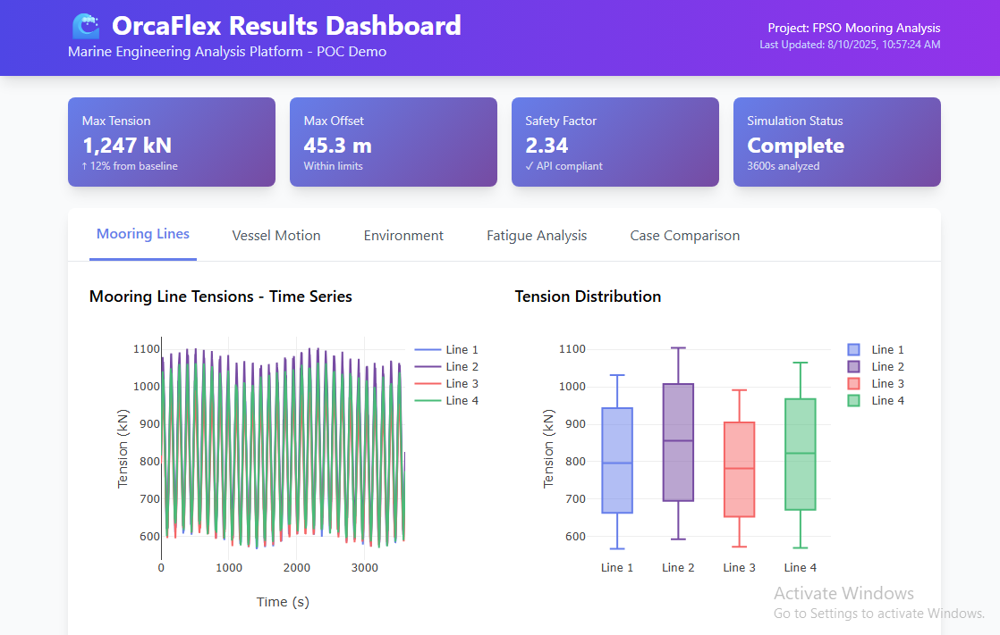

# OrcaFlex Dashboard POC

## Quick Start
Open the dashboard directly in your browser:
```
D:\github\digitalmodel\specs\modules\visualization\orcaflex-dashboard\poc-dashboard.html
```

## Dashboard Screenshot


## Features Demonstrated

### 📊 Interactive Visualizations
- **Mooring Line Analysis**: Real-time tension monitoring, distribution analysis, and plan view layout
- **Vessel Motion Tracking**: 6DOF responses, trajectory paths, and RAO analysis
- **Environmental Conditions**: Wave spectra, wind rose, current profiles, and load distributions
- **Fatigue Assessment**: Life estimation, damage accumulation, S-N curves, and hotspot identification
- **Multi-Case Comparison**: Side-by-side analysis of different operational scenarios

### 🎯 Key Metrics Dashboard
- Maximum Tension: 1,247 kN
- Maximum Offset: 45.3 m
- Safety Factor: 2.34
- Simulation Status: Complete (3600s analyzed)

### 💾 Export Capabilities
- **PDF Reports**: Executive summaries with all visualizations
- **Excel Data**: Time series data, statistical summaries, and maximum values
- **Auto-refresh**: Real-time data updates (configurable)

## How to Take a Screenshot for Documentation

1. Open the dashboard in your browser
2. Press `Windows + Shift + S` to open Snipping Tool
3. Select the browser window
4. Save as `dashboard-screenshot.png` in this folder
5. The README will automatically display it

## Customization for Stakeholders

Edit the `poc-dashboard.html` file to:
- Modify data values in the JavaScript section
- Change project name and details in the header
- Adjust color schemes to match company branding
- Add/remove visualization panels as needed

## Technical Stack
- **Frontend**: Pure HTML5 + JavaScript (no build required)
- **Charting**: Plotly.js for interactive visualizations
- **Styling**: Tailwind CSS via CDN
- **Data**: Mock data generated in JavaScript (easily replaceable with API calls)

## Demo Talking Points

1. **Real-time Monitoring**: Show how the dashboard updates with live data
2. **Interactive Charts**: Demonstrate zoom, pan, and hover features
3. **Compliance Checking**: Highlight safety factors and API/DNV compliance indicators
4. **Export Functions**: Show report generation capabilities
5. **Multi-case Analysis**: Compare different operational scenarios

## Next Steps for Production

1. Connect to real OrcaFlex output files (.sim, .csv)
2. Implement backend API for data processing
3. Add user authentication and project management
4. Deploy to cloud infrastructure
5. Integrate with existing engineering workflows