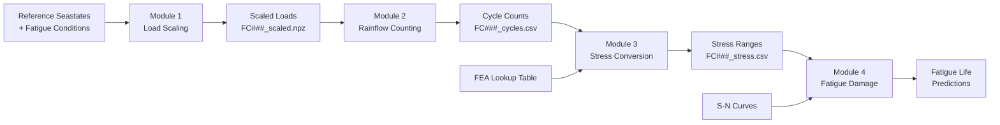

# Modular Fatigue Analysis - Input File Structure

## Overview

The fatigue analysis system has been divided into four independent modules, each with its own specific input requirements. This modular approach allows you to run any stage independently or chain them together for complete analysis.

## Module 1: Load Scaling (`load_scaling.py`)

**Purpose**: Scales reference seastate loads (wind @ 10m/s, wave @ Hs=0.5m) to match target fatigue conditions.

### Input Files Required:

#### 1. `input/reference_seastates.csv`
Defines the available reference seastate conditions.

```csv
reference_id,type,wind_speed,wind_direction,hs,tp,wave_direction
WD01,wind,10.0,0,0.0,0.0,0.0
WD02,wind,10.0,45,0.0,0.0,0.0
W01,wave,0.0,0.0,0.5,1.93,0
W02,wave,0.0,0.0,0.5,2.70,45
```

**Columns**:
- `reference_id`: Unique identifier for the reference condition
- `type`: Either "wind" or "wave"
- `wind_speed`: Wind speed in m/s (10 for wind references, 0 for wave)
- `wind_direction`: Wind direction in degrees
- `hs`: Significant wave height in meters (0 for wind, 0.5 for wave)
- `tp`: Peak period in seconds (for wave references)
- `wave_direction`: Wave direction in degrees

#### 2. `input/fatigue_conditions.csv`
Target fatigue conditions that need to be analyzed.

```csv
condition_id,wind_speed,wind_direction,hs,tp,wave_direction,occurrence_pct
1,5.0,180,0.15,1.7,150,7.76
2,3.0,180,0.09,1.0,150,6.977
3,7.0,225,0.25,2.1,200,4.123
```

**Columns**:
- `condition_id`: Unique identifier (1-81)
- `wind_speed`: Target wind speed in m/s
- `wind_direction`: Wind direction in degrees
- `hs`: Target significant wave height in meters
- `tp`: Target peak period in seconds
- `wave_direction`: Wave direction in degrees
- `occurrence_pct`: Annual occurrence percentage

#### 3. Time Series Data (Optional)
If you have actual time series data, provide them in a directory structure:
```
data/timetraces/
├── WD01_Strut1.csv
├── WD01_Strut2.csv
├── W01_Strut1.csv
└── W01_Strut2.csv
```

### Output Files:
- `output/scaled_loads/scaling_factors.csv` - Calculated scaling factors
- `output/scaled_loads/FC###_scaled.npz` - Scaled load time series
- `output/scaled_loads/load_scaling_summary.csv` - Processing summary

### Usage:
```bash
python load_scaling.py \
    --reference-seastates input/reference_seastates.csv \
    --fatigue-conditions input/fatigue_conditions.csv \
    --output-dir output/scaled_loads
```

---

## Module 2: Rainflow Counting (`rainflow_counting.py`)

**Purpose**: Extracts load cycles from time series using rainflow counting algorithm.

### Input Files Required:

#### 1. Scaled Load Files
From Module 1 output or direct time series files.

**Option A: NPZ format from Module 1**
```
output/scaled_loads/FC001_scaled.npz
output/scaled_loads/FC002_scaled.npz
```

**Option B: CSV time series files**
```csv
time,load
0.0,1234.5
0.1,1245.6
0.2,1223.4
```

### Configuration Parameters:
Create a configuration file `config/rainflow_config.json`:
```json
{
    "gate_value": 0.01,
    "bin_width": null,
    "duration_seconds": 200.0
}
```

### Output Files:
- `output/rainflow_cycles/FC###_cycles.csv` - Cycle ranges and counts
- `output/rainflow_cycles/rainflow_summary.csv` - Processing summary

### Usage:
```bash
python rainflow_counting.py \
    --input-dir output/scaled_loads \
    --output-dir output/rainflow_cycles \
    --pattern "*.npz" \
    --gate-value 0.01
```

---

## Module 3: Tension to Stress Conversion (`tension_stress_conversion.py`)

**Purpose**: Converts tension ranges to stress ranges using FEA lookup tables.

### Input Files Required:

#### 1. `input/tension_stress_lookup.csv`
FEA results mapping tension to stress.

```csv
tension_kn,stress_mpa
0,0
100,25.0
200,50.0
500,125.0
1000,250.0
1500,375.0
2000,500.0
```

#### 2. `input/stress_concentration_factors.csv` (Optional)
SCF values for different locations.

```csv
location,scf,description
Strut1_top,1.15,Top connection of Strut 1
Strut1_bottom,1.20,Bottom connection of Strut 1
Strut2_top,1.10,Top connection of Strut 2
```

#### 3. Rainflow Results
From Module 2 output:
```
output/rainflow_cycles/FC001_cycles.csv
```

### Output Files:
- `output/stress_ranges/FC###_stress.csv` - Stress ranges and cycles
- `output/stress_ranges/stress_conversion_summary.csv` - Processing summary

### Usage:
```bash
python tension_stress_conversion.py \
    --lookup-table input/tension_stress_lookup.csv \
    --scf-file input/stress_concentration_factors.csv \
    --input-dir output/rainflow_cycles \
    --output-dir output/stress_ranges
```

---

## Module 4: Fatigue Damage Calculation (`fatigue_damage.py`)

**Purpose**: Calculates fatigue damage using S-N curves and Miner's rule.

### Input Files Required:

#### 1. `input/configuration_weights.csv`
Vessel configuration operational time distribution.

```csv
configuration,weight_pct,description
fsts_l015,46.25,FSTs Light (15% loaded)
fsts_l095,46.25,FSTs Full (95% loaded)
fsts_l015_125km3_l100_pb,3.75,FSTs Light + LNGC Full
fsts_l095_125km3_l000_pb,3.75,FSTs Full + LNGC Light
```

#### 2. `config/sn_curve_parameters.yml`
S-N curve parameters (optional - defaults are built-in).

```yaml
sn_curve:
  type: ABS_E_in_air
  parameters:
    log_a1: 12.018
    m1: 3.0
    log_a2: 16.000
    m2: 5.0
    threshold_cycles: 1.0e6
    endurance_limit: 52.0  # MPa

design_criteria:
  design_life_years: 25.0
  safety_factor: 1.0
```

#### 3. Stress Range Files
From Module 3 output:
```
output/stress_ranges/FC001_Strut1_stress.csv
```

### Output Files:
- `output/fatigue_damage/{config}_damage.csv` - Damage per configuration
- `output/fatigue_damage/fatigue_report.txt` - Comprehensive report
- `output/fatigue_damage/fatigue_life_summary.csv` - Life predictions

### Usage:
```bash
python fatigue_damage.py \
    --stress-dir output/stress_ranges \
    --output-dir output/fatigue_damage \
    --sn-curve ABS_E_in_air \
    --design-life 25.0 \
    --safety-factor 1.0
```

---

## Complete Pipeline Example

### Directory Structure:
```
fatigue_analysis/
├── input/
│   ├── reference_seastates.csv
│   ├── fatigue_conditions.csv
│   ├── tension_stress_lookup.csv
│   ├── stress_concentration_factors.csv
│   └── configuration_weights.csv
├── config/
│   ├── rainflow_config.json
│   └── sn_curve_parameters.yml
├── output/
│   ├── scaled_loads/
│   ├── rainflow_cycles/
│   ├── stress_ranges/
│   └── fatigue_damage/
└── scripts/
    ├── run_complete_analysis.sh
    └── run_module_tests.py
```

### Sequential Execution Script:
```bash
#!/bin/bash
# run_complete_analysis.sh

echo "Starting Fatigue Analysis Pipeline"

# Module 1: Load Scaling
echo "Module 1: Scaling Loads..."
python load_scaling.py \
    --reference-seastates input/reference_seastates.csv \
    --fatigue-conditions input/fatigue_conditions.csv \
    --output-dir output/scaled_loads

# Module 2: Rainflow Counting  
echo "Module 2: Rainflow Counting..."
python rainflow_counting.py \
    --input-dir output/scaled_loads \
    --output-dir output/rainflow_cycles \
    --pattern "*.npz"

# Module 3: Tension to Stress
echo "Module 3: Converting to Stress..."
python tension_stress_conversion.py \
    --lookup-table input/tension_stress_lookup.csv \
    --input-dir output/rainflow_cycles \
    --output-dir output/stress_ranges

# Module 4: Fatigue Damage
echo "Module 4: Calculating Fatigue Damage..."
python fatigue_damage.py \
    --stress-dir output/stress_ranges \
    --output-dir output/fatigue_damage \
    --sn-curve ABS_E_in_air \
    --design-life 25.0

echo "Analysis Complete!"
```

### Parallel Execution (Python):
```python
# run_parallel_analysis.py
import subprocess
from concurrent.futures import ProcessPoolExecutor
import json

def run_module(module_config):
    """Run a single module with configuration"""
    cmd = module_config['command']
    print(f"Running: {' '.join(cmd)}")
    result = subprocess.run(cmd, capture_output=True, text=True)
    return result.returncode == 0

# Define modules that can run in parallel after initial scaling
modules = [
    {
        'name': 'Load Scaling',
        'command': ['python', 'load_scaling.py', '--reference-seastates', 
                   'input/reference_seastates.csv', '--fatigue-conditions', 
                   'input/fatigue_conditions.csv']
    }
]

# Run load scaling first
run_module(modules[0])

# Then run rainflow for different configurations in parallel
configs = ['fsts_l015', 'fsts_l095', 'fsts_l015_125km3_l100_pb', 'fsts_l095_125km3_l000_pb']

with ProcessPoolExecutor(max_workers=4) as executor:
    # Process each configuration in parallel
    futures = []
    for config in configs:
        module_config = {
            'name': f'Process {config}',
            'command': ['python', 'process_configuration.py', '--config', config]
        }
        futures.append(executor.submit(run_module, module_config))
    
    # Wait for all to complete
    results = [f.result() for f in futures]
```

---

## Data Flow Summary



---

## Module Independence

Each module can be run independently with appropriate input files:

1. **Load Scaling Only**: Generate scaled loads for other analyses
2. **Rainflow Only**: Process any time series data
3. **Stress Conversion Only**: Convert any tension data with FEA results
4. **Fatigue Damage Only**: Calculate damage from any stress range data

This modular design allows for:
- Easy debugging and validation of each step
- Parallel processing of different configurations
- Substitution of modules with alternative implementations
- Integration with existing workflows at any stage